# AlcHepNet Database Knowledge Base - Consolidated

This consolidated file combines the database overview, relationship documentation, raw-data profile, and all entity references generated from the supplied schema.

---

## Database Overview

**Schema version:** 2.1.1  
**Documented entities:** 54  
**Schema-defined relationships:** 102

### Entity categories

- **data_file:** 17 entities
- **administrative:** 12 entities
- **analysis:** 10 entities
- **clinical:** 7 entities
- **biospecimen:** 4 entities
- **notation:** 2 entities
- **index_file:** 1 entities
- **metadata_file:** 1 entities

### Entity catalog

| Entity | Title | Category | Fields | Links | Purpose |
|---|---|---:|---:|---:|---|
| [acknowledgement](entities/acknowledgement.md) | Acknowledgement | administrative | 9 | 1 | Acknowledgement of an individual involved in a project. |
| [aligned_reads](entities/aligned_reads.md) | Aligned Reads | data_file | 11 | 5 | Data file containing aligned reads that are generated internally by the GDC. |
| [aligned_reads_index](entities/aligned_reads_index.md) | Aligned Reads Index | index_file | 7 | 2 | Data file containing the index for a set of aligned reads. |
| [alignment_cocleaning_workflow](entities/alignment_cocleaning_workflow.md) | Alignment Cocleaning Workflow | analysis | 5 | 2 | Metadata for the alignment and cocleaning pipeline used to align reads in the GDC harmonization pipelines. |
| [alignment_workflow](entities/alignment_workflow.md) | Alignment Workflow | analysis | 5 | 2 | Metadata for the alignment pipeline used to align reads in the GDC harmonization pipelines. |
| [aliquot](entities/aliquot.md) | Aliquot | biospecimen | 13 | 2 | Pertaining to a portion of the whole; any one of two or more samples of something, of the same volume or weight. |
| [audit](entities/audit.md) | Audit | administrative | 33 | 1 | audit to a case. |
| [case](entities/case.md) | Case | administrative | 27 | 1 | The collection of all data related to a specific subject in the context of a specific experiment. |
| [clinical_test](entities/clinical_test.md) | Clinical Test | clinical | 29 | 3 | Metadata concerning any clinical tests used in relation to a case diagnosis. |
| [copy_number_auxiliary_file](entities/copy_number_auxiliary_file.md) | Copy Number Auxiliary File | data_file | 8 | 2 | Data file related to the copy number pipeline that contains any outputs not strictly defined in other nodes |
| [copy_number_estimate](entities/copy_number_estimate.md) | Copy Number Estimate | data_file | 10 | 4 | Data file containing copy number variation information generated internally by the GDC. |
| [copy_number_liftover_workflow](entities/copy_number_liftover_workflow.md) | Copy Number Liftover Workflow | analysis | 3 | 1 | Metadata for the copy number liftover workflow used to harmonize TCGA copy number data. |
| [copy_number_segment](entities/copy_number_segment.md) | Copy Number Segment | data_file | 10 | 4 | Data file containing the copy number data from a copy number liftover workflow. Contains all copy numbers detected. |
| [copy_number_variation_workflow](entities/copy_number_variation_workflow.md) | Copy Number Variation Workflow | analysis | 3 | 1 | Metadata for the Copy Number Variation pipeline used to estimate copy number changes from different molecular data sources. |
| [core_metadata_collection](entities/core_metadata_collection.md) | Core Metadata Collection | administrative | 16 | 1 | Structured description of a collection of several dataset |
| [demographic](entities/demographic.md) | Demographic | clinical | 23 | 1 | Data for the characterization of the patient by means of segementing the population (e.g., characterization by age, sex, or race). |
| [diagnosis](entities/diagnosis.md) | Diagnosis | clinical | 61 | 2 | Data from the investigation, analysis and recognition of the presence and nature of disease, condition, or injury from expressed signs and symptoms; also, the scientific determination of any kind; the concise results of such an investigation. |
| [experiment](entities/experiment.md) | Experiment | administrative | 21 | 1 | A coordinated set of actions and observations designed to generate data, with the ultimate goal of discovery or hypothesis testing. |
| [experimental_metadata](entities/experimental_metadata.md) | Experimental Metadata | metadata_file | 7 | 2 | Data file containing the metadata for the experiment performed. |
| [exposure](entities/exposure.md) | Exposure | clinical | 19 | 1 | Clinically relevant patient information not immediately resulting from genetic predispositions. |
| [family_history](entities/family_history.md) | Family History | clinical | 13 | 1 | Record of a patient's background regarding cancer events of blood relatives. |
| [follow_up](entities/follow_up.md) | Follow_up | administrative | 110 | 2 | follow_up for a project. |
| [gene_expression](entities/gene_expression.md) | Gene Expression | data_file | 7 | 2 | Data file containing gene expression information generated internally by the GDC. |
| [genomic_profile_harmonization_workflow](entities/genomic_profile_harmonization_workflow.md) | Genomic Profile Harmonization Workflow | analysis | 3 | 1 | Metadata for the harmonization of genomic profiling reports. |
| [germline_mutation_calling_workflow](entities/germline_mutation_calling_workflow.md) | Germline Mutation Calling Workflow | analysis | 5 | 2 | Metadata for the germline mutation calling pipeline used to call variants in the GDC DNA-Seq pipelines. |
| [keyword](entities/keyword.md) | Keyword | administrative | 9 | 1 | A keyword for a project. |
| [lab](entities/lab.md) | Lab | administrative | 24 | 1 | ARDaC: Lab node describes different lab centers, which are different data sources. |
| [mirna_expression](entities/mirna_expression.md) | miRNA Expression | data_file | 7 | 2 | Data file containing miRNA expression information generated internally by the GDC. |
| [mirna_expression_calling_workflow](entities/mirna_expression_calling_workflow.md) | miRNA Expression Calling Workflow | analysis | 5 | 2 | Metadata for the miRNA expression calling pipeline. |
| [molecular_test](entities/molecular_test.md) | Molecular_test | clinical | 19 | 3 | Data for the characterization of the patient by means of segementing the population (e.g., characterization by age, sex, or race). |
| [program](entities/program.md) | Program | administrative | 4 | 0 | A broad framework of goals to be achieved. (NCIt C52647) |
| [project](entities/project.md) | Project | administrative | 17 | 1 | Any specifically defined piece of work that is undertaken or attempted to meet a single requirement. (NCIt C47885) |
| [publication](entities/publication.md) | Publication | administrative | 10 | 1 | Publication for a project. |
| [read_group](entities/read_group.md) | Read Group | biospecimen | 54 | 1 | Sequencing reads from one lane of an NGS experiment. |
| [read_group_qc](entities/read_group_qc.md) | Read Group QC | notation | 24 | 3 | GDC QC run metadata. |
| [rna_expression_calling_workflow](entities/rna_expression_calling_workflow.md) | RNA Expression Calling Workflow | analysis | 6 | 3 | Metadata for the RNA expression pipeline used to quantify RNA gene and exon expression from unharmonized or GDC harmonized data. |
| [sample](entities/sample.md) | Sample | biospecimen | 35 | 2 | Any material sample taken from a biological entity for testing, diagnostic, propagation, treatment or research purposes, including a sample obtained from a living organism or taken from the biological object after halting of all its life functions. Biospecimen can contain one or more components including but not limited to cellular molecules, cells, tissues, organs, body fluids, embryos, and body excretory products. |
| [simple_germline_variation](entities/simple_germline_variation.md) | Simple Germline Variation | data_file | 10 | 5 | Data file containing simple germline variations called from aligned reads. |
| [slide](entities/slide.md) | Slide | biospecimen | 30 | 1 | A digital image, microscopic or otherwise, of any sample, portion, or sub-part thereof. (GDC) |
| [slide_count](entities/slide_count.md) | Slide Count | notation | 20 | 1 | Information pertaining to processed results obtained from slides; often in the form of counts. |
| [slide_image](entities/slide_image.md) | Slide Image | data_file | 15 | 2 | Data file containing image of a slide. |
| [somatic_copy_number_workflow](entities/somatic_copy_number_workflow.md) | Somatic Copy Number Workflow | analysis | 4 | 2 | Metadata for the Somatic Copy Number pipeline used to estimate copy number changes from different molecular data sources. |
| [structural_variant_calling_workflow](entities/structural_variant_calling_workflow.md) | Structural Variant Calling Workflow | analysis | 3 | 1 | Metadata for the structural variant calling pipeline used to call structural variants in the GDC DNA-Seq or RNA-Seq pipelines. |
| [structural_variation](entities/structural_variation.md) | structural_variation | data_file | 9 | 3 | Structural_variation reads that are used as input to GDC workflows. |
| [study](entities/study.md) | Study | administrative | 12 | 1 | The study node. |
| [submitted_aligned_reads](entities/submitted_aligned_reads.md) | Submitted Aligned Reads | data_file | 9 | 2 | Data file containing aligned reads that are used as input to GDC workflows. |
| [submitted_copy_number](entities/submitted_copy_number.md) | Submitted Copy Number | data_file | 9 | 3 | Data file containing normalized copy number information from an aliquot. |
| [submitted_genomic_profile](entities/submitted_genomic_profile.md) | Submitted Genomic Profile | data_file | 8 | 2 | Data file containing genomic profile information. |
| [submitted_genotyping_array](entities/submitted_genotyping_array.md) | Submitted Genotyping Array | data_file | 8 | 2 | Data file containing raw data from a genotyping array. |
| [submitted_methylation](entities/submitted_methylation.md) | Submitted Methylation | data_file | 10 | 2 | DNA methylation data files contain information on raw and normalized signal intensities, detection confidence and calculated beta values for methylated and unmethylated probes. DNA methylation is an epigenetic mark which can be associated with transcriptional inactivity when located in promoter regions. |
| [submitted_somatic_mutation](entities/submitted_somatic_mutation.md) | Submitted Somatic Mutation | data_file | 9 | 2 | Data file containing somatic mutation calls from a read group. |
| [submitted_tangent_copy_number](entities/submitted_tangent_copy_number.md) | Submitted Tangent Copy Number | data_file | 7 | 2 | Data file containing tangent normalized copy number information from an aliquot. |
| [submitted_unaligned_reads](entities/submitted_unaligned_reads.md) | Submitted Unaligned Reads | data_file | 9 | 2 | Data file containing unaligned reads that have not been GDC Harmonized. |
| [treatment](entities/treatment.md) | Treatment | clinical | 18 | 2 | Record of the administration and intention of therapeutic agents provided to a patient to alter the course of a pathologic process. |

### Core navigation hubs

- **[core_metadata_collection](entities/core_metadata_collection.md):** 1 outgoing link(s), 19 incoming link(s).
- **[submitted_aligned_reads](entities/submitted_aligned_reads.md):** 2 outgoing link(s), 9 incoming link(s).
- **[aligned_reads](entities/aligned_reads.md):** 5 outgoing link(s), 6 incoming link(s).
- **[aliquot](entities/aliquot.md):** 2 outgoing link(s), 6 incoming link(s).
- **[case](entities/case.md):** 1 outgoing link(s), 7 incoming link(s).
- **[project](entities/project.md):** 1 outgoing link(s), 7 incoming link(s).
- **[read_group](entities/read_group.md):** 1 outgoing link(s), 7 incoming link(s).
- **[follow_up](entities/follow_up.md):** 2 outgoing link(s), 6 incoming link(s).
- **[submitted_unaligned_reads](entities/submitted_unaligned_reads.md):** 2 outgoing link(s), 5 incoming link(s).
- **[diagnosis](entities/diagnosis.md):** 2 outgoing link(s), 3 incoming link(s).
- **[copy_number_segment](entities/copy_number_segment.md):** 4 outgoing link(s), 1 incoming link(s).
- **[simple_germline_variation](entities/simple_germline_variation.md):** 5 outgoing link(s), 0 incoming link(s).
- **[somatic_copy_number_workflow](entities/somatic_copy_number_workflow.md):** 2 outgoing link(s), 3 incoming link(s).
- **[copy_number_estimate](entities/copy_number_estimate.md):** 4 outgoing link(s), 0 incoming link(s).
- **[genomic_profile_harmonization_workflow](entities/genomic_profile_harmonization_workflow.md):** 1 outgoing link(s), 3 incoming link(s).

### How to interpret schema relationships

- **Required relationship:** the schema marks the link as required for the source entity.
- **Multiplicity:** values such as `many_to_one` or `one_to_one` are copied from the schema and describe the source-to-target relationship.
- **Back-reference:** the target-side collection/name declared by the source schema.
- **Link field:** the source property used to reference the target entity, generally represented by a submitter identifier or UUID object according to the shared definitions.

### Shared identifier conventions

- `id` uses the shared UUID definition where present.
- `submitter_id` is a project- or submitter-specific identifier where present.
- `project_id` identifies project membership/context where present.
- Relationship properties commonly resolve through the shared `to_one` / `to_many` foreign-key structures, which support `id` and/or `submitter_id` references.

### Recommended retrieval strategy

For questions about a concept or variable, search the [variable index](variable_index.md). For questions about where information lives or how records connect, use the [relationship map](database_relationships.md). For exact definitions, restrictions, and allowed values, use the relevant entity page.

---

## Database Relationship Map

The supplied schema defines **102 directed relationships** among **54 entities**. This page preserves the relationship names, targets, multiplicities, required flags, and back-references declared by the schema.

### Mermaid overview

```mermaid
graph TD
  acknowledgement["acknowledgement"] -->|"projects (many_to_many, required)"| project["project"]
  aligned_reads_index["aligned_reads_index"] -->|"submitted_aligned_reads_files (one_to_one)"| submitted_aligned_reads["submitted_aligned_reads"]
  aligned_reads_index["aligned_reads_index"] -->|"core_metadata_collections (many_to_many)"| core_metadata_collection["core_metadata_collection"]
  aliquot["aliquot"] -->|"follow_ups (many_to_one, required)"| follow_up["follow_up"]
  aliquot["aliquot"] -->|"labs (many_to_one)"| lab["lab"]
  case["case"] -->|"studies (many_to_one, required)"| study["study"]
  clinical_test["clinical_test"] -->|"cases (many_to_one)"| case["case"]
  clinical_test["clinical_test"] -->|"diagnoses (many_to_many)"| diagnosis["diagnosis"]
  clinical_test["clinical_test"] -->|"follow_ups (many_to_one, required)"| follow_up["follow_up"]
  core_metadata_collection["core_metadata_collection"] -->|"projects (many_to_one, required)"| project["project"]
  demographic["demographic"] -->|"cases (one_to_one, required)"| case["case"]
  diagnosis["diagnosis"] -->|"cases (many_to_one)"| case["case"]
  diagnosis["diagnosis"] -->|"follow_ups (many_to_one, required)"| follow_up["follow_up"]
  experiment["experiment"] -->|"projects (many_to_one, required)"| project["project"]
  experimental_metadata["experimental_metadata"] -->|"core_metadata_collections (many_to_many)"| core_metadata_collection["core_metadata_collection"]
  experimental_metadata["experimental_metadata"] -->|"experiments (many_to_many)"| experiment["experiment"]
  exposure["exposure"] -->|"cases (many_to_one, required)"| case["case"]
  family_history["family_history"] -->|"cases (many_to_one, required)"| case["case"]
  keyword["keyword"] -->|"projects (many_to_many, required)"| project["project"]
  project["project"] -->|"programs (many_to_one, required)"| program["program"]
  publication["publication"] -->|"projects (many_to_many, required)"| project["project"]
  read_group["read_group"] -->|"aliquots (many_to_one, required)"| aliquot["aliquot"]
  read_group_qc["read_group_qc"] -->|"submitted_aligned_reads_files (one_to_one)"| submitted_aligned_reads["submitted_aligned_reads"]
  read_group_qc["read_group_qc"] -->|"submitted_unaligned_reads_files (one_to_many)"| submitted_unaligned_reads["submitted_unaligned_reads"]
  read_group_qc["read_group_qc"] -->|"read_groups (many_to_one, required)"| read_group["read_group"]
  sample["sample"] -->|"follow_ups (many_to_one, required)"| follow_up["follow_up"]
  sample["sample"] -->|"diagnoses (many_to_one)"| diagnosis["diagnosis"]
  slide["slide"] -->|"samples (many_to_many, required)"| sample["sample"]
  slide_count["slide_count"] -->|"slides (many_to_many, required)"| slide["slide"]
  slide_image["slide_image"] -->|"slides (many_to_one)"| slide["slide"]
  slide_image["slide_image"] -->|"core_metadata_collections (many_to_many)"| core_metadata_collection["core_metadata_collection"]
  submitted_aligned_reads["submitted_aligned_reads"] -->|"read_groups (one_to_many)"| read_group["read_group"]
  submitted_aligned_reads["submitted_aligned_reads"] -->|"core_metadata_collections (many_to_many)"| core_metadata_collection["core_metadata_collection"]
  submitted_copy_number["submitted_copy_number"] -->|"core_metadata_collections (many_to_many)"| core_metadata_collection["core_metadata_collection"]
  submitted_copy_number["submitted_copy_number"] -->|"aliquots (one_to_one)"| aliquot["aliquot"]
  submitted_copy_number["submitted_copy_number"] -->|"read_groups (many_to_many)"| read_group["read_group"]
  submitted_methylation["submitted_methylation"] -->|"core_metadata_collections (many_to_many)"| core_metadata_collection["core_metadata_collection"]
  submitted_methylation["submitted_methylation"] -->|"aliquots (many_to_one)"| aliquot["aliquot"]
  submitted_somatic_mutation["submitted_somatic_mutation"] -->|"core_metadata_collections (many_to_many)"| core_metadata_collection["core_metadata_collection"]
  submitted_somatic_mutation["submitted_somatic_mutation"] -->|"read_groups (many_to_many)"| read_group["read_group"]
  submitted_unaligned_reads["submitted_unaligned_reads"] -->|"read_groups (many_to_one)"| read_group["read_group"]
  submitted_unaligned_reads["submitted_unaligned_reads"] -->|"core_metadata_collections (many_to_many)"| core_metadata_collection["core_metadata_collection"]
  treatment["treatment"] -->|"diagnoses (many_to_one)"| diagnosis["diagnosis"]
  treatment["treatment"] -->|"follow_ups (many_to_one, required)"| follow_up["follow_up"]
  aligned_reads["aligned_reads"] -->|"core_metadata_collections (many_to_one)"| core_metadata_collection["core_metadata_collection"]
  aligned_reads["aligned_reads"] -->|"alignment_cocleaning_workflows (many_to_one)"| alignment_cocleaning_workflow["alignment_cocleaning_workflow"]
  aligned_reads["aligned_reads"] -->|"alignment_workflows (many_to_one)"| alignment_workflow["alignment_workflow"]
  aligned_reads["aligned_reads"] -->|"submitted_unaligned_reads_files (one_to_many)"| submitted_unaligned_reads["submitted_unaligned_reads"]
  aligned_reads["aligned_reads"] -->|"submitted_aligned_reads_files (one_to_one)"| submitted_aligned_reads["submitted_aligned_reads"]
  alignment_cocleaning_workflow["alignment_cocleaning_workflow"] -->|"submitted_aligned_reads_files (one_to_many)"| submitted_aligned_reads["submitted_aligned_reads"]
  alignment_cocleaning_workflow["alignment_cocleaning_workflow"] -->|"submitted_unaligned_reads_files (one_to_many)"| submitted_unaligned_reads["submitted_unaligned_reads"]
  alignment_workflow["alignment_workflow"] -->|"submitted_aligned_reads_files (one_to_many)"| submitted_aligned_reads["submitted_aligned_reads"]
  alignment_workflow["alignment_workflow"] -->|"submitted_unaligned_reads_files (one_to_many)"| submitted_unaligned_reads["submitted_unaligned_reads"]
  audit["audit"] -->|"cases (one_to_one, required)"| case["case"]
  copy_number_auxiliary_file["copy_number_auxiliary_file"] -->|"somatic_copy_number_workflows (one_to_one, required)"| somatic_copy_number_workflow["somatic_copy_number_workflow"]
  copy_number_auxiliary_file["copy_number_auxiliary_file"] -->|"core_metadata_collections (one_to_many)"| core_metadata_collection["core_metadata_collection"]
  copy_number_estimate["copy_number_estimate"] -->|"copy_number_variation_workflows (one_to_one)"| copy_number_variation_workflow["copy_number_variation_workflow"]
  copy_number_estimate["copy_number_estimate"] -->|"genomic_profile_harmonization_workflows (one_to_one)"| genomic_profile_harmonization_workflow["genomic_profile_harmonization_workflow"]
  copy_number_estimate["copy_number_estimate"] -->|"somatic_copy_number_workflows (one_to_one)"| somatic_copy_number_workflow["somatic_copy_number_workflow"]
  copy_number_estimate["copy_number_estimate"] -->|"core_metadata_collections (one_to_many)"| core_metadata_collection["core_metadata_collection"]
  copy_number_liftover_workflow["copy_number_liftover_workflow"] -->|"submitted_tangent_copy_numbers (one_to_one, required)"| submitted_tangent_copy_number["submitted_tangent_copy_number"]
  copy_number_segment["copy_number_segment"] -->|"core_metadata_collections (many_to_one)"| core_metadata_collection["core_metadata_collection"]
  copy_number_segment["copy_number_segment"] -->|"copy_number_liftover_workflows (one_to_one)"| copy_number_liftover_workflow["copy_number_liftover_workflow"]
  copy_number_segment["copy_number_segment"] -->|"genomic_profile_harmonization_workflows (one_to_one)"| genomic_profile_harmonization_workflow["genomic_profile_harmonization_workflow"]
  copy_number_segment["copy_number_segment"] -->|"somatic_copy_number_workflows (one_to_one)"| somatic_copy_number_workflow["somatic_copy_number_workflow"]
  copy_number_variation_workflow["copy_number_variation_workflow"] -->|"copy_number_segments (many_to_many, required)"| copy_number_segment["copy_number_segment"]
  follow_up["follow_up"] -->|"cases (many_to_one, required)"| case["case"]
  follow_up["follow_up"] -->|"demographics (many_to_one)"| demographic["demographic"]
  gene_expression["gene_expression"] -->|"core_metadata_collections (many_to_one)"| core_metadata_collection["core_metadata_collection"]
  gene_expression["gene_expression"] -->|"rna_expression_calling_workflows (many_to_one, required)"| rna_expression_calling_workflow["rna_expression_calling_workflow"]
  genomic_profile_harmonization_workflow["genomic_profile_harmonization_workflow"] -->|"submitted_genomic_profiles (many_to_one, required)"| submitted_genomic_profile["submitted_genomic_profile"]
  germline_mutation_calling_workflow["germline_mutation_calling_workflow"] -->|"submitted_aligned_reads_files (many_to_many)"| submitted_aligned_reads["submitted_aligned_reads"]
  germline_mutation_calling_workflow["germline_mutation_calling_workflow"] -->|"aligned_reads_files (many_to_many)"| aligned_reads["aligned_reads"]
  lab["lab"] -->|"projects (many_to_one, required)"| project["project"]
  mirna_expression["mirna_expression"] -->|"core_metadata_collections (many_to_one)"| core_metadata_collection["core_metadata_collection"]
  mirna_expression["mirna_expression"] -->|"mirna_expression_calling_workflows (many_to_one)"| mirna_expression_calling_workflow["mirna_expression_calling_workflow"]
  mirna_expression_calling_workflow["mirna_expression_calling_workflow"] -->|"submitted_aligned_reads_files (many_to_many)"| submitted_aligned_reads["submitted_aligned_reads"]
  mirna_expression_calling_workflow["mirna_expression_calling_workflow"] -->|"aligned_reads_files (many_to_many)"| aligned_reads["aligned_reads"]
  molecular_test["molecular_test"] -->|"follow_ups (many_to_one, required)"| follow_up["follow_up"]
  molecular_test["molecular_test"] -->|"labs (many_to_one)"| lab["lab"]
  molecular_test["molecular_test"] -->|"aliquots (many_to_one)"| aliquot["aliquot"]
  rna_expression_calling_workflow["rna_expression_calling_workflow"] -->|"aligned_reads_files (many_to_one)"| aligned_reads["aligned_reads"]
  rna_expression_calling_workflow["rna_expression_calling_workflow"] -->|"submitted_aligned_reads_files (many_to_one)"| submitted_aligned_reads["submitted_aligned_reads"]
  rna_expression_calling_workflow["rna_expression_calling_workflow"] -->|"submitted_unaligned_reads_files (many_to_one)"| submitted_unaligned_reads["submitted_unaligned_reads"]
  simple_germline_variation["simple_germline_variation"] -->|"core_metadata_collections (many_to_one)"| core_metadata_collection["core_metadata_collection"]
  simple_germline_variation["simple_germline_variation"] -->|"germline_mutation_calling_workflows (many_to_one)"| germline_mutation_calling_workflow["germline_mutation_calling_workflow"]
  simple_germline_variation["simple_germline_variation"] -->|"read_groups (many_to_many)"| read_group["read_group"]
  simple_germline_variation["simple_germline_variation"] -->|"submitted_aligned_reads_files (many_to_many)"| submitted_aligned_reads["submitted_aligned_reads"]
  simple_germline_variation["simple_germline_variation"] -->|"aligned_reads_files (many_to_many)"| aligned_reads["aligned_reads"]
  somatic_copy_number_workflow["somatic_copy_number_workflow"] -->|"submitted_genotyping_arrays (many_to_many)"| submitted_genotyping_array["submitted_genotyping_array"]
  somatic_copy_number_workflow["somatic_copy_number_workflow"] -->|"aligned_reads_files (many_to_many)"| aligned_reads["aligned_reads"]
  structural_variant_calling_workflow["structural_variant_calling_workflow"] -->|"aligned_reads_files (many_to_many, required)"| aligned_reads["aligned_reads"]
  structural_variation["structural_variation"] -->|"genomic_profile_harmonization_workflows (one_to_one)"| genomic_profile_harmonization_workflow["genomic_profile_harmonization_workflow"]
  structural_variation["structural_variation"] -->|"structural_variant_calling_workflows (many_to_one)"| structural_variant_calling_workflow["structural_variant_calling_workflow"]
  structural_variation["structural_variation"] -->|"core_metadata_collections (one_to_many)"| core_metadata_collection["core_metadata_collection"]
  study["study"] -->|"projects (many_to_one, required)"| project["project"]
  submitted_genomic_profile["submitted_genomic_profile"] -->|"read_groups (many_to_many, required)"| read_group["read_group"]
  submitted_genomic_profile["submitted_genomic_profile"] -->|"core_metadata_collections (many_to_one)"| core_metadata_collection["core_metadata_collection"]
  submitted_genotyping_array["submitted_genotyping_array"] -->|"aliquots (many_to_one, required)"| aliquot["aliquot"]
  submitted_genotyping_array["submitted_genotyping_array"] -->|"core_metadata_collections (many_to_one)"| core_metadata_collection["core_metadata_collection"]
  submitted_tangent_copy_number["submitted_tangent_copy_number"] -->|"aliquots (one_to_one, required)"| aliquot["aliquot"]
  submitted_tangent_copy_number["submitted_tangent_copy_number"] -->|"core_metadata_collections (many_to_one)"| core_metadata_collection["core_metadata_collection"]
```

### Relationship table

| Source | Link field | Target | Multiplicity | Required | Back-reference | Label |
|---|---|---|---|---|---|---|
| [acknowledgement](entities/acknowledgement.md) | `projects` | [project](entities/project.md) | `many_to_many` | Yes | `acknowledgements` | contribute_to |
| [aligned_reads](entities/aligned_reads.md) | `alignment_cocleaning_workflows` | [alignment_cocleaning_workflow](entities/alignment_cocleaning_workflow.md) | `many_to_one` | No | `aligned_reads_files` | data_from |
| [aligned_reads](entities/aligned_reads.md) | `alignment_workflows` | [alignment_workflow](entities/alignment_workflow.md) | `many_to_one` | No | `aligned_reads_files` | data_from |
| [aligned_reads](entities/aligned_reads.md) | `core_metadata_collections` | [core_metadata_collection](entities/core_metadata_collection.md) | `many_to_one` | No | `aligned_reads_files` | data_from |
| [aligned_reads](entities/aligned_reads.md) | `submitted_aligned_reads_files` | [submitted_aligned_reads](entities/submitted_aligned_reads.md) | `one_to_one` | No | `aligned_reads_files` | matched_to |
| [aligned_reads](entities/aligned_reads.md) | `submitted_unaligned_reads_files` | [submitted_unaligned_reads](entities/submitted_unaligned_reads.md) | `one_to_many` | No | `aligned_reads_files` | matched_to |
| [aligned_reads_index](entities/aligned_reads_index.md) | `core_metadata_collections` | [core_metadata_collection](entities/core_metadata_collection.md) | `many_to_many` | No | `aligned_reads_indexes` | data_from |
| [aligned_reads_index](entities/aligned_reads_index.md) | `submitted_aligned_reads_files` | [submitted_aligned_reads](entities/submitted_aligned_reads.md) | `one_to_one` | No | `aligned_reads_indexes` | derived_from |
| [alignment_cocleaning_workflow](entities/alignment_cocleaning_workflow.md) | `submitted_aligned_reads_files` | [submitted_aligned_reads](entities/submitted_aligned_reads.md) | `one_to_many` | No | `alignment_cocleaning_workflows` | performed_on |
| [alignment_cocleaning_workflow](entities/alignment_cocleaning_workflow.md) | `submitted_unaligned_reads_files` | [submitted_unaligned_reads](entities/submitted_unaligned_reads.md) | `one_to_many` | No | `alignment_cocleaning_workflows` | performed_on |
| [alignment_workflow](entities/alignment_workflow.md) | `submitted_aligned_reads_files` | [submitted_aligned_reads](entities/submitted_aligned_reads.md) | `one_to_many` | No | `alignment_workflows` | performed_on |
| [alignment_workflow](entities/alignment_workflow.md) | `submitted_unaligned_reads_files` | [submitted_unaligned_reads](entities/submitted_unaligned_reads.md) | `one_to_many` | No | `alignment_workflows` | performed_on |
| [aliquot](entities/aliquot.md) | `follow_ups` | [follow_up](entities/follow_up.md) | `many_to_one` | Yes | `aliquots` | describes |
| [aliquot](entities/aliquot.md) | `labs` | [lab](entities/lab.md) | `many_to_one` | No | `aliquots` | describe |
| [audit](entities/audit.md) | `cases` | [case](entities/case.md) | `one_to_one` | Yes | `audits` | describe |
| [case](entities/case.md) | `studies` | [study](entities/study.md) | `many_to_one` | Yes | `cases` | member_of |
| [clinical_test](entities/clinical_test.md) | `cases` | [case](entities/case.md) | `many_to_one` | No | `clinical_tests` | performed_for |
| [clinical_test](entities/clinical_test.md) | `diagnoses` | [diagnosis](entities/diagnosis.md) | `many_to_many` | No | `clinical_tests` | relates_to |
| [clinical_test](entities/clinical_test.md) | `follow_ups` | [follow_up](entities/follow_up.md) | `many_to_one` | Yes | `clinical_tests` | describes |
| [copy_number_auxiliary_file](entities/copy_number_auxiliary_file.md) | `core_metadata_collections` | [core_metadata_collection](entities/core_metadata_collection.md) | `one_to_many` | No | `copy_number_auxiliary_files` | data_from |
| [copy_number_auxiliary_file](entities/copy_number_auxiliary_file.md) | `somatic_copy_number_workflows` | [somatic_copy_number_workflow](entities/somatic_copy_number_workflow.md) | `one_to_one` | Yes | `copy_number_auxiliary_files` | derived_from |
| [copy_number_estimate](entities/copy_number_estimate.md) | `copy_number_variation_workflows` | [copy_number_variation_workflow](entities/copy_number_variation_workflow.md) | `one_to_one` | No | `copy_number_estimates` | derived_from |
| [copy_number_estimate](entities/copy_number_estimate.md) | `core_metadata_collections` | [core_metadata_collection](entities/core_metadata_collection.md) | `one_to_many` | No | `copy_number_estimates` | data_from |
| [copy_number_estimate](entities/copy_number_estimate.md) | `genomic_profile_harmonization_workflows` | [genomic_profile_harmonization_workflow](entities/genomic_profile_harmonization_workflow.md) | `one_to_one` | No | `copy_number_estimates` | derived_from |
| [copy_number_estimate](entities/copy_number_estimate.md) | `somatic_copy_number_workflows` | [somatic_copy_number_workflow](entities/somatic_copy_number_workflow.md) | `one_to_one` | No | `copy_number_estimates` | derived_from |
| [copy_number_liftover_workflow](entities/copy_number_liftover_workflow.md) | `submitted_tangent_copy_numbers` | [submitted_tangent_copy_number](entities/submitted_tangent_copy_number.md) | `one_to_one` | Yes | `copy_number_liftover_workflows` | performed_on |
| [copy_number_segment](entities/copy_number_segment.md) | `copy_number_liftover_workflows` | [copy_number_liftover_workflow](entities/copy_number_liftover_workflow.md) | `one_to_one` | No | `copy_number_segments` | derived_from |
| [copy_number_segment](entities/copy_number_segment.md) | `core_metadata_collections` | [core_metadata_collection](entities/core_metadata_collection.md) | `many_to_one` | No | `copy_number_segments` | data_from |
| [copy_number_segment](entities/copy_number_segment.md) | `genomic_profile_harmonization_workflows` | [genomic_profile_harmonization_workflow](entities/genomic_profile_harmonization_workflow.md) | `one_to_one` | No | `copy_number_segments` | derived_from |
| [copy_number_segment](entities/copy_number_segment.md) | `somatic_copy_number_workflows` | [somatic_copy_number_workflow](entities/somatic_copy_number_workflow.md) | `one_to_one` | No | `copy_number_segments` | derived_from |
| [copy_number_variation_workflow](entities/copy_number_variation_workflow.md) | `copy_number_segments` | [copy_number_segment](entities/copy_number_segment.md) | `many_to_many` | Yes | `copy_number_variation_workflows` | performed_on |
| [core_metadata_collection](entities/core_metadata_collection.md) | `projects` | [project](entities/project.md) | `many_to_one` | Yes | `core_metadata_collections` | data_from |
| [demographic](entities/demographic.md) | `cases` | [case](entities/case.md) | `one_to_one` | Yes | `demographics` | describes |
| [diagnosis](entities/diagnosis.md) | `cases` | [case](entities/case.md) | `many_to_one` | No | `diagnoses` | describes |
| [diagnosis](entities/diagnosis.md) | `follow_ups` | [follow_up](entities/follow_up.md) | `many_to_one` | Yes | `diagnoses` | describes |
| [experiment](entities/experiment.md) | `projects` | [project](entities/project.md) | `many_to_one` | Yes | `experiments` | performed_for |
| [experimental_metadata](entities/experimental_metadata.md) | `core_metadata_collections` | [core_metadata_collection](entities/core_metadata_collection.md) | `many_to_many` | No | `experiment_metadata_files` | data_from |
| [experimental_metadata](entities/experimental_metadata.md) | `experiments` | [experiment](entities/experiment.md) | `many_to_many` | No | `experiment_metadata_files` | derived_from |
| [exposure](entities/exposure.md) | `cases` | [case](entities/case.md) | `many_to_one` | Yes | `exposures` | describes |
| [family_history](entities/family_history.md) | `cases` | [case](entities/case.md) | `many_to_one` | Yes | `family_histories` | describes |
| [follow_up](entities/follow_up.md) | `cases` | [case](entities/case.md) | `many_to_one` | Yes | `follow_ups` | describe |
| [follow_up](entities/follow_up.md) | `demographics` | [demographic](entities/demographic.md) | `many_to_one` | No | `follow_ups` | describes |
| [gene_expression](entities/gene_expression.md) | `core_metadata_collections` | [core_metadata_collection](entities/core_metadata_collection.md) | `many_to_one` | No | `gene_expressions` | data_from |
| [gene_expression](entities/gene_expression.md) | `rna_expression_calling_workflows` | [rna_expression_calling_workflow](entities/rna_expression_calling_workflow.md) | `many_to_one` | Yes | `gene_expressions` | data_from |
| [genomic_profile_harmonization_workflow](entities/genomic_profile_harmonization_workflow.md) | `submitted_genomic_profiles` | [submitted_genomic_profile](entities/submitted_genomic_profile.md) | `many_to_one` | Yes | `genomic_profile_harmonization_workflows` | performed_on |
| [germline_mutation_calling_workflow](entities/germline_mutation_calling_workflow.md) | `aligned_reads_files` | [aligned_reads](entities/aligned_reads.md) | `many_to_many` | No | `germline_mutation_calling_workflows` | performed_on |
| [germline_mutation_calling_workflow](entities/germline_mutation_calling_workflow.md) | `submitted_aligned_reads_files` | [submitted_aligned_reads](entities/submitted_aligned_reads.md) | `many_to_many` | No | `germline_mutation_calling_workflows` | performed_on |
| [keyword](entities/keyword.md) | `projects` | [project](entities/project.md) | `many_to_many` | Yes | `keywords` | describe |
| [lab](entities/lab.md) | `projects` | [project](entities/project.md) | `many_to_one` | Yes | `labs` | member_of |
| [mirna_expression](entities/mirna_expression.md) | `core_metadata_collections` | [core_metadata_collection](entities/core_metadata_collection.md) | `many_to_one` | No | `mirna_expressions` | data_from |
| [mirna_expression](entities/mirna_expression.md) | `mirna_expression_calling_workflows` | [mirna_expression_calling_workflow](entities/mirna_expression_calling_workflow.md) | `many_to_one` | No | `mirna_expressions` | data_from |
| [mirna_expression_calling_workflow](entities/mirna_expression_calling_workflow.md) | `aligned_reads_files` | [aligned_reads](entities/aligned_reads.md) | `many_to_many` | No | `mirna_expression_calling_workflows` | performed_on |
| [mirna_expression_calling_workflow](entities/mirna_expression_calling_workflow.md) | `submitted_aligned_reads_files` | [submitted_aligned_reads](entities/submitted_aligned_reads.md) | `many_to_many` | No | `mirna_expression_calling_workflows` | performed_on |
| [molecular_test](entities/molecular_test.md) | `aliquots` | [aliquot](entities/aliquot.md) | `many_to_one` | No | `molecular_tests` | describes |
| [molecular_test](entities/molecular_test.md) | `follow_ups` | [follow_up](entities/follow_up.md) | `many_to_one` | Yes | `molecular_tests` | describes |
| [molecular_test](entities/molecular_test.md) | `labs` | [lab](entities/lab.md) | `many_to_one` | No | `molecular_tests` | describes |
| [project](entities/project.md) | `programs` | [program](entities/program.md) | `many_to_one` | Yes | `projects` | member_of |
| [publication](entities/publication.md) | `projects` | [project](entities/project.md) | `many_to_many` | Yes | `publications` | refers_to |
| [read_group](entities/read_group.md) | `aliquots` | [aliquot](entities/aliquot.md) | `many_to_one` | Yes | `read_groups` | derived_from |
| [read_group_qc](entities/read_group_qc.md) | `read_groups` | [read_group](entities/read_group.md) | `many_to_one` | Yes | `read_group_qcs` | generated_from |
| [read_group_qc](entities/read_group_qc.md) | `submitted_aligned_reads_files` | [submitted_aligned_reads](entities/submitted_aligned_reads.md) | `one_to_one` | No | `read_group_qcs` | data_from |
| [read_group_qc](entities/read_group_qc.md) | `submitted_unaligned_reads_files` | [submitted_unaligned_reads](entities/submitted_unaligned_reads.md) | `one_to_many` | No | `read_group_qcs` | data_from |
| [rna_expression_calling_workflow](entities/rna_expression_calling_workflow.md) | `aligned_reads_files` | [aligned_reads](entities/aligned_reads.md) | `many_to_one` | No | `rna_expression_calling_workflows` | performed_on |
| [rna_expression_calling_workflow](entities/rna_expression_calling_workflow.md) | `submitted_aligned_reads_files` | [submitted_aligned_reads](entities/submitted_aligned_reads.md) | `many_to_one` | No | `rna_expression_calling_workflows` | performed_on |
| [rna_expression_calling_workflow](entities/rna_expression_calling_workflow.md) | `submitted_unaligned_reads_files` | [submitted_unaligned_reads](entities/submitted_unaligned_reads.md) | `many_to_one` | No | `rna_expression_calling_workflows` | performed_on |
| [sample](entities/sample.md) | `diagnoses` | [diagnosis](entities/diagnosis.md) | `many_to_one` | No | `samples` | related_to |
| [sample](entities/sample.md) | `follow_ups` | [follow_up](entities/follow_up.md) | `many_to_one` | Yes | `samples` | derived_from |
| [simple_germline_variation](entities/simple_germline_variation.md) | `aligned_reads_files` | [aligned_reads](entities/aligned_reads.md) | `many_to_many` | No | `simple_germline_variations` | data_from |
| [simple_germline_variation](entities/simple_germline_variation.md) | `core_metadata_collections` | [core_metadata_collection](entities/core_metadata_collection.md) | `many_to_one` | No | `simple_germline_variations` | data_from |
| [simple_germline_variation](entities/simple_germline_variation.md) | `germline_mutation_calling_workflows` | [germline_mutation_calling_workflow](entities/germline_mutation_calling_workflow.md) | `many_to_one` | No | `simple_germline_variations` | data_from |
| [simple_germline_variation](entities/simple_germline_variation.md) | `read_groups` | [read_group](entities/read_group.md) | `many_to_many` | No | `simple_germline_variations` | data_from |
| [simple_germline_variation](entities/simple_germline_variation.md) | `submitted_aligned_reads_files` | [submitted_aligned_reads](entities/submitted_aligned_reads.md) | `many_to_many` | No | `simple_germline_variations` | data_from |
| [slide](entities/slide.md) | `samples` | [sample](entities/sample.md) | `many_to_many` | Yes | `slides` | derived_from |
| [slide_count](entities/slide_count.md) | `slides` | [slide](entities/slide.md) | `many_to_many` | Yes | `slide_counts` | data_from |
| [slide_image](entities/slide_image.md) | `core_metadata_collections` | [core_metadata_collection](entities/core_metadata_collection.md) | `many_to_many` | No | `slide_images` | data_from |
| [slide_image](entities/slide_image.md) | `slides` | [slide](entities/slide.md) | `many_to_one` | No | `slide_images` | data_from |
| [somatic_copy_number_workflow](entities/somatic_copy_number_workflow.md) | `aligned_reads_files` | [aligned_reads](entities/aligned_reads.md) | `many_to_many` | No | `somatic_copy_number_workflows` | performed_on |
| [somatic_copy_number_workflow](entities/somatic_copy_number_workflow.md) | `submitted_genotyping_arrays` | [submitted_genotyping_array](entities/submitted_genotyping_array.md) | `many_to_many` | No | `somatic_copy_number_workflows` | performed_on |
| [structural_variant_calling_workflow](entities/structural_variant_calling_workflow.md) | `aligned_reads_files` | [aligned_reads](entities/aligned_reads.md) | `many_to_many` | Yes | `structural_variant_calling_workflows` | performed_on |
| [structural_variation](entities/structural_variation.md) | `core_metadata_collections` | [core_metadata_collection](entities/core_metadata_collection.md) | `one_to_many` | No | `structural_variations` | data_from |
| [structural_variation](entities/structural_variation.md) | `genomic_profile_harmonization_workflows` | [genomic_profile_harmonization_workflow](entities/genomic_profile_harmonization_workflow.md) | `one_to_one` | No | `structural_variations` | data_from |
| [structural_variation](entities/structural_variation.md) | `structural_variant_calling_workflows` | [structural_variant_calling_workflow](entities/structural_variant_calling_workflow.md) | `many_to_one` | No | `structural_variations` | data_from |
| [study](entities/study.md) | `projects` | [project](entities/project.md) | `many_to_one` | Yes | `studies` | member_of |
| [submitted_aligned_reads](entities/submitted_aligned_reads.md) | `core_metadata_collections` | [core_metadata_collection](entities/core_metadata_collection.md) | `many_to_many` | No | `submitted_aligned_reads_files` | data_from |
| [submitted_aligned_reads](entities/submitted_aligned_reads.md) | `read_groups` | [read_group](entities/read_group.md) | `one_to_many` | No | `submitted_aligned_reads_files` | data_from |
| [submitted_copy_number](entities/submitted_copy_number.md) | `aliquots` | [aliquot](entities/aliquot.md) | `one_to_one` | No | `submitted_copy_number_files` | derived_from |
| [submitted_copy_number](entities/submitted_copy_number.md) | `core_metadata_collections` | [core_metadata_collection](entities/core_metadata_collection.md) | `many_to_many` | No | `submitted_copy_number_files` | data_from |
| [submitted_copy_number](entities/submitted_copy_number.md) | `read_groups` | [read_group](entities/read_group.md) | `many_to_many` | No | `submitted_copy_number_files` | derived_from |
| [submitted_genomic_profile](entities/submitted_genomic_profile.md) | `core_metadata_collections` | [core_metadata_collection](entities/core_metadata_collection.md) | `many_to_one` | No | `submitted_genomic_profiles` | data_from |
| [submitted_genomic_profile](entities/submitted_genomic_profile.md) | `read_groups` | [read_group](entities/read_group.md) | `many_to_many` | Yes | `submitted_genomic_profiles` | derived_from |
| [submitted_genotyping_array](entities/submitted_genotyping_array.md) | `aliquots` | [aliquot](entities/aliquot.md) | `many_to_one` | Yes | `submitted_genotyping_arrays` | derived_from |
| [submitted_genotyping_array](entities/submitted_genotyping_array.md) | `core_metadata_collections` | [core_metadata_collection](entities/core_metadata_collection.md) | `many_to_one` | No | `submitted_genotyping_arrays` | data_from |
| [submitted_methylation](entities/submitted_methylation.md) | `aliquots` | [aliquot](entities/aliquot.md) | `many_to_one` | No | `submitted_methylation_files` | data_from |
| [submitted_methylation](entities/submitted_methylation.md) | `core_metadata_collections` | [core_metadata_collection](entities/core_metadata_collection.md) | `many_to_many` | No | `submitted_methylation_files` | data_from |
| [submitted_somatic_mutation](entities/submitted_somatic_mutation.md) | `core_metadata_collections` | [core_metadata_collection](entities/core_metadata_collection.md) | `many_to_many` | No | `submitted_somatic_mutations` | data_from |
| [submitted_somatic_mutation](entities/submitted_somatic_mutation.md) | `read_groups` | [read_group](entities/read_group.md) | `many_to_many` | No | `submitted_somatic_mutations` | derived_from |
| [submitted_tangent_copy_number](entities/submitted_tangent_copy_number.md) | `aliquots` | [aliquot](entities/aliquot.md) | `one_to_one` | Yes | `submitted_tangent_copy_number` | derived_from |
| [submitted_tangent_copy_number](entities/submitted_tangent_copy_number.md) | `core_metadata_collections` | [core_metadata_collection](entities/core_metadata_collection.md) | `many_to_one` | No | `submitted_tangent_copy_number` | data_from |
| [submitted_unaligned_reads](entities/submitted_unaligned_reads.md) | `core_metadata_collections` | [core_metadata_collection](entities/core_metadata_collection.md) | `many_to_many` | No | `submitted_unaligned_reads_files` | data_from |
| [submitted_unaligned_reads](entities/submitted_unaligned_reads.md) | `read_groups` | [read_group](entities/read_group.md) | `many_to_one` | No | `submitted_unaligned_reads_files` | data_from |
| [treatment](entities/treatment.md) | `diagnoses` | [diagnosis](entities/diagnosis.md) | `many_to_one` | No | `treatments` | describes |
| [treatment](entities/treatment.md) | `follow_ups` | [follow_up](entities/follow_up.md) | `many_to_one` | Yes | `treatments` | describes |

### Entity-centered relationship index

#### acknowledgement
**Outgoing**
- `projects` -> [project](entities/project.md) (`many_to_many`, required; backref `acknowledgements`).

#### aligned_reads
**Outgoing**
- `core_metadata_collections` -> [core_metadata_collection](entities/core_metadata_collection.md) (`many_to_one`, optional; backref `aligned_reads_files`).
- `alignment_cocleaning_workflows` -> [alignment_cocleaning_workflow](entities/alignment_cocleaning_workflow.md) (`many_to_one`, optional; backref `aligned_reads_files`).
- `alignment_workflows` -> [alignment_workflow](entities/alignment_workflow.md) (`many_to_one`, optional; backref `aligned_reads_files`).
- `submitted_unaligned_reads_files` -> [submitted_unaligned_reads](entities/submitted_unaligned_reads.md) (`one_to_many`, optional; backref `aligned_reads_files`).
- `submitted_aligned_reads_files` -> [submitted_aligned_reads](entities/submitted_aligned_reads.md) (`one_to_one`, optional; backref `aligned_reads_files`).
**Incoming**
- [germline_mutation_calling_workflow](entities/germline_mutation_calling_workflow.md) -> `aligned_reads_files` (`many_to_many`, optional; backref `germline_mutation_calling_workflows`).
- [mirna_expression_calling_workflow](entities/mirna_expression_calling_workflow.md) -> `aligned_reads_files` (`many_to_many`, optional; backref `mirna_expression_calling_workflows`).
- [rna_expression_calling_workflow](entities/rna_expression_calling_workflow.md) -> `aligned_reads_files` (`many_to_one`, optional; backref `rna_expression_calling_workflows`).
- [simple_germline_variation](entities/simple_germline_variation.md) -> `aligned_reads_files` (`many_to_many`, optional; backref `simple_germline_variations`).
- [somatic_copy_number_workflow](entities/somatic_copy_number_workflow.md) -> `aligned_reads_files` (`many_to_many`, optional; backref `somatic_copy_number_workflows`).
- [structural_variant_calling_workflow](entities/structural_variant_calling_workflow.md) -> `aligned_reads_files` (`many_to_many`, required; backref `structural_variant_calling_workflows`).

#### aligned_reads_index
**Outgoing**
- `submitted_aligned_reads_files` -> [submitted_aligned_reads](entities/submitted_aligned_reads.md) (`one_to_one`, optional; backref `aligned_reads_indexes`).
- `core_metadata_collections` -> [core_metadata_collection](entities/core_metadata_collection.md) (`many_to_many`, optional; backref `aligned_reads_indexes`).

#### alignment_cocleaning_workflow
**Outgoing**
- `submitted_aligned_reads_files` -> [submitted_aligned_reads](entities/submitted_aligned_reads.md) (`one_to_many`, optional; backref `alignment_cocleaning_workflows`).
- `submitted_unaligned_reads_files` -> [submitted_unaligned_reads](entities/submitted_unaligned_reads.md) (`one_to_many`, optional; backref `alignment_cocleaning_workflows`).
**Incoming**
- [aligned_reads](entities/aligned_reads.md) -> `alignment_cocleaning_workflows` (`many_to_one`, optional; backref `aligned_reads_files`).

#### alignment_workflow
**Outgoing**
- `submitted_aligned_reads_files` -> [submitted_aligned_reads](entities/submitted_aligned_reads.md) (`one_to_many`, optional; backref `alignment_workflows`).
- `submitted_unaligned_reads_files` -> [submitted_unaligned_reads](entities/submitted_unaligned_reads.md) (`one_to_many`, optional; backref `alignment_workflows`).
**Incoming**
- [aligned_reads](entities/aligned_reads.md) -> `alignment_workflows` (`many_to_one`, optional; backref `aligned_reads_files`).

#### aliquot
**Outgoing**
- `follow_ups` -> [follow_up](entities/follow_up.md) (`many_to_one`, required; backref `aliquots`).
- `labs` -> [lab](entities/lab.md) (`many_to_one`, optional; backref `aliquots`).
**Incoming**
- [read_group](entities/read_group.md) -> `aliquots` (`many_to_one`, required; backref `read_groups`).
- [submitted_copy_number](entities/submitted_copy_number.md) -> `aliquots` (`one_to_one`, optional; backref `submitted_copy_number_files`).
- [submitted_methylation](entities/submitted_methylation.md) -> `aliquots` (`many_to_one`, optional; backref `submitted_methylation_files`).
- [molecular_test](entities/molecular_test.md) -> `aliquots` (`many_to_one`, optional; backref `molecular_tests`).
- [submitted_genotyping_array](entities/submitted_genotyping_array.md) -> `aliquots` (`many_to_one`, required; backref `submitted_genotyping_arrays`).
- [submitted_tangent_copy_number](entities/submitted_tangent_copy_number.md) -> `aliquots` (`one_to_one`, required; backref `submitted_tangent_copy_number`).

#### audit
**Outgoing**
- `cases` -> [case](entities/case.md) (`one_to_one`, required; backref `audits`).

#### case
**Outgoing**
- `studies` -> [study](entities/study.md) (`many_to_one`, required; backref `cases`).
**Incoming**
- [clinical_test](entities/clinical_test.md) -> `cases` (`many_to_one`, optional; backref `clinical_tests`).
- [demographic](entities/demographic.md) -> `cases` (`one_to_one`, required; backref `demographics`).
- [diagnosis](entities/diagnosis.md) -> `cases` (`many_to_one`, optional; backref `diagnoses`).
- [exposure](entities/exposure.md) -> `cases` (`many_to_one`, required; backref `exposures`).
- [family_history](entities/family_history.md) -> `cases` (`many_to_one`, required; backref `family_histories`).
- [audit](entities/audit.md) -> `cases` (`one_to_one`, required; backref `audits`).
- [follow_up](entities/follow_up.md) -> `cases` (`many_to_one`, required; backref `follow_ups`).

#### clinical_test
**Outgoing**
- `cases` -> [case](entities/case.md) (`many_to_one`, optional; backref `clinical_tests`).
- `diagnoses` -> [diagnosis](entities/diagnosis.md) (`many_to_many`, optional; backref `clinical_tests`).
- `follow_ups` -> [follow_up](entities/follow_up.md) (`many_to_one`, required; backref `clinical_tests`).

#### copy_number_auxiliary_file
**Outgoing**
- `somatic_copy_number_workflows` -> [somatic_copy_number_workflow](entities/somatic_copy_number_workflow.md) (`one_to_one`, required; backref `copy_number_auxiliary_files`).
- `core_metadata_collections` -> [core_metadata_collection](entities/core_metadata_collection.md) (`one_to_many`, optional; backref `copy_number_auxiliary_files`).

#### copy_number_estimate
**Outgoing**
- `copy_number_variation_workflows` -> [copy_number_variation_workflow](entities/copy_number_variation_workflow.md) (`one_to_one`, optional; backref `copy_number_estimates`).
- `genomic_profile_harmonization_workflows` -> [genomic_profile_harmonization_workflow](entities/genomic_profile_harmonization_workflow.md) (`one_to_one`, optional; backref `copy_number_estimates`).
- `somatic_copy_number_workflows` -> [somatic_copy_number_workflow](entities/somatic_copy_number_workflow.md) (`one_to_one`, optional; backref `copy_number_estimates`).
- `core_metadata_collections` -> [core_metadata_collection](entities/core_metadata_collection.md) (`one_to_many`, optional; backref `copy_number_estimates`).

#### copy_number_liftover_workflow
**Outgoing**
- `submitted_tangent_copy_numbers` -> [submitted_tangent_copy_number](entities/submitted_tangent_copy_number.md) (`one_to_one`, required; backref `copy_number_liftover_workflows`).
**Incoming**
- [copy_number_segment](entities/copy_number_segment.md) -> `copy_number_liftover_workflows` (`one_to_one`, optional; backref `copy_number_segments`).

#### copy_number_segment
**Outgoing**
- `core_metadata_collections` -> [core_metadata_collection](entities/core_metadata_collection.md) (`many_to_one`, optional; backref `copy_number_segments`).
- `copy_number_liftover_workflows` -> [copy_number_liftover_workflow](entities/copy_number_liftover_workflow.md) (`one_to_one`, optional; backref `copy_number_segments`).
- `genomic_profile_harmonization_workflows` -> [genomic_profile_harmonization_workflow](entities/genomic_profile_harmonization_workflow.md) (`one_to_one`, optional; backref `copy_number_segments`).
- `somatic_copy_number_workflows` -> [somatic_copy_number_workflow](entities/somatic_copy_number_workflow.md) (`one_to_one`, optional; backref `copy_number_segments`).
**Incoming**
- [copy_number_variation_workflow](entities/copy_number_variation_workflow.md) -> `copy_number_segments` (`many_to_many`, required; backref `copy_number_variation_workflows`).

#### copy_number_variation_workflow
**Outgoing**
- `copy_number_segments` -> [copy_number_segment](entities/copy_number_segment.md) (`many_to_many`, required; backref `copy_number_variation_workflows`).
**Incoming**
- [copy_number_estimate](entities/copy_number_estimate.md) -> `copy_number_variation_workflows` (`one_to_one`, optional; backref `copy_number_estimates`).

#### core_metadata_collection
**Outgoing**
- `projects` -> [project](entities/project.md) (`many_to_one`, required; backref `core_metadata_collections`).
**Incoming**
- [aligned_reads_index](entities/aligned_reads_index.md) -> `core_metadata_collections` (`many_to_many`, optional; backref `aligned_reads_indexes`).
- [experimental_metadata](entities/experimental_metadata.md) -> `core_metadata_collections` (`many_to_many`, optional; backref `experiment_metadata_files`).
- [slide_image](entities/slide_image.md) -> `core_metadata_collections` (`many_to_many`, optional; backref `slide_images`).
- [submitted_aligned_reads](entities/submitted_aligned_reads.md) -> `core_metadata_collections` (`many_to_many`, optional; backref `submitted_aligned_reads_files`).
- [submitted_copy_number](entities/submitted_copy_number.md) -> `core_metadata_collections` (`many_to_many`, optional; backref `submitted_copy_number_files`).
- [submitted_methylation](entities/submitted_methylation.md) -> `core_metadata_collections` (`many_to_many`, optional; backref `submitted_methylation_files`).
- [submitted_somatic_mutation](entities/submitted_somatic_mutation.md) -> `core_metadata_collections` (`many_to_many`, optional; backref `submitted_somatic_mutations`).
- [submitted_unaligned_reads](entities/submitted_unaligned_reads.md) -> `core_metadata_collections` (`many_to_many`, optional; backref `submitted_unaligned_reads_files`).
- [aligned_reads](entities/aligned_reads.md) -> `core_metadata_collections` (`many_to_one`, optional; backref `aligned_reads_files`).
- [copy_number_auxiliary_file](entities/copy_number_auxiliary_file.md) -> `core_metadata_collections` (`one_to_many`, optional; backref `copy_number_auxiliary_files`).
- [copy_number_estimate](entities/copy_number_estimate.md) -> `core_metadata_collections` (`one_to_many`, optional; backref `copy_number_estimates`).
- [copy_number_segment](entities/copy_number_segment.md) -> `core_metadata_collections` (`many_to_one`, optional; backref `copy_number_segments`).
- [gene_expression](entities/gene_expression.md) -> `core_metadata_collections` (`many_to_one`, optional; backref `gene_expressions`).
- [mirna_expression](entities/mirna_expression.md) -> `core_metadata_collections` (`many_to_one`, optional; backref `mirna_expressions`).
- [simple_germline_variation](entities/simple_germline_variation.md) -> `core_metadata_collections` (`many_to_one`, optional; backref `simple_germline_variations`).
- [structural_variation](entities/structural_variation.md) -> `core_metadata_collections` (`one_to_many`, optional; backref `structural_variations`).
- [submitted_genomic_profile](entities/submitted_genomic_profile.md) -> `core_metadata_collections` (`many_to_one`, optional; backref `submitted_genomic_profiles`).
- [submitted_genotyping_array](entities/submitted_genotyping_array.md) -> `core_metadata_collections` (`many_to_one`, optional; backref `submitted_genotyping_arrays`).
- [submitted_tangent_copy_number](entities/submitted_tangent_copy_number.md) -> `core_metadata_collections` (`many_to_one`, optional; backref `submitted_tangent_copy_number`).

#### demographic
**Outgoing**
- `cases` -> [case](entities/case.md) (`one_to_one`, required; backref `demographics`).
**Incoming**
- [follow_up](entities/follow_up.md) -> `demographics` (`many_to_one`, optional; backref `follow_ups`).

#### diagnosis
**Outgoing**
- `cases` -> [case](entities/case.md) (`many_to_one`, optional; backref `diagnoses`).
- `follow_ups` -> [follow_up](entities/follow_up.md) (`many_to_one`, required; backref `diagnoses`).
**Incoming**
- [clinical_test](entities/clinical_test.md) -> `diagnoses` (`many_to_many`, optional; backref `clinical_tests`).
- [sample](entities/sample.md) -> `diagnoses` (`many_to_one`, optional; backref `samples`).
- [treatment](entities/treatment.md) -> `diagnoses` (`many_to_one`, optional; backref `treatments`).

#### experiment
**Outgoing**
- `projects` -> [project](entities/project.md) (`many_to_one`, required; backref `experiments`).
**Incoming**
- [experimental_metadata](entities/experimental_metadata.md) -> `experiments` (`many_to_many`, optional; backref `experiment_metadata_files`).

#### experimental_metadata
**Outgoing**
- `core_metadata_collections` -> [core_metadata_collection](entities/core_metadata_collection.md) (`many_to_many`, optional; backref `experiment_metadata_files`).
- `experiments` -> [experiment](entities/experiment.md) (`many_to_many`, optional; backref `experiment_metadata_files`).

#### exposure
**Outgoing**
- `cases` -> [case](entities/case.md) (`many_to_one`, required; backref `exposures`).

#### family_history
**Outgoing**
- `cases` -> [case](entities/case.md) (`many_to_one`, required; backref `family_histories`).

#### follow_up
**Outgoing**
- `cases` -> [case](entities/case.md) (`many_to_one`, required; backref `follow_ups`).
- `demographics` -> [demographic](entities/demographic.md) (`many_to_one`, optional; backref `follow_ups`).
**Incoming**
- [aliquot](entities/aliquot.md) -> `follow_ups` (`many_to_one`, required; backref `aliquots`).
- [clinical_test](entities/clinical_test.md) -> `follow_ups` (`many_to_one`, required; backref `clinical_tests`).
- [diagnosis](entities/diagnosis.md) -> `follow_ups` (`many_to_one`, required; backref `diagnoses`).
- [sample](entities/sample.md) -> `follow_ups` (`many_to_one`, required; backref `samples`).
- [treatment](entities/treatment.md) -> `follow_ups` (`many_to_one`, required; backref `treatments`).
- [molecular_test](entities/molecular_test.md) -> `follow_ups` (`many_to_one`, required; backref `molecular_tests`).

#### gene_expression
**Outgoing**
- `core_metadata_collections` -> [core_metadata_collection](entities/core_metadata_collection.md) (`many_to_one`, optional; backref `gene_expressions`).
- `rna_expression_calling_workflows` -> [rna_expression_calling_workflow](entities/rna_expression_calling_workflow.md) (`many_to_one`, required; backref `gene_expressions`).

#### genomic_profile_harmonization_workflow
**Outgoing**
- `submitted_genomic_profiles` -> [submitted_genomic_profile](entities/submitted_genomic_profile.md) (`many_to_one`, required; backref `genomic_profile_harmonization_workflows`).
**Incoming**
- [copy_number_estimate](entities/copy_number_estimate.md) -> `genomic_profile_harmonization_workflows` (`one_to_one`, optional; backref `copy_number_estimates`).
- [copy_number_segment](entities/copy_number_segment.md) -> `genomic_profile_harmonization_workflows` (`one_to_one`, optional; backref `copy_number_segments`).
- [structural_variation](entities/structural_variation.md) -> `genomic_profile_harmonization_workflows` (`one_to_one`, optional; backref `structural_variations`).

#### germline_mutation_calling_workflow
**Outgoing**
- `submitted_aligned_reads_files` -> [submitted_aligned_reads](entities/submitted_aligned_reads.md) (`many_to_many`, optional; backref `germline_mutation_calling_workflows`).
- `aligned_reads_files` -> [aligned_reads](entities/aligned_reads.md) (`many_to_many`, optional; backref `germline_mutation_calling_workflows`).
**Incoming**
- [simple_germline_variation](entities/simple_germline_variation.md) -> `germline_mutation_calling_workflows` (`many_to_one`, optional; backref `simple_germline_variations`).

#### keyword
**Outgoing**
- `projects` -> [project](entities/project.md) (`many_to_many`, required; backref `keywords`).

#### lab
**Outgoing**
- `projects` -> [project](entities/project.md) (`many_to_one`, required; backref `labs`).
**Incoming**
- [aliquot](entities/aliquot.md) -> `labs` (`many_to_one`, optional; backref `aliquots`).
- [molecular_test](entities/molecular_test.md) -> `labs` (`many_to_one`, optional; backref `molecular_tests`).

#### mirna_expression
**Outgoing**
- `core_metadata_collections` -> [core_metadata_collection](entities/core_metadata_collection.md) (`many_to_one`, optional; backref `mirna_expressions`).
- `mirna_expression_calling_workflows` -> [mirna_expression_calling_workflow](entities/mirna_expression_calling_workflow.md) (`many_to_one`, optional; backref `mirna_expressions`).

#### mirna_expression_calling_workflow
**Outgoing**
- `submitted_aligned_reads_files` -> [submitted_aligned_reads](entities/submitted_aligned_reads.md) (`many_to_many`, optional; backref `mirna_expression_calling_workflows`).
- `aligned_reads_files` -> [aligned_reads](entities/aligned_reads.md) (`many_to_many`, optional; backref `mirna_expression_calling_workflows`).
**Incoming**
- [mirna_expression](entities/mirna_expression.md) -> `mirna_expression_calling_workflows` (`many_to_one`, optional; backref `mirna_expressions`).

#### molecular_test
**Outgoing**
- `follow_ups` -> [follow_up](entities/follow_up.md) (`many_to_one`, required; backref `molecular_tests`).
- `labs` -> [lab](entities/lab.md) (`many_to_one`, optional; backref `molecular_tests`).
- `aliquots` -> [aliquot](entities/aliquot.md) (`many_to_one`, optional; backref `molecular_tests`).

#### program
**Incoming**
- [project](entities/project.md) -> `programs` (`many_to_one`, required; backref `projects`).

#### project
**Outgoing**
- `programs` -> [program](entities/program.md) (`many_to_one`, required; backref `projects`).
**Incoming**
- [acknowledgement](entities/acknowledgement.md) -> `projects` (`many_to_many`, required; backref `acknowledgements`).
- [core_metadata_collection](entities/core_metadata_collection.md) -> `projects` (`many_to_one`, required; backref `core_metadata_collections`).
- [experiment](entities/experiment.md) -> `projects` (`many_to_one`, required; backref `experiments`).
- [keyword](entities/keyword.md) -> `projects` (`many_to_many`, required; backref `keywords`).
- [publication](entities/publication.md) -> `projects` (`many_to_many`, required; backref `publications`).
- [lab](entities/lab.md) -> `projects` (`many_to_one`, required; backref `labs`).
- [study](entities/study.md) -> `projects` (`many_to_one`, required; backref `studies`).

#### publication
**Outgoing**
- `projects` -> [project](entities/project.md) (`many_to_many`, required; backref `publications`).

#### read_group
**Outgoing**
- `aliquots` -> [aliquot](entities/aliquot.md) (`many_to_one`, required; backref `read_groups`).
**Incoming**
- [read_group_qc](entities/read_group_qc.md) -> `read_groups` (`many_to_one`, required; backref `read_group_qcs`).
- [submitted_aligned_reads](entities/submitted_aligned_reads.md) -> `read_groups` (`one_to_many`, optional; backref `submitted_aligned_reads_files`).
- [submitted_copy_number](entities/submitted_copy_number.md) -> `read_groups` (`many_to_many`, optional; backref `submitted_copy_number_files`).
- [submitted_somatic_mutation](entities/submitted_somatic_mutation.md) -> `read_groups` (`many_to_many`, optional; backref `submitted_somatic_mutations`).
- [submitted_unaligned_reads](entities/submitted_unaligned_reads.md) -> `read_groups` (`many_to_one`, optional; backref `submitted_unaligned_reads_files`).
- [simple_germline_variation](entities/simple_germline_variation.md) -> `read_groups` (`many_to_many`, optional; backref `simple_germline_variations`).
- [submitted_genomic_profile](entities/submitted_genomic_profile.md) -> `read_groups` (`many_to_many`, required; backref `submitted_genomic_profiles`).

#### read_group_qc
**Outgoing**
- `submitted_aligned_reads_files` -> [submitted_aligned_reads](entities/submitted_aligned_reads.md) (`one_to_one`, optional; backref `read_group_qcs`).
- `submitted_unaligned_reads_files` -> [submitted_unaligned_reads](entities/submitted_unaligned_reads.md) (`one_to_many`, optional; backref `read_group_qcs`).
- `read_groups` -> [read_group](entities/read_group.md) (`many_to_one`, required; backref `read_group_qcs`).

#### rna_expression_calling_workflow
**Outgoing**
- `aligned_reads_files` -> [aligned_reads](entities/aligned_reads.md) (`many_to_one`, optional; backref `rna_expression_calling_workflows`).
- `submitted_aligned_reads_files` -> [submitted_aligned_reads](entities/submitted_aligned_reads.md) (`many_to_one`, optional; backref `rna_expression_calling_workflows`).
- `submitted_unaligned_reads_files` -> [submitted_unaligned_reads](entities/submitted_unaligned_reads.md) (`many_to_one`, optional; backref `rna_expression_calling_workflows`).
**Incoming**
- [gene_expression](entities/gene_expression.md) -> `rna_expression_calling_workflows` (`many_to_one`, required; backref `gene_expressions`).

#### sample
**Outgoing**
- `follow_ups` -> [follow_up](entities/follow_up.md) (`many_to_one`, required; backref `samples`).
- `diagnoses` -> [diagnosis](entities/diagnosis.md) (`many_to_one`, optional; backref `samples`).
**Incoming**
- [slide](entities/slide.md) -> `samples` (`many_to_many`, required; backref `slides`).

#### simple_germline_variation
**Outgoing**
- `core_metadata_collections` -> [core_metadata_collection](entities/core_metadata_collection.md) (`many_to_one`, optional; backref `simple_germline_variations`).
- `germline_mutation_calling_workflows` -> [germline_mutation_calling_workflow](entities/germline_mutation_calling_workflow.md) (`many_to_one`, optional; backref `simple_germline_variations`).
- `read_groups` -> [read_group](entities/read_group.md) (`many_to_many`, optional; backref `simple_germline_variations`).
- `submitted_aligned_reads_files` -> [submitted_aligned_reads](entities/submitted_aligned_reads.md) (`many_to_many`, optional; backref `simple_germline_variations`).
- `aligned_reads_files` -> [aligned_reads](entities/aligned_reads.md) (`many_to_many`, optional; backref `simple_germline_variations`).

#### slide
**Outgoing**
- `samples` -> [sample](entities/sample.md) (`many_to_many`, required; backref `slides`).
**Incoming**
- [slide_count](entities/slide_count.md) -> `slides` (`many_to_many`, required; backref `slide_counts`).
- [slide_image](entities/slide_image.md) -> `slides` (`many_to_one`, optional; backref `slide_images`).

#### slide_count
**Outgoing**
- `slides` -> [slide](entities/slide.md) (`many_to_many`, required; backref `slide_counts`).

#### slide_image
**Outgoing**
- `slides` -> [slide](entities/slide.md) (`many_to_one`, optional; backref `slide_images`).
- `core_metadata_collections` -> [core_metadata_collection](entities/core_metadata_collection.md) (`many_to_many`, optional; backref `slide_images`).

#### somatic_copy_number_workflow
**Outgoing**
- `submitted_genotyping_arrays` -> [submitted_genotyping_array](entities/submitted_genotyping_array.md) (`many_to_many`, optional; backref `somatic_copy_number_workflows`).
- `aligned_reads_files` -> [aligned_reads](entities/aligned_reads.md) (`many_to_many`, optional; backref `somatic_copy_number_workflows`).
**Incoming**
- [copy_number_auxiliary_file](entities/copy_number_auxiliary_file.md) -> `somatic_copy_number_workflows` (`one_to_one`, required; backref `copy_number_auxiliary_files`).
- [copy_number_estimate](entities/copy_number_estimate.md) -> `somatic_copy_number_workflows` (`one_to_one`, optional; backref `copy_number_estimates`).
- [copy_number_segment](entities/copy_number_segment.md) -> `somatic_copy_number_workflows` (`one_to_one`, optional; backref `copy_number_segments`).

#### structural_variant_calling_workflow
**Outgoing**
- `aligned_reads_files` -> [aligned_reads](entities/aligned_reads.md) (`many_to_many`, required; backref `structural_variant_calling_workflows`).
**Incoming**
- [structural_variation](entities/structural_variation.md) -> `structural_variant_calling_workflows` (`many_to_one`, optional; backref `structural_variations`).

#### structural_variation
**Outgoing**
- `genomic_profile_harmonization_workflows` -> [genomic_profile_harmonization_workflow](entities/genomic_profile_harmonization_workflow.md) (`one_to_one`, optional; backref `structural_variations`).
- `structural_variant_calling_workflows` -> [structural_variant_calling_workflow](entities/structural_variant_calling_workflow.md) (`many_to_one`, optional; backref `structural_variations`).
- `core_metadata_collections` -> [core_metadata_collection](entities/core_metadata_collection.md) (`one_to_many`, optional; backref `structural_variations`).

#### study
**Outgoing**
- `projects` -> [project](entities/project.md) (`many_to_one`, required; backref `studies`).
**Incoming**
- [case](entities/case.md) -> `studies` (`many_to_one`, required; backref `cases`).

#### submitted_aligned_reads
**Outgoing**
- `read_groups` -> [read_group](entities/read_group.md) (`one_to_many`, optional; backref `submitted_aligned_reads_files`).
- `core_metadata_collections` -> [core_metadata_collection](entities/core_metadata_collection.md) (`many_to_many`, optional; backref `submitted_aligned_reads_files`).
**Incoming**
- [aligned_reads_index](entities/aligned_reads_index.md) -> `submitted_aligned_reads_files` (`one_to_one`, optional; backref `aligned_reads_indexes`).
- [read_group_qc](entities/read_group_qc.md) -> `submitted_aligned_reads_files` (`one_to_one`, optional; backref `read_group_qcs`).
- [aligned_reads](entities/aligned_reads.md) -> `submitted_aligned_reads_files` (`one_to_one`, optional; backref `aligned_reads_files`).
- [alignment_cocleaning_workflow](entities/alignment_cocleaning_workflow.md) -> `submitted_aligned_reads_files` (`one_to_many`, optional; backref `alignment_cocleaning_workflows`).
- [alignment_workflow](entities/alignment_workflow.md) -> `submitted_aligned_reads_files` (`one_to_many`, optional; backref `alignment_workflows`).
- [germline_mutation_calling_workflow](entities/germline_mutation_calling_workflow.md) -> `submitted_aligned_reads_files` (`many_to_many`, optional; backref `germline_mutation_calling_workflows`).
- [mirna_expression_calling_workflow](entities/mirna_expression_calling_workflow.md) -> `submitted_aligned_reads_files` (`many_to_many`, optional; backref `mirna_expression_calling_workflows`).
- [rna_expression_calling_workflow](entities/rna_expression_calling_workflow.md) -> `submitted_aligned_reads_files` (`many_to_one`, optional; backref `rna_expression_calling_workflows`).
- [simple_germline_variation](entities/simple_germline_variation.md) -> `submitted_aligned_reads_files` (`many_to_many`, optional; backref `simple_germline_variations`).

#### submitted_copy_number
**Outgoing**
- `core_metadata_collections` -> [core_metadata_collection](entities/core_metadata_collection.md) (`many_to_many`, optional; backref `submitted_copy_number_files`).
- `aliquots` -> [aliquot](entities/aliquot.md) (`one_to_one`, optional; backref `submitted_copy_number_files`).
- `read_groups` -> [read_group](entities/read_group.md) (`many_to_many`, optional; backref `submitted_copy_number_files`).

#### submitted_genomic_profile
**Outgoing**
- `read_groups` -> [read_group](entities/read_group.md) (`many_to_many`, required; backref `submitted_genomic_profiles`).
- `core_metadata_collections` -> [core_metadata_collection](entities/core_metadata_collection.md) (`many_to_one`, optional; backref `submitted_genomic_profiles`).
**Incoming**
- [genomic_profile_harmonization_workflow](entities/genomic_profile_harmonization_workflow.md) -> `submitted_genomic_profiles` (`many_to_one`, required; backref `genomic_profile_harmonization_workflows`).

#### submitted_genotyping_array
**Outgoing**
- `aliquots` -> [aliquot](entities/aliquot.md) (`many_to_one`, required; backref `submitted_genotyping_arrays`).
- `core_metadata_collections` -> [core_metadata_collection](entities/core_metadata_collection.md) (`many_to_one`, optional; backref `submitted_genotyping_arrays`).
**Incoming**
- [somatic_copy_number_workflow](entities/somatic_copy_number_workflow.md) -> `submitted_genotyping_arrays` (`many_to_many`, optional; backref `somatic_copy_number_workflows`).

#### submitted_methylation
**Outgoing**
- `core_metadata_collections` -> [core_metadata_collection](entities/core_metadata_collection.md) (`many_to_many`, optional; backref `submitted_methylation_files`).
- `aliquots` -> [aliquot](entities/aliquot.md) (`many_to_one`, optional; backref `submitted_methylation_files`).

#### submitted_somatic_mutation
**Outgoing**
- `core_metadata_collections` -> [core_metadata_collection](entities/core_metadata_collection.md) (`many_to_many`, optional; backref `submitted_somatic_mutations`).
- `read_groups` -> [read_group](entities/read_group.md) (`many_to_many`, optional; backref `submitted_somatic_mutations`).

#### submitted_tangent_copy_number
**Outgoing**
- `aliquots` -> [aliquot](entities/aliquot.md) (`one_to_one`, required; backref `submitted_tangent_copy_number`).
- `core_metadata_collections` -> [core_metadata_collection](entities/core_metadata_collection.md) (`many_to_one`, optional; backref `submitted_tangent_copy_number`).
**Incoming**
- [copy_number_liftover_workflow](entities/copy_number_liftover_workflow.md) -> `submitted_tangent_copy_numbers` (`one_to_one`, required; backref `copy_number_liftover_workflows`).

#### submitted_unaligned_reads
**Outgoing**
- `read_groups` -> [read_group](entities/read_group.md) (`many_to_one`, optional; backref `submitted_unaligned_reads_files`).
- `core_metadata_collections` -> [core_metadata_collection](entities/core_metadata_collection.md) (`many_to_many`, optional; backref `submitted_unaligned_reads_files`).
**Incoming**
- [read_group_qc](entities/read_group_qc.md) -> `submitted_unaligned_reads_files` (`one_to_many`, optional; backref `read_group_qcs`).
- [aligned_reads](entities/aligned_reads.md) -> `submitted_unaligned_reads_files` (`one_to_many`, optional; backref `aligned_reads_files`).
- [alignment_cocleaning_workflow](entities/alignment_cocleaning_workflow.md) -> `submitted_unaligned_reads_files` (`one_to_many`, optional; backref `alignment_cocleaning_workflows`).
- [alignment_workflow](entities/alignment_workflow.md) -> `submitted_unaligned_reads_files` (`one_to_many`, optional; backref `alignment_workflows`).
- [rna_expression_calling_workflow](entities/rna_expression_calling_workflow.md) -> `submitted_unaligned_reads_files` (`many_to_one`, optional; backref `rna_expression_calling_workflows`).

#### treatment
**Outgoing**
- `diagnoses` -> [diagnosis](entities/diagnosis.md) (`many_to_one`, optional; backref `treatments`).
- `follow_ups` -> [follow_up](entities/follow_up.md) (`many_to_one`, required; backref `treatments`).

---

## Raw Data Profile - Supplied Aliquot TSV Chunk

**File:** `aliquot_DCC_data_release_v2-1-0_shipped_mapped_chunk_001(1).tsv`  
**Rows:** 20,000  
**Columns:** 9  

This profile describes only the supplied chunk. It should not be interpreted as a complete distributional summary of every aliquot record in the full data release.

### Column completeness and examples

| Column | Non-empty | Completeness | Distinct captured | Example values |
|---|---:|---:|---:|---|
| `*type` | 20,000 | 100.0% | 1 | aliquot |
| `project_id` | 20,000 | 100.0% | 1 | ARDaC-AlcHepNet |
| `*submitter_id` | 20,000 | 100.0% | 10,000 | 71063BW00SE04; 71063BW00SE03; 71063BW00SE02; 42092BW00SE04; 42092BW00SE03 |
| `*follow_ups.submitter_id` | 20,000 | 100.0% | 2,031 | 71063_obs_0; 42092_obs_0; 42071_obs_0; 31115_obs_0; 71056_obs_0 |
| `labs.submitter_id` | 20,000 | 100.0% | 10 | lab_1; lab_14; lab_15; lab_6; lab_3 |
| `aliquot_amount` | 0 | 0.0% | 0 |  |
| `aliquot_collection_unit` | 0 | 0.0% | 0 |  |
| `container_type` | 0 | 0.0% | 0 |  |
| `specimen_type` | 20,000 | 100.0% | 13 | Serum; Stool; Platelet Rich Plasma; Urine; Platelet Poor Plasma |

### Schema alignment

The raw columns use flattened relationship names such as `*follow_ups.submitter_id` and `labs.submitter_id`. These correspond to the `aliquot` schema links to `follow_up` and `lab`. The schema marks the follow-up relationship required and the lab relationship optional.

---

## Entity Reference

---

### Acknowledgement

**Schema entity:** `acknowledgement`  
**Category:** administrative  
**Submittable:** True  

#### Purpose

Acknowledgement of an individual involved in a project.

#### Identifiers and record-level fields

- **`id`** - type `UUID`; not marked required.
- **`submitter_id`** - type `string / null`; required.
- **`project_id`** - type `string`; not marked required.
- **`type`** - type `enum`; required.
- **`state`** - type `state`; not marked required.

#### Schema-defined relationships

| Link field | Target entity | Multiplicity | Required | Back-reference | Relationship label | Group context |
|---|---|---|---|---|---|---|
| `projects` | [project](#project) | `many_to_many` | Yes | `acknowledgements` | contribute_to |  |

#### Required fields

- `submitter_id`
- `type`
- `projects`

#### Field reference (9 fields)

| Field | Type / reference | Required | Description | Allowed values | Relationship target |
|---|---|---|---|---|---|
| `type` | `enum` | Yes |  | acknowledgement |  |
| `id` | `UUID` | No |  |  |  |
| `state` | `state` | No |  |  |  |
| `submitter_id` | `string / null` | Yes |  |  |  |
| `acknowledgee` | `string` | No | The indvidiual or group being acknowledged by the project. |  |  |
| `projects` | `to_many_project` | Yes |  |  | [project](#project) |
| `project_id` | `string` | No |  |  |  |
| `created_datetime` | `datetime` | No |  |  |  |
| `updated_datetime` | `datetime` | No |  |  |  |

#### Retrieval notes

Use this entity when a question concerns the schema-defined concept **Acknowledgement**. For cross-entity traversal, follow only the relationships listed above unless another source supplies an additional mapping.

---

### Aligned Reads

**Schema entity:** `aligned_reads`  
**Category:** data_file  
**Submittable:** False  

#### Purpose

Data file containing aligned reads that are generated internally by the GDC.

#### Identifiers and record-level fields

#### Schema-defined relationships

| Link field | Target entity | Multiplicity | Required | Back-reference | Relationship label | Group context |
|---|---|---|---|---|---|---|
| `core_metadata_collections` | [core_metadata_collection](#core_metadata_collection) | `many_to_one` | No | `aligned_reads_files` | data_from | nonexclusive, group-required |
| `alignment_cocleaning_workflows` | [alignment_cocleaning_workflow](#alignment_cocleaning_workflow) | `many_to_one` | No | `aligned_reads_files` | data_from | nonexclusive, group-required |
| `alignment_workflows` | [alignment_workflow](#alignment_workflow) | `many_to_one` | No | `aligned_reads_files` | data_from | nonexclusive, group-required |
| `submitted_unaligned_reads_files` | [submitted_unaligned_reads](#submitted_unaligned_reads) | `one_to_many` | No | `aligned_reads_files` | matched_to | nonexclusive, group-required |
| `submitted_aligned_reads_files` | [submitted_aligned_reads](#submitted_aligned_reads) | `one_to_one` | No | `aligned_reads_files` | matched_to | nonexclusive, group-required |

##### Incoming relationships

- [germline_mutation_calling_workflow](#germline_mutation_calling_workflow) links here through `aligned_reads_files` (`many_to_many`, optional).
- [mirna_expression_calling_workflow](#mirna_expression_calling_workflow) links here through `aligned_reads_files` (`many_to_many`, optional).
- [rna_expression_calling_workflow](#rna_expression_calling_workflow) links here through `aligned_reads_files` (`many_to_one`, optional).
- [simple_germline_variation](#simple_germline_variation) links here through `aligned_reads_files` (`many_to_many`, optional).
- [somatic_copy_number_workflow](#somatic_copy_number_workflow) links here through `aligned_reads_files` (`many_to_many`, optional).
- [structural_variant_calling_workflow](#structural_variant_calling_workflow) links here through `aligned_reads_files` (`many_to_many`, required).

#### Required fields

- `type`
- `submitter_id`
- `file_name`
- `file_size`
- `md5sum`
- `data_category`
- `data_type`
- `data_format`
- `experimental_strategy`
- `platform`

#### Field reference (11 fields)

| Field | Type / reference | Required | Description | Allowed values | Relationship target |
|---|---|---|---|---|---|
| `$ref` | `` | No |  |  |  |
| `data_category` | `enum` | Yes | Broad categorization of the contents of the data file. | Sequencing Data; Sequencing Reads; Raw Sequencing Data |  |
| `data_type` | `enum` | Yes | Specific content type of the data file. | Aligned Reads |  |
| `data_format` | `enum` | Yes | Format of the data files. | BAM; CRAM |  |
| `experimental_strategy` | `enum` | Yes | The sequencing strategy used to generate the data file. | WGS; WXS; Low Pass WGS; Validation; RNA-Seq; miRNA-Seq; Total RNA-Seq |  |
| `platform` | `properties/platform` | Yes |  |  |  |
| `alignment_cocleaning_workflows` | `to_one` | No |  |  | [alignment_cocleaning_workflow](#alignment_cocleaning_workflow) |
| `alignment_workflows` | `to_one` | No |  |  | [alignment_workflow](#alignment_workflow) |
| `submitted_unaligned_reads_files` | `to_many` | No |  |  | [submitted_unaligned_reads](#submitted_unaligned_reads) |
| `submitted_aligned_reads_files` | `to_one` | No |  |  | [submitted_aligned_reads](#submitted_aligned_reads) |
| `core_metadata_collections` | `to_many` | No |  |  | [core_metadata_collection](#core_metadata_collection) |

#### Retrieval notes

Use this entity when a question concerns the schema-defined concept **Aligned Reads**. For cross-entity traversal, follow only the relationships listed above unless another source supplies an additional mapping.

---

### Aligned Reads Index

**Schema entity:** `aligned_reads_index`  
**Category:** index_file  
**Submittable:** True  

#### Purpose

Data file containing the index for a set of aligned reads.

#### Identifiers and record-level fields

- **`type`** - type `enum`; required.

#### Schema-defined relationships

| Link field | Target entity | Multiplicity | Required | Back-reference | Relationship label | Group context |
|---|---|---|---|---|---|---|
| `submitted_aligned_reads_files` | [submitted_aligned_reads](#submitted_aligned_reads) | `one_to_one` | No | `aligned_reads_indexes` | derived_from | nonexclusive, group-required |
| `core_metadata_collections` | [core_metadata_collection](#core_metadata_collection) | `many_to_many` | No | `aligned_reads_indexes` | data_from | nonexclusive, group-required |

#### Required fields

- `submitter_id`
- `type`
- `file_name`
- `file_size`
- `md5sum`
- `data_category`
- `data_type`
- `data_format`

#### Field reference (7 fields)

| Field | Type / reference | Required | Description | Allowed values | Relationship target |
|---|---|---|---|---|---|
| `$ref` | `` | No |  |  |  |
| `type` | `enum` | Yes |  | aligned_reads_index |  |
| `data_category` | `enum` | Yes | Broad categorization of the contents of the data file. | Sequencing Data; Sequencing Reads; Raw Sequencing Data |  |
| `data_type` | `enum` | Yes | Specific content type of the data file. | Aligned Reads Index |  |
| `data_format` | `enum` | Yes | UPDATED: Format of the data files. | BAI; CRAI |  |
| `submitted_aligned_reads_files` | `to_one` | No |  |  | [submitted_aligned_reads](#submitted_aligned_reads) |
| `core_metadata_collections` | `to_many` | No |  |  | [core_metadata_collection](#core_metadata_collection) |

#### Retrieval notes

Use this entity when a question concerns the schema-defined concept **Aligned Reads Index**. For cross-entity traversal, follow only the relationships listed above unless another source supplies an additional mapping.

---

### Alignment Cocleaning Workflow

**Schema entity:** `alignment_cocleaning_workflow`  
**Category:** analysis  
**Submittable:** False  

#### Purpose

Metadata for the alignment and cocleaning pipeline used to align reads in the GDC harmonization pipelines.

#### Identifiers and record-level fields

- **`type`** - type `enum`; required.

#### Schema-defined relationships

| Link field | Target entity | Multiplicity | Required | Back-reference | Relationship label | Group context |
|---|---|---|---|---|---|---|
| `submitted_aligned_reads_files` | [submitted_aligned_reads](#submitted_aligned_reads) | `one_to_many` | No | `alignment_cocleaning_workflows` | performed_on | exclusive, group-required |
| `submitted_unaligned_reads_files` | [submitted_unaligned_reads](#submitted_unaligned_reads) | `one_to_many` | No | `alignment_cocleaning_workflows` | performed_on | exclusive, group-required |

##### Incoming relationships

- [aligned_reads](#aligned_reads) links here through `alignment_cocleaning_workflows` (`many_to_one`, optional).

#### Required fields

- `type`
- `submitter_id`
- `workflow_link`
- `workflow_type`

#### Field reference (5 fields)

| Field | Type / reference | Required | Description | Allowed values | Relationship target |
|---|---|---|---|---|---|
| `$ref` | `` | No |  |  |  |
| `type` | `enum` | Yes |  | alignment_cocleaning_workflow |  |
| `workflow_type` | `enum` | Yes | Generic name for the workflow used to analyze a data set. | BWA with Mark Duplicates and Cocleaning |  |
| `submitted_aligned_reads_files` | `to_many` | No |  |  | [submitted_aligned_reads](#submitted_aligned_reads) |
| `submitted_unaligned_reads_files` | `to_many` | No |  |  | [submitted_unaligned_reads](#submitted_unaligned_reads) |

#### Retrieval notes

Use this entity when a question concerns the schema-defined concept **Alignment Cocleaning Workflow**. For cross-entity traversal, follow only the relationships listed above unless another source supplies an additional mapping.

---

### Alignment Workflow

**Schema entity:** `alignment_workflow`  
**Category:** analysis  
**Submittable:** False  

#### Purpose

Metadata for the alignment pipeline used to align reads in the GDC harmonization pipelines.

#### Identifiers and record-level fields

- **`type`** - type `enum`; required.

#### Schema-defined relationships

| Link field | Target entity | Multiplicity | Required | Back-reference | Relationship label | Group context |
|---|---|---|---|---|---|---|
| `submitted_aligned_reads_files` | [submitted_aligned_reads](#submitted_aligned_reads) | `one_to_many` | No | `alignment_workflows` | performed_on | exclusive, group-required |
| `submitted_unaligned_reads_files` | [submitted_unaligned_reads](#submitted_unaligned_reads) | `one_to_many` | No | `alignment_workflows` | performed_on | exclusive, group-required |

##### Incoming relationships

- [aligned_reads](#aligned_reads) links here through `alignment_workflows` (`many_to_one`, optional).

#### Required fields

- `type`
- `submitter_id`
- `workflow_type`

#### Field reference (5 fields)

| Field | Type / reference | Required | Description | Allowed values | Relationship target |
|---|---|---|---|---|---|
| `$ref` | `` | No |  |  |  |
| `type` | `enum` | Yes |  | alignment_workflow |  |
| `workflow_type` | `enum` | Yes |  | STAR; BWA-aln; BWA-mem; spinnaker |  |
| `submitted_aligned_reads_files` | `to_many` | No |  |  | [submitted_aligned_reads](#submitted_aligned_reads) |
| `submitted_unaligned_reads_files` | `to_many` | No |  |  | [submitted_unaligned_reads](#submitted_unaligned_reads) |

#### Retrieval notes

Use this entity when a question concerns the schema-defined concept **Alignment Workflow**. For cross-entity traversal, follow only the relationships listed above unless another source supplies an additional mapping.

---

### Aliquot

**Schema entity:** `aliquot`  
**Category:** biospecimen  
**Submittable:** True  

#### Purpose

Pertaining to a portion of the whole; any one of two or more samples of something, of the same volume or weight.

#### Identifiers and record-level fields

- **`id`** - type `UUID`; not marked required.
- **`submitter_id`** - type `string / null`; required. The legacy barcode used before prior to the use UUIDs. For TCGA this is bcraliquotbarcode.
- **`project_id`** - type `project_id`; not marked required.
- **`type`** - type `string`; required.
- **`state`** - type `state`; not marked required.

#### Schema-defined relationships

| Link field | Target entity | Multiplicity | Required | Back-reference | Relationship label | Group context |
|---|---|---|---|---|---|---|
| `follow_ups` | [follow_up](#follow_up) | `many_to_one` | Yes | `aliquots` | describes |  |
| `labs` | [lab](#lab) | `many_to_one` | No | `aliquots` | describe |  |

##### Incoming relationships

- [read_group](#read_group) links here through `aliquots` (`many_to_one`, required).
- [submitted_copy_number](#submitted_copy_number) links here through `aliquots` (`one_to_one`, optional).
- [submitted_methylation](#submitted_methylation) links here through `aliquots` (`many_to_one`, optional).
- [molecular_test](#molecular_test) links here through `aliquots` (`many_to_one`, optional).
- [submitted_genotyping_array](#submitted_genotyping_array) links here through `aliquots` (`many_to_one`, required).
- [submitted_tangent_copy_number](#submitted_tangent_copy_number) links here through `aliquots` (`one_to_one`, required).

#### Required fields

- `submitter_id`
- `type`
- `follow_ups`

#### Field reference (13 fields)

| Field | Type / reference | Required | Description | Allowed values | Relationship target |
|---|---|---|---|---|---|
| `type` | `string` | Yes |  |  |  |
| `id` | `UUID` | No |  |  |  |
| `state` | `state` | No |  |  |  |
| `submitter_id` | `string / null` | Yes | The legacy barcode used before prior to the use UUIDs. For TCGA this is bcraliquotbarcode. |  |  |
| `aliquot_amount` | `number` | No | Aliquot quantity, (weight in grams or volume in ml and other units). |  |  |
| `aliquot_collection_unit` | `enum` | No | Unit of the aliquot sample ( example: grams, ml, etc). | gram; ml; Collection Kit |  |
| `specimen_type` | `enum` | No | Term to describe type of sample collection. | Platelet Poor Plasma; HCl Acidified Plasma; HCl Sodium Citrate Plasma; CPT Plasma; PBMC; Serum; DNA; Lysed RBC; Platelet Rich Plasma; Urine; Stool; Anakinra; … (+5 more) |  |
| `container_type` | `enum` | No | Term to describe type of container in which Aliquot was collected. | 2 ml microtubes; 1.5 ml Fisherbrand Sterile Microcentrifuge Tubes with Screw Caps; 1.8 ml cryovials; 5 ml cryovials; 15 ml cryovials; Collection Cups; Collection Kit |  |
| `project_id` | `project_id` | No |  |  |  |
| `labs` | `to_one` | No |  |  | [lab](#lab) |
| `follow_ups` | `to_one` | Yes |  |  | [follow_up](#follow_up) |
| `created_datetime` | `datetime` | No |  |  |  |
| `updated_datetime` | `datetime` | No |  |  |  |

#### Supplied raw-data chunk profile

The supplied aliquot TSV chunk contains **20,000 rows** and **9 columns**.

| Raw column | Non-empty rows | Distinct captured values | Examples |
|---|---:|---:|---|
| `*type` | 20,000 | 1 | aliquot |
| `project_id` | 20,000 | 1 | ARDaC-AlcHepNet |
| `*submitter_id` | 20,000 | 10,000 | 71063BW00SE04; 71063BW00SE03; 71063BW00SE02; 42092BW00SE04; 42092BW00SE03 |
| `*follow_ups.submitter_id` | 20,000 | 2,031 | 71063_obs_0; 42092_obs_0; 42071_obs_0; 31115_obs_0; 71056_obs_0 |
| `labs.submitter_id` | 20,000 | 10 | lab_1; lab_14; lab_15; lab_6; lab_3 |
| `aliquot_amount` | 0 | 0 |  |
| `aliquot_collection_unit` | 0 | 0 |  |
| `container_type` | 0 | 0 |  |
| `specimen_type` | 20,000 | 13 | Serum; Stool; Platelet Rich Plasma; Urine; Platelet Poor Plasma |

#### Retrieval notes

Use this entity when a question concerns the schema-defined concept **Aliquot**. For cross-entity traversal, follow only the relationships listed above unless another source supplies an additional mapping.

---

### Audit

**Schema entity:** `audit`  
**Category:** administrative  
**Submittable:** True  

#### Purpose

audit to a case.

#### Identifiers and record-level fields

- **`id`** - type `UUID`; not marked required.
- **`submitter_id`** - type `string / null`; required.
- **`project_id`** - type `project_id`; not marked required.
- **`type`** - type `string`; required.
- **`state`** - type `state`; not marked required.

#### Schema-defined relationships

| Link field | Target entity | Multiplicity | Required | Back-reference | Relationship label | Group context |
|---|---|---|---|---|---|---|
| `cases` | [case](#case) | `one_to_one` | Yes | `audits` | describe |  |

#### Required fields

- `submitter_id`
- `type`

#### Field reference (33 fields)

| Field | Type / reference | Required | Description | Allowed values | Relationship target |
|---|---|---|---|---|---|
| `type` | `string` | Yes |  |  |  |
| `id` | `UUID` | No |  |  |  |
| `state` | `state` | No |  |  |  |
| `submitter_id` | `string / null` | Yes |  |  |  |
| `days_to_test` | `number / null` | No | Number of days between the date used for index and the date of the laboratory test. |  |  |
| `usaudit_collected` | `enum` | No | The yes/no indicator to describe if the AUDIT was collected at this visit. | Yes; No |  |
| `usaudit_completed_by` | `enum` | No | The text term used to describe the person who completed the AUDIT. | Patient/Study Participant; Relative of Patient/Study Participant; Friend of Patient/Study Participant; Other |  |
| `usaudit_q1` | `enum` | No | Thinking about your drinking in the past year, how often do you have a drink containing alcohol? | Never; Less than monthly; Monthly; Weekly; 2 to 3 times a week; 4 to 6 times a week; Daily |  |
| `usaudit_q2` | `enum` | No | Thinking about your drinking in the past year, how many drinks containing alcohol do you have on a typical day you are drinking? | 1 drink; 2 drinks; 3 drinks; 4 drinks; 5 to 6 drinks; 7 to 9 drinks; 10 or more drinks |  |
| `usaudit_q3` | `enum` | No | Thinking about your drinking in the past year, how often do you have X (5 for men; 4 for women and men over age 65) or more drinks on one occasion? | Never; Less than monthly; Monthly; Weekly; 2 to 3 times a week; 4 to 6 times a week; Daily |  |
| `usaudit_q4` | `enum` | No | Thinking about your drinking in the past year, how often have you found that you were not able to stop drinking once you had started? | Never; Less than monthly; Monthly; Weekly; Daily or almost daily |  |
| `usaudit_q5` | `enum` | No | Thinking about your drinking in the past year, how often have you failed to do what was expected of you because of drinking? | Never; Less than monthly; Monthly; Weekly; Daily or almost daily |  |
| `usaudit_q6` | `enum` | No | Thinking about your drinking in the past year, how often have you needed a drink first thing in the morning to get yourself going after a heavy drinking session? | Never; Less than monthly; Monthly; Weekly; Daily or almost daily |  |
| `usaudit_q7` | `enum` | No | Thinking about your drinking in the past year, how often have you had a feeling of guilt or remorse after drinking? | Never; Less than monthly; Monthly; Weekly; Daily or almost daily |  |
| `usaudit_q8` | `enum` | No | Thinking about your drinking in the past year, how often have you been unable to remember what happened the night before because you had been drinking? | Never; Less than monthly; Monthly; Weekly; Daily or almost daily |  |
| `usaudit_q9` | `enum` | No | Thinking about your drinking in the past year, have you or someone else been injured because of your drinking? | No; Yes, but not in the past year; Yes, during the past year |  |
| `usaudit_q10` | `enum` | No | Thinking about your drinking in the past year, has a relative, friend, doctor, or other health care worker been concerned about your drinking and suggested you cut down? | No; Yes, but not in the past year; Yes, during the past year |  |
| `auditnd` | `enum` | No | auditnd | No; Yes; null |  |
| `adtcomploth` | `string / null` | No | adtcomploth |  |  |
| `adt0101` | `enum` | No | adt0101 | 2 to 3 times a week; 2 to 4 times a month; 4 or more times a week; Monthly or less; Never; Not Done/Missing; null |  |
| `adt0102` | `enum` | No | adt0102 | 1 or 2; 3 or 4; 5 or 6; 7 to 9; 10 or more; Not Done/Missing; null |  |
| `adt0103` | `enum` | No | adt0103 | Never; Weekly; Less than monthly; Daily or almost daily; Monthly; Not Done/Missing; null |  |
| `adt0104` | `enum` | No | adt0104 | Never; Weekly; Less than monthly; Daily or almost daily; Monthly; Not Done/Missing; null |  |
| `adt0105` | `enum` | No | adt0105 | Never; Weekly; Less than monthly; Daily or almost daily; Monthly; Not Done/Missing; null |  |
| `adt0106` | `enum` | No | adt0106 | Never; Weekly; Less than monthly; Daily or almost daily; Monthly; Not Done/Missing; null |  |
| `adt0107` | `enum` | No | adt0107 | Never; Weekly; Less than monthly; Daily or almost daily; Monthly; Not Done/Missing; null |  |
| `adt0108` | `enum` | No | adt0108 | Never; Weekly; Less than monthly; Daily or almost daily; Monthly; Not Done/Missing; null |  |
| `adt0109` | `enum` | No | adt0109 | No; Yes, during the last year; Yes, but not in the last year; Not Done/Missing; null |  |
| `adt0110` | `enum` | No | adt0110 | No; Yes, during the last year; Yes, but not in the last year; Not Done/Missing; null |  |
| `cases` | `to_one` | No |  |  | [case](#case) |
| `project_id` | `project_id` | No |  |  |  |
| `created_datetime` | `datetime` | No |  |  |  |
| `updated_datetime` | `datetime` | No |  |  |  |

#### Retrieval notes

Use this entity when a question concerns the schema-defined concept **Audit**. For cross-entity traversal, follow only the relationships listed above unless another source supplies an additional mapping.

---

### Case

**Schema entity:** `case`  
**Category:** administrative  
**Submittable:** True  

#### Purpose

The collection of all data related to a specific subject in the context of a specific experiment.

#### Identifiers and record-level fields

- **`id`** - type `UUID`; not marked required.
- **`submitter_id`** - type `string / null`; required.
- **`project_id`** - type `project_id`; not marked required.
- **`type`** - type `string`; required.
- **`state`** - type `state`; not marked required.

#### Schema-defined relationships

| Link field | Target entity | Multiplicity | Required | Back-reference | Relationship label | Group context |
|---|---|---|---|---|---|---|
| `studies` | [study](#study) | `many_to_one` | Yes | `cases` | member_of |  |

##### Incoming relationships

- [clinical_test](#clinical_test) links here through `cases` (`many_to_one`, optional).
- [demographic](#demographic) links here through `cases` (`one_to_one`, required).
- [diagnosis](#diagnosis) links here through `cases` (`many_to_one`, optional).
- [exposure](#exposure) links here through `cases` (`many_to_one`, required).
- [family_history](#family_history) links here through `cases` (`many_to_one`, required).
- [audit](#audit) links here through `cases` (`one_to_one`, required).
- [follow_up](#follow_up) links here through `cases` (`many_to_one`, required).

#### Required fields

- `submitter_id`
- `type`
- `studies`

#### Field reference (27 fields)

| Field | Type / reference | Required | Description | Allowed values | Relationship target |
|---|---|---|---|---|---|
| `type` | `string` | Yes |  |  |  |
| `id` | `UUID` | No |  |  |  |
| `state` | `state` | No |  |  |  |
| `submitter_id` | `string / null` | Yes |  |  |  |
| `consent_type` | `enum` | No | The text term used to describe the type of consent obtain from the subject for participation in the study. | Consent by Death; Consent Exemption; Consent Waiver; Informed Consent |  |
| `inf_cnst_sign_dt` | `string` | No | The date the informed consent was signed. |  |  |
| `days_to_consent` | `number` | No | Number of days between the date used for index and the date the subject consent was obtained for participation in the study. |  |  |
| `index_date` | `enum` | No | The text term used to describe the reference or anchor date used when for date obfuscation, where a single date is obscurred by creating one or more date ranges in relation to this date. | Diagnosis; First Patient Visit; First Treatment; Intitial Genomic Sequencing; Recurrence; Sample Procurement; Study Enrollment |  |
| `actarm` | `enum` | No | Description of actual Arm. When an Arm is not planned, ACTARM will be “Unplanned Treatment”. Randomized subjects who were not treated will be given a value of “Not Treated”. Values should be “Screen Failure” for screen failures and “Not Assigned” for subjects not assigned to treatment. Restricted to values in Trial Arms in all other cases. | Prednisone; Anakinra + Zinc; Not Treated |  |
| `cohort` | `enum` | No | The text term used to describe the study arm of the patient. | Heavy Drinker with Alcoholic Hepatits; Heavy Drinker without Alcoholic Hepatits; Healthy Donor |  |
| `study_site` | `enum` | No | The text term used to describe the study site location of the patient. | Cleveland Clinic; Indiana University; University of Louisville; University of Massachusetts; Beth Israel Deaconess Medical Center; Virginia Commonwealth University; University of Pittsburgh; Mayo Clinic Rochester; University of Texas Southwest; BIDMC; Mayo Clinic; Mayo Clinic - AZ; … (+4 more) |  |
| `bari_surgery` | `enum` | No | Boolean variable that describes whether the patient ever had any type of Bariatric Surgery? | Yes; No |  |
| `ah_hosp` | `enum` | No | Boolean variable that describes in the last year, were you hospitalized due to Alcoholic Hepatitis? | Yes; No |  |
| `ah_hosp_num` | `number` | No | Numeric term used to desceibe how many times that patient was hospitalized for alcoholic hepatitis? |  |  |
| `rct_meld_strata` | `enum` | No | The text term used to describe the MELD strata of the patient. | Low(<=25); High(>25) |  |
| `vital_status` | `enum` | No | Vital status of the patient. | alive; dead; Unknown |  |
| `days_to_death` | `number` | No | How many days from index date to death. |  |  |
| `aki_status` | `enum` | No | Aki status of the patient. | Yes; No; Unknown |  |
| `days_to_aki` | `number` | No | How many days from index date to aki. |  |  |
| `days_90_survival` | `enum` | No | 90 days survival. | alive; dead; Unknown |  |
| `days_180_survival` | `enum` | No | 180 days survival. | alive; dead; Unknown |  |
| `days_90_aki` | `enum` | No | 90 days aki. | Yes; No; Unknown |  |
| `days_180_aki` | `enum` | No | 180 days aki. | Yes; No; Unknown |  |
| `studies` | `to_one` | Yes |  |  | [study](#study) |
| `project_id` | `project_id` | No |  |  |  |
| `created_datetime` | `datetime` | No |  |  |  |
| `updated_datetime` | `datetime` | No |  |  |  |

#### Retrieval notes

Use this entity when a question concerns the schema-defined concept **Case**. For cross-entity traversal, follow only the relationships listed above unless another source supplies an additional mapping.

---

### Clinical Test

**Schema entity:** `clinical_test`  
**Category:** clinical  
**Submittable:** True  

#### Purpose

Metadata concerning any clinical tests used in relation to a case diagnosis.

#### Identifiers and record-level fields

- **`id`** - type `UUID`; not marked required.
- **`submitter_id`** - type `string / null`; required.
- **`project_id`** - type `project_id`; not marked required.
- **`type`** - type `enum`; required.
- **`state`** - type `state`; not marked required.

#### Schema-defined relationships

| Link field | Target entity | Multiplicity | Required | Back-reference | Relationship label | Group context |
|---|---|---|---|---|---|---|
| `cases` | [case](#case) | `many_to_one` | No | `clinical_tests` | performed_for |  |
| `diagnoses` | [diagnosis](#diagnosis) | `many_to_many` | No | `clinical_tests` | relates_to |  |
| `follow_ups` | [follow_up](#follow_up) | `many_to_one` | Yes | `clinical_tests` | describes |  |

#### Required fields

- `type`
- `submitter_id`
- `biomarker_name`
- `biomarker_result`
- `biomarker_test_method`

#### Field reference (29 fields)

| Field | Type / reference | Required | Description | Allowed values | Relationship target |
|---|---|---|---|---|---|
| `type` | `enum` | Yes |  | clinical_test |  |
| `id` | `UUID` | No |  |  |  |
| `state` | `state` | No |  |  |  |
| `submitter_id` | `string / null` | Yes |  |  |  |
| `biomarker_name` | `string` | Yes | The name of the biomarker being tested for this specimen and set of test results. |  |  |
| `biomarker_result` | `enum` | Yes | Text term to define the results of genetic testing. | Amplification; Gain; Loss; Normal; Other; Translocation; Not Reported; Not Allowed To Collect; Pending |  |
| `biomarker_test_method` | `enum` | Yes | Text descriptor of a molecular analysis method used for an individual. | Cytogenetics; FISH; IHC; Karyotype; NGS; Nuclear Staining; Other; RT-PCR; Southern; Not Reported; Not Allowed To Collect; Pending |  |
| `cea_level_preoperative` | `number` | No | Numeric value of the Carcinoembryonic antigen or CEA at the time before surgery. [Manually- curated] |  |  |
| `dlco_ref_predictive_percent` | `number` | No | The value, as a percentage of predicted lung volume, measuring the amount of carbon monoxide detected in a patient's lungs. |  |  |
| `estrogen_receptor_percent_positive_ihc` | `enum` | No | Classification to represent ER Positive results expressed as a percentage value. | <1%; 1-10%; 11-20%; 21-30%; 31-40%; 41-50%; 51-60%; 61-70%; 71-80%; 81-90%; 91-100% |  |
| `estrogen_receptor_result_ihc` | `enum` | No | Text term to represent the overall result of Estrogen Receptor (ER) testing. | Negative; Not Performed; Positive; Unknown |  |
| `fev1_ref_post_bronch_percent` | `number` | No | The percentage comparison to a normal value reference range of the volume of air that a patient can forcibly exhale from the lungs in one second post-bronchodilator. |  |  |
| `fev1_ref_pre_bronch_percent` | `number` | No | The percentage comparison to a normal value reference range of the volume of air that a patient can forcibly exhale from the lungs in one second pre-bronchodilator. |  |  |
| `fev1_fvc_post_bronch_percent` | `number` | No | Percentage value to represent result of Forced Expiratory Volume in 1 second (FEV1) divided by the Forced Vital Capacity (FVC) post-bronchodilator. |  |  |
| `fev1_fvc_pre_bronch_percent` | `number` | No | Percentage value to represent result of Forced Expiratory Volume in 1 second (FEV1) divided by the Forced Vital Capacity (FVC) pre-bronchodilator. |  |  |
| `her2_erbb2_percent_positive_ihc` | `enum` | No | Classification to represent the number of positive HER2/ERBB2 cells in a specimen or sample. | <1%; 1-10%; 11-20%; 21-30%; 31-40%; 41-50%; 51-60%; 61-70%; 71-80%; 81-90%; 91-100% |  |
| `her2_erbb2_result_fish` | `enum` | No | the type of outcome for HER2 as determined by an in situ hybridization (ISH) assay. | Negative; Not Performed; Positive; Unknown |  |
| `her2_erbb2_result_ihc` | `enum` | No | Text term to signify the result of the medical procedure that involves testing a sample of blood or tissue for HER2 by histochemical localization of immunoreactive substances using labeled antibodies as reagents. | Negative; Not Performed; Positive; Unknown |  |
| `ldh_level_at_diagnosis` | `number` | No | The 2 decimal place numeric laboratory value measured, assigned or computed related to the assessment of lactate dehydrogenase in a specimen. |  |  |
| `ldh_normal_range_upper` | `number` | No | The top value of the range of statistical characteristics that are supposed to represent accepted standard, non-pathological pattern for lactate dehydrogenase (units not specified). |  |  |
| `microsatellite_instability_abnormal` | `enum` | No | The yes/no indicator to signify the status of a tumor for microsatellite instability. | Yes; No; Unknown |  |
| `progesterone_receptor_percent_positive_ihc` | `enum` | No | Classification to represent Progesterone Receptor Positive results expressed as a percentage value. | <1%; 1-10%; 11-20%; 21-30%; 31-40%; 41-50%; 51-60%; 61-70%; 71-80%; 81-90%; 91-100% |  |
| `progesterone_receptor_result_ihc` | `enum` | No | Text term to represent the overall result of Progresterone Receptor (PR) testing. | Negative; Not Performed; Positive; Unknown |  |
| `cases` | `to_one` | No |  |  | [case](#case) |
| `diagnoses` | `to_many` | No |  |  | [diagnosis](#diagnosis) |
| `follow_ups` | `to_one` | No |  |  | [follow_up](#follow_up) |
| `project_id` | `project_id` | No |  |  |  |
| `created_datetime` | `datetime` | No |  |  |  |
| `updated_datetime` | `datetime` | No |  |  |  |

#### Retrieval notes

Use this entity when a question concerns the schema-defined concept **Clinical Test**. For cross-entity traversal, follow only the relationships listed above unless another source supplies an additional mapping.

---

### Copy Number Auxiliary File

**Schema entity:** `copy_number_auxiliary_file`  
**Category:** data_file  
**Submittable:** False  

#### Purpose

Data file related to the copy number pipeline that contains any outputs not strictly defined in other nodes

#### Identifiers and record-level fields

#### Schema-defined relationships

| Link field | Target entity | Multiplicity | Required | Back-reference | Relationship label | Group context |
|---|---|---|---|---|---|---|
| `somatic_copy_number_workflows` | [somatic_copy_number_workflow](#somatic_copy_number_workflow) | `one_to_one` | Yes | `copy_number_auxiliary_files` | derived_from | exclusive, group-required |
| `core_metadata_collections` | [core_metadata_collection](#core_metadata_collection) | `one_to_many` | No | `copy_number_auxiliary_files` | data_from | exclusive, group-required |

#### Required fields

- `type`
- `submitter_id`
- `file_name`
- `file_size`
- `md5sum`
- `data_category`
- `data_format`
- `data_type`
- `experimental_strategy`
- `platform`

#### Field reference (8 fields)

| Field | Type / reference | Required | Description | Allowed values | Relationship target |
|---|---|---|---|---|---|
| `$ref` | `` | No |  |  |  |
| `data_category` | `enum` | Yes | Broad categorization of the contents of the data file. | Copy Number Variation |  |
| `data_type` | `enum` | Yes | Specific content type of the data file. | Intermediate Analysis Archive |  |
| `data_format` | `enum` | Yes | Format of the data files. | TAR |  |
| `experimental_strategy` | `enum` | Yes | The sequencing strategy used to generate the data file. | WGS |  |
| `platform` | `enum` | Yes | Name of the platform used to obtain data. | Illumina |  |
| `somatic_copy_number_workflows` | `to_one` | No |  |  | [somatic_copy_number_workflow](#somatic_copy_number_workflow) |
| `core_metadata_collections` | `to_many` | No |  |  | [core_metadata_collection](#core_metadata_collection) |

#### Retrieval notes

Use this entity when a question concerns the schema-defined concept **Copy Number Auxiliary File**. For cross-entity traversal, follow only the relationships listed above unless another source supplies an additional mapping.

---

### Copy Number Estimate

**Schema entity:** `copy_number_estimate`  
**Category:** data_file  
**Submittable:** False  

#### Purpose

Data file containing copy number variation information generated internally by the GDC.

#### Identifiers and record-level fields

#### Schema-defined relationships

| Link field | Target entity | Multiplicity | Required | Back-reference | Relationship label | Group context |
|---|---|---|---|---|---|---|
| `copy_number_variation_workflows` | [copy_number_variation_workflow](#copy_number_variation_workflow) | `one_to_one` | No | `copy_number_estimates` | derived_from | exclusive, group-required |
| `genomic_profile_harmonization_workflows` | [genomic_profile_harmonization_workflow](#genomic_profile_harmonization_workflow) | `one_to_one` | No | `copy_number_estimates` | derived_from | exclusive, group-required |
| `somatic_copy_number_workflows` | [somatic_copy_number_workflow](#somatic_copy_number_workflow) | `one_to_one` | No | `copy_number_estimates` | derived_from | exclusive, group-required |
| `core_metadata_collections` | [core_metadata_collection](#core_metadata_collection) | `one_to_many` | No | `copy_number_estimates` | data_from | exclusive, group-required |

#### Required fields

- `type`
- `submitter_id`
- `file_name`
- `file_size`
- `md5sum`
- `data_category`
- `data_format`
- `data_type`
- `experimental_strategy`
- `platform`

#### Field reference (10 fields)

| Field | Type / reference | Required | Description | Allowed values | Relationship target |
|---|---|---|---|---|---|
| `$ref` | `` | No |  |  |  |
| `data_category` | `enum` | Yes | Broad categorization of the contents of the data file. | Copy Number Variation |  |
| `data_type` | `enum` | Yes | Specific content type of the data file. | Gene Level Copy Number; Gene Level Copy Number Scores; Cohort Level Copy Number Scores |  |
| `data_format` | `enum` | Yes | Format of the data files. | TSV; TXT |  |
| `experimental_strategy` | `enum` | Yes | The sequencing strategy used to generate the data file. | Genotyping Array; Targeted Sequencing; WGS; WXS |  |
| `platform` | `enum` | Yes | Name of the platform used to obtain data. | Affymetrix SNP 6.0; Illumina; Ion Torrent |  |
| `copy_number_variation_workflows` | `to_one` | No |  |  | [copy_number_variation_workflow](#copy_number_variation_workflow) |
| `genomic_profile_harmonization_workflows` | `to_one` | No |  |  | [genomic_profile_harmonization_workflow](#genomic_profile_harmonization_workflow) |
| `somatic_copy_number_workflows` | `to_one` | No |  |  | [somatic_copy_number_workflow](#somatic_copy_number_workflow) |
| `core_metadata_collections` | `to_many` | No |  |  | [core_metadata_collection](#core_metadata_collection) |

#### Retrieval notes

Use this entity when a question concerns the schema-defined concept **Copy Number Estimate**. For cross-entity traversal, follow only the relationships listed above unless another source supplies an additional mapping.

---

### Copy Number Liftover Workflow

**Schema entity:** `copy_number_liftover_workflow`  
**Category:** analysis  
**Submittable:** False  

#### Purpose

Metadata for the copy number liftover workflow used to harmonize TCGA copy number data.

#### Identifiers and record-level fields

#### Schema-defined relationships

| Link field | Target entity | Multiplicity | Required | Back-reference | Relationship label | Group context |
|---|---|---|---|---|---|---|
| `submitted_tangent_copy_numbers` | [submitted_tangent_copy_number](#submitted_tangent_copy_number) | `one_to_one` | Yes | `copy_number_liftover_workflows` | performed_on | exclusive, group-required |

##### Incoming relationships

- [copy_number_segment](#copy_number_segment) links here through `copy_number_liftover_workflows` (`one_to_one`, optional).

#### Required fields

- `type`
- `submitter_id`
- `workflow_link`
- `workflow_type`

#### Field reference (3 fields)

| Field | Type / reference | Required | Description | Allowed values | Relationship target |
|---|---|---|---|---|---|
| `$ref` | `` | No |  |  |  |
| `workflow_type` | `enum` | Yes | Generic name for the workflow used to analyze a data set. | DNAcopy |  |
| `submitted_tangent_copy_numbers` | `to_one` | No |  |  | [submitted_tangent_copy_number](#submitted_tangent_copy_number) |

#### Retrieval notes

Use this entity when a question concerns the schema-defined concept **Copy Number Liftover Workflow**. For cross-entity traversal, follow only the relationships listed above unless another source supplies an additional mapping.

---

### Copy Number Segment

**Schema entity:** `copy_number_segment`  
**Category:** data_file  
**Submittable:** False  

#### Purpose

Data file containing the copy number data from a copy number liftover workflow. Contains all copy numbers detected.

#### Identifiers and record-level fields

#### Schema-defined relationships

| Link field | Target entity | Multiplicity | Required | Back-reference | Relationship label | Group context |
|---|---|---|---|---|---|---|
| `core_metadata_collections` | [core_metadata_collection](#core_metadata_collection) | `many_to_one` | No | `copy_number_segments` | data_from | exclusive, group-required |
| `copy_number_liftover_workflows` | [copy_number_liftover_workflow](#copy_number_liftover_workflow) | `one_to_one` | No | `copy_number_segments` | derived_from | exclusive, group-required |
| `genomic_profile_harmonization_workflows` | [genomic_profile_harmonization_workflow](#genomic_profile_harmonization_workflow) | `one_to_one` | No | `copy_number_segments` | derived_from | exclusive, group-required |
| `somatic_copy_number_workflows` | [somatic_copy_number_workflow](#somatic_copy_number_workflow) | `one_to_one` | No | `copy_number_segments` | derived_from | exclusive, group-required |

##### Incoming relationships

- [copy_number_variation_workflow](#copy_number_variation_workflow) links here through `copy_number_segments` (`many_to_many`, required).

#### Required fields

- `type`
- `submitter_id`
- `file_name`
- `file_size`
- `md5sum`
- `data_category`
- `data_format`
- `data_type`
- `experimental_strategy`
- `platform`

#### Field reference (10 fields)

| Field | Type / reference | Required | Description | Allowed values | Relationship target |
|---|---|---|---|---|---|
| `$ref` | `` | No |  |  |  |
| `data_category` | `enum` | Yes | Broad categorization of the contents of the data file. | Copy Number Variation |  |
| `data_type` | `enum` | Yes | Specific content type of the data file. | Allele-specific Copy Number Segment; Copy Number Segment; Masked Copy Number Segment |  |
| `data_format` | `enum` | Yes | Format of the data files. | TXT |  |
| `experimental_strategy` | `enum` | Yes | The sequencing strategy used to generate the data file. | Genotyping Array; Targeted Sequencing; WGS; WXS |  |
| `platform` | `enum` | Yes | Name of the platform used to obtain data. | Affymetrix SNP 6.0; Illumina |  |
| `core_metadata_collections` | `to_many` | No |  |  | [core_metadata_collection](#core_metadata_collection) |
| `copy_number_liftover_workflows` | `to_one` | No |  |  | [copy_number_liftover_workflow](#copy_number_liftover_workflow) |
| `genomic_profile_harmonization_workflows` | `to_one` | No |  |  | [genomic_profile_harmonization_workflow](#genomic_profile_harmonization_workflow) |
| `somatic_copy_number_workflows` | `to_one` | No |  |  | [somatic_copy_number_workflow](#somatic_copy_number_workflow) |

#### Retrieval notes

Use this entity when a question concerns the schema-defined concept **Copy Number Segment**. For cross-entity traversal, follow only the relationships listed above unless another source supplies an additional mapping.

---

### Copy Number Variation Workflow

**Schema entity:** `copy_number_variation_workflow`  
**Category:** analysis  
**Submittable:** False  

#### Purpose

Metadata for the Copy Number Variation pipeline used to estimate copy number changes from different molecular data sources.

#### Identifiers and record-level fields

#### Schema-defined relationships

| Link field | Target entity | Multiplicity | Required | Back-reference | Relationship label | Group context |
|---|---|---|---|---|---|---|
| `copy_number_segments` | [copy_number_segment](#copy_number_segment) | `many_to_many` | Yes | `copy_number_variation_workflows` | performed_on |  |

##### Incoming relationships

- [copy_number_estimate](#copy_number_estimate) links here through `copy_number_variation_workflows` (`one_to_one`, optional).

#### Required fields

- `type`
- `submitter_id`
- `workflow_link`
- `workflow_type`

#### Field reference (3 fields)

| Field | Type / reference | Required | Description | Allowed values | Relationship target |
|---|---|---|---|---|---|
| `$ref` | `` | No |  |  |  |
| `workflow_type` | `enum` | Yes | Generic name for the workflow used to analyze a data set. | GISTIC - Copy Number Score; GISTIC - Arm Level Copy Number; GISTIC - Focal Deletion; GISTIC - Focal Amplification |  |
| `copy_number_segments` | `to_many` | No |  |  | [copy_number_segment](#copy_number_segment) |

#### Retrieval notes

Use this entity when a question concerns the schema-defined concept **Copy Number Variation Workflow**. For cross-entity traversal, follow only the relationships listed above unless another source supplies an additional mapping.

---

### Core Metadata Collection

**Schema entity:** `core_metadata_collection`  
**Category:** administrative  
**Submittable:** True  

#### Purpose

Structured description of a collection of several dataset

#### Identifiers and record-level fields

#### Schema-defined relationships

| Link field | Target entity | Multiplicity | Required | Back-reference | Relationship label | Group context |
|---|---|---|---|---|---|---|
| `projects` | [project](#project) | `many_to_one` | Yes | `core_metadata_collections` | data_from |  |

##### Incoming relationships

- [aligned_reads_index](#aligned_reads_index) links here through `core_metadata_collections` (`many_to_many`, optional).
- [experimental_metadata](#experimental_metadata) links here through `core_metadata_collections` (`many_to_many`, optional).
- [slide_image](#slide_image) links here through `core_metadata_collections` (`many_to_many`, optional).
- [submitted_aligned_reads](#submitted_aligned_reads) links here through `core_metadata_collections` (`many_to_many`, optional).
- [submitted_copy_number](#submitted_copy_number) links here through `core_metadata_collections` (`many_to_many`, optional).
- [submitted_methylation](#submitted_methylation) links here through `core_metadata_collections` (`many_to_many`, optional).
- [submitted_somatic_mutation](#submitted_somatic_mutation) links here through `core_metadata_collections` (`many_to_many`, optional).
- [submitted_unaligned_reads](#submitted_unaligned_reads) links here through `core_metadata_collections` (`many_to_many`, optional).
- [aligned_reads](#aligned_reads) links here through `core_metadata_collections` (`many_to_one`, optional).
- [copy_number_auxiliary_file](#copy_number_auxiliary_file) links here through `core_metadata_collections` (`one_to_many`, optional).
- [copy_number_estimate](#copy_number_estimate) links here through `core_metadata_collections` (`one_to_many`, optional).
- [copy_number_segment](#copy_number_segment) links here through `core_metadata_collections` (`many_to_one`, optional).
- [gene_expression](#gene_expression) links here through `core_metadata_collections` (`many_to_one`, optional).
- [mirna_expression](#mirna_expression) links here through `core_metadata_collections` (`many_to_one`, optional).
- [simple_germline_variation](#simple_germline_variation) links here through `core_metadata_collections` (`many_to_one`, optional).
- [structural_variation](#structural_variation) links here through `core_metadata_collections` (`one_to_many`, optional).
- [submitted_genomic_profile](#submitted_genomic_profile) links here through `core_metadata_collections` (`many_to_one`, optional).
- [submitted_genotyping_array](#submitted_genotyping_array) links here through `core_metadata_collections` (`many_to_one`, optional).
- [submitted_tangent_copy_number](#submitted_tangent_copy_number) links here through `core_metadata_collections` (`many_to_one`, optional).

#### Required fields

- `submitter_id`
- `type`
- `projects`

#### Field reference (16 fields)

| Field | Type / reference | Required | Description | Allowed values | Relationship target |
|---|---|---|---|---|---|
| `$ref` | `` | No |  |  |  |
| `contributor` | `string` | No | An entity responsible for making contributions to the resource. Examples of a Contributor include a person, an organization, or a service. Typically, the name of a Contributor should be used to indicate the entity. |  |  |
| `coverage` | `string` | No | The spatial or temporal topic of the resource, the spatial applicability of the resource, or the jurisdiction under which the resource is relevant. Spatial topic and spatial applicability may be a named place or a location specified by its geographic coordinates. Temporal topic may be a named period, date, or date range. A jurisdiction may be a named administrative entity or a geographic place to which the resource applies. Recommended best practice is to use a controlled vocabulary such as the Thesaurus of Geographic Names [TGN] (http://www.getty.edu/research/tools/vocabulary/tgn/index.html). Where appropriate, named places or time periods can be used in preference to numeric identifiers such as sets of coordinates or date ranges. |  |  |
| `creator` | `string` | No | An entity primarily responsible for making the resource. Examples of a Creator include a person, an organization, or a service. Typically, the name of a Creator should be used to indicate the entity. |  |  |
| `date` | `datetime` | No |  |  |  |
| `description` | `string` | No | An account of the resource. Description may include but is not limited to: an abstract, a table of contents, a graphical representation, or a free-text account of the resource. |  |  |
| `format` | `string` | No | The file format, physical medium, or dimensions of the resource. Examples of dimensions include size and duration. Recommended best practice is to use a controlled vocabulary such as the list of Internet Media Types [MIME] (http://www.iana.org/assignments/media-types/). |  |  |
| `language` | `string` | No | A language of the resource. Recommended best practice is to use a controlled vocabulary such as RFC 4646 (http://www.ietf.org/rfc/rfc4646.txt). |  |  |
| `publisher` | `string` | No | An entity responsible for making the resource available. Examples of a Publisher include a person, an organization, or a service. Typically, the name of a Publisher should be used to indicate the entity. |  |  |
| `relation` | `string` | No | A related resource. Recommended best practice is to identify the related resource by means of a string conforming to a formal identification system.� |  |  |
| `rights` | `string` | No | Information about rights held in and over the resource. Typically, rights information includes a statement about various property rights associated with the resource, including intellectual property rights. |  |  |
| `source` | `string` | No | A related resource from which the described resource is derived. The described resource may be derived from the related resource in whole or in part. Recommended best practice is to identify the related resource by means of a string conforming to a formal identification system. |  |  |
| `subject` | `string` | No | The topic of the resource. Typically, the subject will be represented using keywords, key phrases, or classification codes. Recommended best practice is to use a controlled vocabulary. |  |  |
| `title` | `string` | No | A name given to the resource. Typically, a Title will be a name by which the resource is formally known. |  |  |
| `data_type` | `string` | No | The nature or genre of the resource. Recommended best practice is to use a controlled vocabulary such as the DCMI Type Vocabulary [DCMITYPE]. To describe the file format, physical medium, or dimensions of the resource, use the Format element. |  |  |
| `projects` | `to_one_project` | Yes |  |  | [project](#project) |

#### Retrieval notes

Use this entity when a question concerns the schema-defined concept **Core Metadata Collection**. For cross-entity traversal, follow only the relationships listed above unless another source supplies an additional mapping.

---

### Demographic

**Schema entity:** `demographic`  
**Category:** clinical  
**Submittable:** True  

#### Purpose

Data for the characterization of the patient by means of segementing the population (e.g., characterization by age, sex, or race).

#### Identifiers and record-level fields

- **`id`** - type `UUID`; not marked required.
- **`submitter_id`** - type `string / null`; required.
- **`project_id`** - type `project_id`; not marked required.
- **`type`** - type `string`; required.
- **`state`** - type `state`; not marked required.

#### Schema-defined relationships

| Link field | Target entity | Multiplicity | Required | Back-reference | Relationship label | Group context |
|---|---|---|---|---|---|---|
| `cases` | [case](#case) | `one_to_one` | Yes | `demographics` | describes |  |

##### Incoming relationships

- [follow_up](#follow_up) links here through `demographics` (`many_to_one`, optional).

#### Required fields

- `submitter_id`
- `type`
- `cases`

#### Field reference (23 fields)

| Field | Type / reference | Required | Description | Allowed values | Relationship target |
|---|---|---|---|---|---|
| `type` | `string` | Yes |  |  |  |
| `id` | `UUID` | No |  |  |  |
| `state` | `state` | No |  |  |  |
| `submitter_id` | `string / null` | Yes |  |  |  |
| `ethnicity` | `enum` | No | An individual's self-described social and cultural grouping, specifically whether an individual describes themselves as Hispanic or Latino. The provided values are based on the categories defined by the U.S. Office of Management and Business and used by the U.S. Census Bureau. | hispanic or latino; not hispanic or latino; Unknown; not reported; not allowed to collect; None |  |
| `sex` | `enum` | No | Sex of patient at birth. | male; female; unknown; unspecified |  |
| `gender` | `enum` | No | Text designations that identify gender. Gender is described as the assemblage of properties that distinguish people on the basis of their societal roles. [Explanatory Comment 1: Identification of gender is based upon self-report and may come from a form, questionnaire, interview, etc.] | female; male; unknown; unspecified; not reported; None |  |
| `race` | `enum` | No | An arbitrary classification of a taxonomic group that is a division of a species. It usually arises as a consequence of geographical isolation within a species and is characterized by shared heredity, physical attributes and behavior, and in the case of humans, by common history, nationality, or geographic distribution. The provided values are based on the categories defined by the U.S. Office of Management and Business and used by the U.S. Census Bureau. | white; american indian or alaska native; black or african american; asian; native hawaiian or other pacific islander; other; Unknown; More than one race; not reported; not allowed to contact; None |  |
| `education` | `string` | No | Text term to identify the highest level of education complete for the patient. |  |  |
| `marital` | `enum` | No | What is your current marital status? | Divorced; Domestic Partnership; Married; Never Married; Separated; Widowed; Missing; Living with significant other (common law marriage); Single, never married |  |
| `cur_employ_stat` | `enum` | No | The indicator to ask if the patient is currently employed. | No; Not sure; Missing; Yes |  |
| `vital_status` | `enum` | No | The survival state of the person registered on the protocol. | Alive; Dead; Unknown; Not Reported; None |  |
| `age_at_index` | `number / null` | No | The patient's age (in years) on the reference or anchor date date used during date obfuscation. |  |  |
| `year_of_birth` | `number / null` | No | Numeric value to represent the calendar year in which an individual was born. |  |  |
| `days_to_death` | `number` | No | Number of days between the date used for index and the date from a person's date of death represented as a calculated number of days. |  |  |
| `year_of_death` | `number` | No | Numeric value to represent the year of the death of an individual. |  |  |
| `cause_of_death_primary` | `string` | No | Text term to identify the primary cause of death for a patient. |  |  |
| `cause_of_death_secondary` | `string` | No | Text term to identify the secondary cause of death for a patient. |  |  |
| `death_related_to` | `enum` | No | Text term to identify common conditions to which the death is related. | Spontaneous Bacterial Peritonitis; Sepsis; Esophageal Variceal Bleed; Gastric Variceal Bleeding; Liver Disease - Other; Unknown; Other |  |
| `cases` | `to_one` | Yes |  |  | [case](#case) |
| `project_id` | `project_id` | No |  |  |  |
| `created_datetime` | `datetime` | No |  |  |  |
| `updated_datetime` | `datetime` | No |  |  |  |

#### Retrieval notes

Use this entity when a question concerns the schema-defined concept **Demographic**. For cross-entity traversal, follow only the relationships listed above unless another source supplies an additional mapping.

---

### Diagnosis

**Schema entity:** `diagnosis`  
**Category:** clinical  
**Submittable:** True  

#### Purpose

Data from the investigation, analysis and recognition of the presence and nature of disease, condition, or injury from expressed signs and symptoms; also, the scientific determination of any kind; the concise results of such an investigation.

#### Identifiers and record-level fields

- **`id`** - type `UUID`; not marked required.
- **`submitter_id`** - type `string / null`; required.
- **`project_id`** - type `project_id`; not marked required.
- **`type`** - type `string`; required.
- **`state`** - type `state`; not marked required.

#### Schema-defined relationships

| Link field | Target entity | Multiplicity | Required | Back-reference | Relationship label | Group context |
|---|---|---|---|---|---|---|
| `cases` | [case](#case) | `many_to_one` | No | `diagnoses` | describes |  |
| `follow_ups` | [follow_up](#follow_up) | `many_to_one` | Yes | `diagnoses` | describes |  |

##### Incoming relationships

- [clinical_test](#clinical_test) links here through `diagnoses` (`many_to_many`, optional).
- [sample](#sample) links here through `diagnoses` (`many_to_one`, optional).
- [treatment](#treatment) links here through `diagnoses` (`many_to_one`, optional).

#### Required fields

- `submitter_id`
- `type`
- `age_at_diagnosis`
- `days_to_last_follow_up`
- `vital_status`
- `primary_diagnosis`
- `morphology`
- `tissue_or_organ_of_origin`
- `site_of_resection_or_biopsy`
- `classification_of_tumor`
- `tumor_stage`
- `tumor_grade`
- `progression_or_recurrence`
- `days_to_recurrence`
- `days_to_last_known_disease_status`
- `last_known_disease_status`

#### Field reference (61 fields)

| Field | Type / reference | Required | Description | Allowed values | Relationship target |
|---|---|---|---|---|---|
| `type` | `string` | Yes |  |  |  |
| `id` | `UUID` | No |  |  |  |
| `state` | `state` | No |  |  |  |
| `submitter_id` | `string / null` | Yes |  |  |  |
| `age_at_diagnosis` | `number / null` | Yes | Age at the time of diagnosis expressed in number of days since birth. |  |  |
| `ajcc_clinical_m` | `enum` | No | Extent of the distant metastasis for the cancer based on evidence obtained from clinical assessment parameters determined prior to treatment. | M0; M1; M1a; M1b; M1c; MX; cM0 (i+); Unknown; Not Reported; Not Allowed To Collect |  |
| `ajcc_clinical_n` | `enum` | No | Extent of the regional lymph node involvement for the cancer based on evidence obtained from clinical assessment parameters determined prior to treatment. | N0; N0 (i+); N0 (i-); N0 (mol+); N0 (mol-); N1; N1a; N1b; N1bI; N1bII; N1bIII; N1bIV; … (+15 more) |  |
| `ajcc_clinical_stage` | `enum` | No | Stage group determined from clinical information on the tumor (T), regional node (N) and metastases (M) and by grouping cases with similar prognosis for cancer. | Stage 0; Stage 0a; Stage 0is; Stage I; Stage IA; Stage IA1; Stage IA2; Stage IB; Stage IB Cervix; Stage IB1; Stage IB2; Stage II; … (+19 more) |  |
| `ajcc_clinical_t` | `enum` | No | Extent of the primary cancer based on evidence obtained from clinical assessment parameters determined prior to treatment. | T0; T1; T1a; T1a1; T1a2; T1b; T1b1; T1b2; T1c; T1mi; T2; T2a; … (+25 more) |  |
| `ajcc_pathologic_m` | `enum` | No | Code to represent the defined absence or presence of distant spread or metastases (M) to locations via vascular channels or lymphatics beyond the regional lymph nodes, using criteria established by the American Joint Committee on Cancer (AJCC). | M0; M1; M1a; M1b; M1c; M2; MX; cM0 (i+); Unknown; Not Reported; Not Allowed To Collect |  |
| `ajcc_pathologic_n` | `enum` | No | The codes that represent the stage of cancer based on the nodes present (N stage) according to criteria based on multiple editions of the AJCC's Cancer Staging Manual. | N0; N0 (i+); N0 (i-); N0 (mol+); N0 (mol-); N1; N1a; N1b; N1bI; N1bII; N1bIII; N1bIV; … (+15 more) |  |
| `ajcc_pathologic_stage` | `enum` | No | The extent of a cancer, especially whether the disease has spread from the original site to other parts of the body based on AJCC staging criteria. | Stage 0; Stage 0a; Stage 0is; Stage I; Stage IA; Stage IA1; Stage IA2; Stage IB; Stage IB1; Stage IB2; Stage IC; Stage II; … (+15 more) |  |
| `ajcc_pathologic_t` | `enum` | No | Code of pathological T (primary tumor) to define the size or contiguous extension of the primary tumor (T), using staging criteria from the American Joint Committee on Cancer (AJCC). | T0; T1; T1a; T1a1; T1a2; T1b; T1b1; T1b2; T1c; T1mi; T2; T2a; … (+25 more) |  |
| `ann_arbor_b_symptoms` | `enum` | No | Text term to signify whether lymphoma B-symptoms are present as noted in the patient's medical record. | Yes; No; Unknown; Not Reported; Not Allowed To Collect |  |
| `ann_arbor_clinical_stage` | `enum` | No | The classification of the clinically confirmed anatomic disease extent of lymphoma (Hodgkin's and Non-Hodgkins) based on the Ann Arbor Staging System. | Stage I; Stage II; Stage III; Stage IV |  |
| `ann_arbor_extranodal_involvement` | `enum` | No | Indicator that identifies whether a patient with malignant lymphoma has lymphomatous involvement of an extranodal site. | Yes; No; Unknown; Not Reported; Not Allowed To Collect |  |
| `ann_arbor_pathologic_stage` | `enum` | No | The classification of the pathologically confirmed anatomic disease extent of lymphoma (Hodgkin's and Non-Hodgkins) based on the Ann Arbor Staging System. | Stage I; Stage II; Stage III; Stage IV |  |
| `burkitt_lymphoma_clinical_variant` | `enum` | No | Burkitt's lymphoma categorization based on clinical features that differ from other forms of the same disease. | Endemic; Immunodeficiency-associated, adult; Immunodeficiency-associated, pediatric; Sporadic, adult; Sporadic, pediatric; Unknown; Not Reported; Not Allowed To Collect |  |
| `cause_of_death` | `enum` | No | Text term to identify the cause of death for a patient. | Cancer Related; Not Cancer Related; Unknown |  |
| `circumferential_resection_margin` | `number` | No | A value in millimeters indicating the measured length between a malignant lesion of the colon or rectum and the nearest radial (or circumferential) border of tissue removed during cancer surgery. |  |  |
| `classification_of_tumor` | `enum` | Yes | Text that describes the kind of disease present in the tumor specimen as related to a specific timepoint. | primary; metastasis; recurrence; other; Unknown; not reported; Not Allowed To Collect |  |
| `colon_polyps_history` | `enum` | No | Yes/No indicator to describe if the subject had a previous history of colon polyps as noted in the history/physical or previous endoscopic report (s). | Yes; No; Unknown; Not Reported; Not Allowed To Collect |  |
| `days_to_birth` | `number / null` | No | Time interval from a person's date of birth to the date of initial pathologic diagnosis, represented as a calculated negative number of days. |  |  |
| `days_to_death` | `number` | No | Time interval from a person's date of death to the date of initial pathologic diagnosis, represented as a calculated number of days. |  |  |
| `days_to_hiv_diagnosis` | `number / null` | No | Time interval from the date of the initial pathologic diagnosis to the date of human immunodeficiency diagnosis, represented as a calculated number of days. |  |  |
| `days_to_last_follow_up` | `number / null` | Yes | Time interval from the date of last follow up to the date of initial pathologic diagnosis, represented as a calculated number of days. |  |  |
| `days_to_last_known_disease_status` | `number / null` | Yes | Time interval from the date of last follow up to the date of initial pathologic diagnosis, represented as a calculated number of days. |  |  |
| `days_to_new_event` | `number / null` | No | Time interval from the date of new tumor event including progression, recurrence and new primary malignacies to the date of initial pathologic diagnosis, represented as a calculated number of days. |  |  |
| `days_to_recurrence` | `number / null` | Yes | Time interval from the date of new tumor event including progression, recurrence and new primary malignancies to the date of initial pathologic diagnosis, represented as a calculated number of days. |  |  |
| `figo_stage` | `enum` | No | The extent of a cervical or endometrial cancer within the body, especially whether the disease has spread from the original site to other parts of the body, as described by the International Federation of Gynecology and Obstetrics (FIGO) stages. | Stage 0; Stage I; Stage IA; Stage IA1; Stage IA2; Stage IB; Stage IB1; Stage IB2; Stage IC; Stage II; Stage IIA; Stage IIA1; … (+14 more) |  |
| `hiv_positive` | `enum` | No | Text term to signify whether a physician has diagnosed HIV infection in a patient. | Yes; No; Unknown |  |
| `hpv_positive_type` | `enum` | No | Text classification to represent the strain or type of human papillomavirus identified in an individual. | HPV 16; HPV 18; Other HPV type(s); Unknown |  |
| `hpv_status` | `enum` | No | The findings of the oncogenic HPV. | Negative; Positive; Unknown |  |
| `last_known_disease_status` | `enum` | Yes | Text term that describes the last known state or condition of an individual's neoplasm. | Distant met recurrence/progression; Loco-regional recurrence/progression; Biochemical evidence of disease without structural correlate; Tumor free; Unknown tumor status; With tumor; not reported; Not Allowed To Collect |  |
| `laterality` | `enum` | No | For tumors in paired organs, designates the side on which the cancer originates. | Bilateral; Left; Right; Unknown |  |
| `ldh_level_at_diagnosis` | `number / null` | No | The 2 decimal place numeric laboratory value measured, assigned or computed related to the assessment of lactate dehydrogenase in a specimen. |  |  |
| `ldh_normal_range_upper` | `number / null` | No | The top value of the range of statistical characteristics that are supposed to represent accepted standard, non-pathological pattern for lactate dehydrogenase (units not specified). |  |  |
| `lymph_nodes_positive` | `integer` | No | The number of lymph nodes involved with disease as determined by pathologic examination. |  |  |
| `lymphatic_invasion_present` | `enum` | No | A yes/no indicator to ask if small or thin-walled vessel invasion is present, indicating lymphatic involvement | Yes; No; Unknown |  |
| `method_of_diagnosis` | `enum` | No | The method used to initially the patient's diagnosis. | Autopsy; Biopsy; Blood Draw; Bone Marrow Aspirate; Core Biopsy; Cytology; Debulking; Diagnostic Imaging; Excisional Biopsy; Fine Needle Aspiration; Incisional Biopsy; Laparoscopy; … (+7 more) |  |
| `morphology` | `string` | Yes | The third edition of the International Classification of Diseases for Oncology, published in 2000 used principally in tumor and cancer registries for coding the site (topography) and the histology (morphology) of neoplasms. The study of the structure of the cells and their arrangement to constitute tissues and, finally, the association among these to form organs. In pathology, the microscopic process of identifying normal and abnormal morphologic characteristics in tissues, by employing various cytochemical and immunocytochemical stains. A system of numbered categories for representation of data. |  |  |
| `new_event_anatomic_site` | `enum` | No | Text term to specify the anatomic location of the return of tumor after treatment. | Abdomen; Adrenal; Anus; Appendix; Ascites/Peritoneum; Axillary lymph nodes; Bladder; Bone; Bone Marrow; Brain; Breast; Cervical lymph nodes; … (+90 more) |  |
| `new_event_type` | `enum` | No | Text term to identify a new tumor event. | Biochemical Evidence of Disease; Both Locoregional and Distant Metastasis; Distant Metastasis; Extrahepatic Recurrence; Intrahepatic Recurrence; Intrapleural Progression; Locoregional (Urothelial tumor event); Locoregional Disease; Locoregional Recurrence; Metachronous Testicular Tumor; Metastatic; New Primary Tumor; … (+9 more) |  |
| `perineural_invasion_present` | `enum` | No | a yes/no indicator to ask if perineural invasion or infiltration of tumor or cancer is present. | Yes; No; Unknown |  |
| `primary_diagnosis` | `string` | Yes | Text term for the structural pattern of cancer cells used to define a microscopic diagnosis. |  |  |
| `prior_malignancy` | `enum` | No | Text term to describe the patient's history of prior cancer diagnosis and the spatial location of any previous cancer occurrence. | yes; no; unknown; not reported; Not Allowed To Collect |  |
| `prior_treatment` | `enum` | No | A yes/no/unknown/not applicable indicator related to the administration of therapeutic agents received before the body specimen was collected. | Yes; No; Unknown; Not Reported; Not Allowed To Collect |  |
| `progression_or_recurrence` | `enum` | Yes | Yes/No/Unknown indicator to identify whether a patient has had a new tumor event after initial treatment. | yes; no; unknown; not reported; Not Allowed To Collect |  |
| `residual_disease` | `enum` | No | Text terms to describe the status of a tissue margin following surgical resection. | R0; R1; R2; RX |  |
| `site_of_resection_or_biopsy` | `string` | Yes | The third edition of the International Classification of Diseases for Oncology, published in 2000, used principally in tumor and cancer registries for coding the site (topography) and the histology (morphology) of neoplasms. The description of an anatomical region or of a body part. Named locations of, or within, the body. A system of numbered categories for representation of data. |  |  |
| `tissue_or_organ_of_origin` | `string` | Yes | Text term that describes the anatomic site of the tumor or disease. |  |  |
| `tumor_grade` | `string` | Yes | Numeric value to express the degree of abnormality of cancer cells, a measure of differentiation and aggressiveness. |  |  |
| `tumor_stage` | `string` | Yes | The extent of a cancer in the body. Staging is usually based on the size of the tumor, whether lymph nodes contain cancer, and whether the cancer has spread from the original site to other parts of the body. The accepted values for tumor_stage depend on the tumor site, type, and accepted staging system. These items should accompany the tumor_stage value as associated metadata. |  |  |
| `vascular_invasion_present` | `enum` | No | The yes/no indicator to ask if large vessel or venous invasion was detected by surgery or presence in a tumor specimen. | Yes; No; Unknown; Not Reported; Not Allowed To Collect |  |
| `vital_status` | `enum` | Yes | The survival state of the person registered on the protocol. | alive; dead; lost to follow-up; unknown; not reported; Not Allowed To Collect; pending |  |
| `year_of_diagnosis` | `number / null` | No | Numeric value to represent the year of an individual's initial pathologic diagnosis of cancer. |  |  |
| `cases` | `to_one` | No |  |  | [case](#case) |
| `follow_ups` | `to_one` | No |  |  | [follow_up](#follow_up) |
| `project_id` | `project_id` | No |  |  |  |
| `created_datetime` | `datetime` | No |  |  |  |
| `updated_datetime` | `datetime` | No |  |  |  |

#### Retrieval notes

Use this entity when a question concerns the schema-defined concept **Diagnosis**. For cross-entity traversal, follow only the relationships listed above unless another source supplies an additional mapping.

---

### Experiment

**Schema entity:** `experiment`  
**Category:** administrative  
**Submittable:** True  

#### Purpose

A coordinated set of actions and observations designed to generate data, with the ultimate goal of discovery or hypothesis testing.

#### Identifiers and record-level fields

- **`id`** - type `UUID`; not marked required.
- **`submitter_id`** - type `string / null`; required.
- **`project_id`** - type `project_id`; not marked required.
- **`type`** - type `enum`; required.
- **`state`** - type `state`; not marked required.

#### Schema-defined relationships

| Link field | Target entity | Multiplicity | Required | Back-reference | Relationship label | Group context |
|---|---|---|---|---|---|---|
| `projects` | [project](#project) | `many_to_one` | Yes | `experiments` | performed_for |  |

##### Incoming relationships

- [experimental_metadata](#experimental_metadata) links here through `experiments` (`many_to_many`, optional).

#### Required fields

- `submitter_id`
- `type`
- `projects`

#### Field reference (21 fields)

| Field | Type / reference | Required | Description | Allowed values | Relationship target |
|---|---|---|---|---|---|
| `type` | `enum` | Yes |  | experiment |  |
| `id` | `UUID` | No |  |  |  |
| `state` | `state` | No |  |  |  |
| `submitter_id` | `string / null` | Yes |  |  |  |
| `number_experimental_group` | `integer` | No | The number denoting this experiment's place within the group within the whole. |  |  |
| `number_samples_per_experimental_group` | `integer` | No | The number of samples contained within this experimental group. |  |  |
| `experimental_description` | `string` | No | A brief description of the experiment being performed. |  |  |
| `experimental_intent` | `string` | No | Summary of the goals the experiment is designed to discover. |  |  |
| `associated_experiment` | `string` | No | The submitter_id for any experiment with which this experiment is associated, paired, or matched. |  |  |
| `type_of_sample` | `string` | No | String indicator identifying the types of samples as contrived or clinical. |  |  |
| `type_of_specimen` | `string` | No | Broad description of the specimens used in the experiment. |  |  |
| `marker_panel_description` | `string` | No | Brief description of the marker panel used in this experiment. |  |  |
| `somatic_mutations_identified` | `boolean` | No | Are somatic mutations identified for this experiment? |  |  |
| `indels_identified` | `boolean` | No | Are indels identified in this experiment? |  |  |
| `copy_numbers_identified` | `boolean` | No | Are copy number variations identified in this experiment? |  |  |
| `type_of_data` | `enum` | No | Is the data raw or processed? | Raw; Processed |  |
| `data_description` | `string` | No | Brief description of the data being provided for this experiment. |  |  |
| `projects` | `to_one_project` | Yes |  |  | [project](#project) |
| `project_id` | `project_id` | No |  |  |  |
| `created_datetime` | `datetime` | No |  |  |  |
| `updated_datetime` | `datetime` | No |  |  |  |

#### Retrieval notes

Use this entity when a question concerns the schema-defined concept **Experiment**. For cross-entity traversal, follow only the relationships listed above unless another source supplies an additional mapping.

---

### Experimental Metadata

**Schema entity:** `experimental_metadata`  
**Category:** metadata_file  
**Submittable:** True  

#### Purpose

Data file containing the metadata for the experiment performed.

#### Identifiers and record-level fields

- **`type`** - type `enum`; required.

#### Schema-defined relationships

| Link field | Target entity | Multiplicity | Required | Back-reference | Relationship label | Group context |
|---|---|---|---|---|---|---|
| `core_metadata_collections` | [core_metadata_collection](#core_metadata_collection) | `many_to_many` | No | `experiment_metadata_files` | data_from | nonexclusive, group-required |
| `experiments` | [experiment](#experiment) | `many_to_many` | No | `experiment_metadata_files` | derived_from | nonexclusive, group-required |

#### Required fields

- `submitter_id`
- `type`
- `file_name`
- `file_size`
- `md5sum`
- `data_category`
- `data_type`
- `data_format`

#### Field reference (7 fields)

| Field | Type / reference | Required | Description | Allowed values | Relationship target |
|---|---|---|---|---|---|
| `$ref` | `` | No |  |  |  |
| `type` | `enum` | Yes |  | experimental_metadata |  |
| `data_category` | `string` | Yes | Broad categorization of the contents of the data file. |  |  |
| `data_type` | `enum` | Yes | Specific content type of the data file. | Experimental Metadata |  |
| `data_format` | `string` | Yes | Format of the data files. |  |  |
| `experiments` | `to_one` | No |  |  | [experiment](#experiment) |
| `core_metadata_collections` | `to_many` | No |  |  | [core_metadata_collection](#core_metadata_collection) |

#### Retrieval notes

Use this entity when a question concerns the schema-defined concept **Experimental Metadata**. For cross-entity traversal, follow only the relationships listed above unless another source supplies an additional mapping.

---

### Exposure

**Schema entity:** `exposure`  
**Category:** clinical  
**Submittable:** True  

#### Purpose

Clinically relevant patient information not immediately resulting from genetic predispositions.

#### Identifiers and record-level fields

- **`id`** - type `UUID`; not marked required.
- **`submitter_id`** - type `string / null`; required.
- **`project_id`** - type `project_id`; not marked required.
- **`type`** - type `enum`; required.
- **`state`** - type `state`; not marked required.

#### Schema-defined relationships

| Link field | Target entity | Multiplicity | Required | Back-reference | Relationship label | Group context |
|---|---|---|---|---|---|---|
| `cases` | [case](#case) | `many_to_one` | Yes | `exposures` | describes |  |

#### Required fields

- `submitter_id`
- `type`

#### Field reference (19 fields)

| Field | Type / reference | Required | Description | Allowed values | Relationship target |
|---|---|---|---|---|---|
| `type` | `enum` | Yes |  | exposure |  |
| `id` | `UUID` | No |  |  |  |
| `state` | `state` | No |  |  |  |
| `submitter_id` | `string / null` | Yes |  |  |  |
| `alcohol_history` | `string` | No | A response to a question that asks whether the participant has consumed at least 12 drinks of any kind of alcoholic beverage in their lifetime. |  |  |
| `alcohol_intensity` | `string` | No | Category to describe the patient's current level of alcohol use as self-reported by the patient. |  |  |
| `bmi` | `number` | No | The body mass divided by the square of the body height expressed in units of kg/m^2. |  |  |
| `cigarettes_per_day` | `number` | No | The average number of cigarettes smoked per day. |  |  |
| `height` | `number` | No | The height of the patient in centimeters. |  |  |
| `pack_years_smoked` | `number` | No | Numeric computed value to represent lifetime tobacco exposure defined as number of cigarettes smoked per day x number of years smoked divided by 20. |  |  |
| `tobacco_smoking_onset_year` | `integer` | No | The year in which the participant began smoking. |  |  |
| `tobacco_smoking_quit_year` | `integer` | No | The year in which the participant quit smoking. |  |  |
| `tobacco_smoking_status` | `enum` | No | Category describing current smoking status and smoking history as self-reported by a patient. | 1; 2; 3; 4; 5; 6; 7; Unknown; Not Reported; Not Allowed To Collect |  |
| `weight` | `number` | No | The weight of the patient measured in kilograms. |  |  |
| `years_smoked` | `number` | No | Numeric value (or unknown) to represent the number of years a person has been smoking. |  |  |
| `cases` | `to_one` | No |  |  | [case](#case) |
| `project_id` | `project_id` | No |  |  |  |
| `created_datetime` | `datetime` | No |  |  |  |
| `updated_datetime` | `datetime` | No |  |  |  |

#### Retrieval notes

Use this entity when a question concerns the schema-defined concept **Exposure**. For cross-entity traversal, follow only the relationships listed above unless another source supplies an additional mapping.

---

### Family History

**Schema entity:** `family_history`  
**Category:** clinical  
**Submittable:** True  

#### Purpose

Record of a patient's background regarding cancer events of blood relatives.

#### Identifiers and record-level fields

- **`id`** - type `UUID`; not marked required.
- **`submitter_id`** - type `string / null`; required.
- **`project_id`** - type `project_id`; not marked required.
- **`type`** - type `enum`; required.
- **`state`** - type `state`; not marked required.

#### Schema-defined relationships

| Link field | Target entity | Multiplicity | Required | Back-reference | Relationship label | Group context |
|---|---|---|---|---|---|---|
| `cases` | [case](#case) | `many_to_one` | Yes | `family_histories` | describes |  |

#### Required fields

- `submitter_id`
- `type`

#### Field reference (13 fields)

| Field | Type / reference | Required | Description | Allowed values | Relationship target |
|---|---|---|---|---|---|
| `type` | `enum` | Yes |  | family_history |  |
| `id` | `UUID` | No |  |  |  |
| `state` | `state` | No |  |  |  |
| `submitter_id` | `string / null` | Yes |  |  |  |
| `relative_with_cancer_history` | `enum` | No | Indicator to signify whether or not an individual's biological relative has been diagnosed with another type of cancer. | yes; no; unknown; not reported |  |
| `relationship_type` | `string` | No | The subgroup that describes the state of connectedness between members of the unit of society organized around kinship ties. |  |  |
| `relationship_gender` | `enum` | No | Text designations that identify gender. Gender is described as the assemblage of properties that distinguish people on the basis of their societal roles. [Explanatory Comment 1: Identification of gender is based upon self-report and may come from a form, questionnaire, interview, etc.] | female; male; unknown; unspecified; not reported |  |
| `relationship_age_at_diagnosis` | `number` | No | The age (in years) when the patient's relative was first diagnosed. |  |  |
| `relationship_primary_diagnosis` | `string` | No | Text term for the structural pattern of cancer cells used to define a microscopic diagnosis. |  |  |
| `cases` | `to_one` | No |  |  | [case](#case) |
| `project_id` | `project_id` | No |  |  |  |
| `created_datetime` | `datetime` | No |  |  |  |
| `updated_datetime` | `datetime` | No |  |  |  |

#### Retrieval notes

Use this entity when a question concerns the schema-defined concept **Family History**. For cross-entity traversal, follow only the relationships listed above unless another source supplies an additional mapping.

---

### Follow_up

**Schema entity:** `follow_up`  
**Category:** administrative  
**Submittable:** True  

#### Purpose

follow_up for a project.

#### Identifiers and record-level fields

- **`id`** - type `UUID`; not marked required.
- **`submitter_id`** - type `string / null`; required.
- **`project_id`** - type `project_id`; not marked required.
- **`type`** - type `enum`; required.
- **`state`** - type `state`; not marked required.

#### Schema-defined relationships

| Link field | Target entity | Multiplicity | Required | Back-reference | Relationship label | Group context |
|---|---|---|---|---|---|---|
| `cases` | [case](#case) | `many_to_one` | Yes | `follow_ups` | describe |  |
| `demographics` | [demographic](#demographic) | `many_to_one` | No | `follow_ups` | describes |  |

##### Incoming relationships

- [aliquot](#aliquot) links here through `follow_ups` (`many_to_one`, required).
- [clinical_test](#clinical_test) links here through `follow_ups` (`many_to_one`, required).
- [diagnosis](#diagnosis) links here through `follow_ups` (`many_to_one`, required).
- [sample](#sample) links here through `follow_ups` (`many_to_one`, required).
- [treatment](#treatment) links here through `follow_ups` (`many_to_one`, required).
- [molecular_test](#molecular_test) links here through `follow_ups` (`many_to_one`, required).

#### Required fields

- `submitter_id`
- `type`
- `days_to_follow_up`

#### Field reference (110 fields)

| Field | Type / reference | Required | Description | Allowed values | Relationship target |
|---|---|---|---|---|---|
| `type` | `enum` | Yes |  | follow_up |  |
| `id` | `UUID` | No |  |  |  |
| `state` | `state` | No |  |  |  |
| `submitter_id` | `string / null` | Yes |  |  |  |
| `days_to_follow_up` | `number / null` | Yes | Number of days between the date used for index and the date of the patient's last follow-up appointment or contact. |  |  |
| `event_type` | `string / null` | No | Event type for a follow up visit. |  |  |
| `visit_day` | `enum` | No | Number of days between the baseline and when the visit is scheduled according to the protocol. Equivalent to the visit. | 0; 3; 7; 14; 28; 60; 90; 180; 84; 168 |  |
| `cdc_hiv_risk_factors` | `enum` | No | The text term used to describe a risk factor for human immunodeficiency virus, as described by the Center for Disease Control. | Hemophiliac; Heterosexual Contact; Homosexual Contact; Intravenous Drug User; None; Not Reported; Transfusion Recipient; Unknown |  |
| `height` | `number` | No | The height of the patient in centimeters. |  |  |
| `weight` | `number` | No | The weight of the patient measured in kilograms. |  |  |
| `bmi` | `number` | No | A calculated numerical quantity that represents an individual's weight to height ratio. |  |  |
| `soc_collected` | `enum` | No | The yes/no indicator used to describe if standard of care procedure information collected. | Yes; No |  |
| `infection_screen_done` | `enum` | No | The yes/no indicator used to describe if an infection screen was done. | Yes; No |  |
| `infection_screen_date` | `string` | No | The date of the infection screen. In (YYYY-MM-DD) format. |  |  |
| `blood_culture` | `enum` | No | The yes/no indicator used to describe if a blood culture was done. | Yes; No |  |
| `blood_culture_result` | `enum` | No | The text term used to describe the results of the blood culture test. | Positive; Negative |  |
| `blood_organism` | `string` | No | Text used to describe the organism growth found during blood culture. |  |  |
| `blood_culture_date` | `string` | No | The date of blood culture. In (YYYY-MM-DD) format. |  |  |
| `urine_culture` | `enum` | No | The yes/no indicator used to describe if a urine culture test was done. | Yes; No; Missing; Not Done |  |
| `urine_culture_result` | `enum` | No | The text term used to describe the results of the urine culture test. | Positive; Negative; Missing |  |
| `urine_culture_organism` | `string` | No | Text used to describe the organism growth found during urine culture test. |  |  |
| `urine_culture_date` | `string` | No | Date of urine culture. In (YYYY-MM-DD) format. |  |  |
| `urine_culture_fungal_result` | `enum` | No | The text term used to describe if the urine culture was positive for a fungal culture with >50,000 colonies/mL? | Yes; No; Positive fungal culture ≤50,000 colonies/mL; No; Positive for other organisms only; Missing |  |
| `ascites_culture` | `enum` | No | The yes/no indicator to describe the state of ascites presence at a particular time. | Yes; No; Not Reported; Not Done; Missing |  |
| `ascites_culture_result` | `enum` | No | The text used to describe the results of the ascites culture test. | Positive; Negative; Missing |  |
| `ascites_organism` | `string` | No | The text term used to describe the organism growth found ascites culture. |  |  |
| `ascites_date` | `string` | No | The date of ascites culture test. In (YYYY-MM-DD) format. |  |  |
| `xray` | `enum` | No | The yes/no indicator used to describe if a x-ray was done as a standard of care procedure. | Yes; No |  |
| `xray_last_4_weeks` | `enum` | No | The yes/no indicator used to describe if the patient received a chest X-ray in the last 4 weeks. | Yes; No; Not Reported |  |
| `xray_date` | `string` | No | Date of X-ray. In (YYYY-MM-DD) format. |  |  |
| `xray_infiltrates` | `enum` | No | The yes/no indicator used to describe if there are infiltrates noted. | Yes; No; Not Reported |  |
| `xray_impression` | `string` | No | The text describing a list of impression ( if any) found during the x-ray. |  |  |
| `xray_pleural_effusion` | `enum` | No | The yes/no indicator used to describe if pleural effusion was found during the x-ray. | Yes; No; Missing |  |
| `xray_normal` | `enum` | No | The yes/no indicator used to describe if the x-ray scan was normal. | Yes; No; Missing |  |
| `xray_findings` | `string` | No | The text describing any additional findings from the x-ray. |  |  |
| `endoscopy` | `enum` | No | The yes/no indicator used to describe if an endoscopy was done as a standard of care procedure. | Yes; No |  |
| `endoscopy_date` | `string` | No | The date of endoscopy done as a standard of care procedure. In (YYYY-MM-DD) format. |  |  |
| `endoscopy_varices_present` | `enum` | No | The text term used to describe if varices were present on endoscopy. | Esophageal; Gastric; Esophageal and Gastric; None Present |  |
| `esophageal_varices_size` | `enum` | No | The text term used to describe the size of esophageal varices found during endoscopy. | Small; Medium; Large; Not Reported; Missing |  |
| `esophageal_varices_bleed` | `enum` | No | The yes/no indicator used to describe if there were signs of recent bleeding from the esophageal varices. | Yes; No; Not Reported; Missing |  |
| `gastric_varices_size` | `enum` | No | The text term used to describe the size of gastric varices found during endoscopy. | Small; Medium; Large; Not Reported; Missing |  |
| `gastric_varices_bleed` | `enum` | No | The yes/no indicator used to describe if there were signs of recent bleeding from the gastric varices. | Yes; No; Not Reported; Missing |  |
| `portal_hypertensive_gastropathy` | `enum` | No | The text term used to describe portal hypertensive gastropathy found on endoscopy. | Yes, Mild; Yes, Moderate; Yes, Severe; Yes, Unknown severity; None; Not Reported; Missing |  |
| `endoscopy_ulcer_present` | `enum` | No | The text term used to describe ulcers or erosions present on endoscopy. | Esophageal; Stomach; Duodenum; Esophageal and Stomach; Esophageal and Duodenum; Stomach and Duodenum; Esophageal, Stomach, and Duodenum; None Present |  |
| `esophageal_ulcer_size` | `enum` | No | The text term used to describe the esophageal ulcer or erosion size. | Small; Medium; Large; Not Reported; Missing |  |
| `esophageal_ulcer_bleed` | `enum` | No | The yes/no indicator used to describe if there were signs of recent bleeding from the esophageal ulcer or erosion. | Yes; No; Not Reported; Missing |  |
| `gastric_ulcer_size` | `enum` | No | The text term used to describe the gastric ulcer or erosion size. | Small; Medium; Large; Not Reported; Missing |  |
| `gastric_ulcer_bleed` | `enum` | No | The yes/no indicator used to describe if there were signs of recent bleeding from the gastric ulcer or erosion. | Yes; No; Not Reported; Missing |  |
| `duodenum_ulcer_size` | `enum` | No | The text term used to describe the duodenal ulcer or erosion size. | Small; Medium; Large; Not Reported; Missing |  |
| `duodenum_ulcer_bleed` | `enum` | No | The yes/no indicator used to describe if there were signs of recent bleeding from the duodenal ulcer or erosion. | Yes; No; Not Reported; Missing |  |
| `fibroscan` | `enum` | No | The yes/no indicator used to describe if a fibroscan was done as a standard care of procedure. | Yes; No |  |
| `fibroscan_date` | `string` | No | The date of fibroscan done as a standard of care procedure. In (YYYY-MM-DD) format. |  |  |
| `fibro_capmed` | `number` | No | Fibroscan median CAP score in decibels per meter (dB/m). |  |  |
| `fibro_iqr` | `number` | No | Fibroscan CAP interquartile range. |  |  |
| `fibro_e` | `number` | No | Fibroscan fibrosis result in kilopascals (kPa). |  |  |
| `firbro_e_iqr` | `number` | No | Fibroscan fibrosis interquartile range. |  |  |
| `fibro_probe` | `enum` | No | The text term used to describe the probe used during the fibroscan. | M; XL; Not Reported |  |
| `firbro_valid_number` | `number` | No | Number of valid measurements in the fibroscan. |  |  |
| `fibro_total_number` | `number` | No | Number describing the total measurements used in the fibroscan. |  |  |
| `liver_abdomen_imaging` | `enum` | No | The yes/no indicator use to describe if there were any other imaging test done on the liver or abdomen. | Yes; No |  |
| `liver_imaging_type` | `enum` | No | The text term used to describe the other type of image done to the liver or abdomen. | Ultrasound; CT; MRI; Other type |  |
| `ultrasound_date` | `string` | No | The date of ultrasound. In (YYYY-MM-DD) format. |  |  |
| `ultrasound_result` | `enum` | No | The text term used to describe the results of the ultrasound. | Normal; Abnormal; Missing |  |
| `ultrasound_result_sig` | `enum` | No | The yes/no indicator used to describe if the ultrasound results are clinically significant. | Yes; No; Missing |  |
| `ultrasound_finding` | `string` | No | Description of the overall findings/impressions from the ultrasound. |  |  |
| `ct_date` | `string` | No | Date of CT. In (YYYY-MM-DD) format. |  |  |
| `ct_result` | `enum` | No | The text term used to describe the results of the ultrasound. | Normal; Abnormal; Missing |  |
| `ct_result_sig` | `enum` | No | The yes/no indicator used to describe if the CT results are clinically significant. | Yes; No; Missing |  |
| `ct_result_finding` | `string` | No | Description of the overall findings/impressions of the CT. |  |  |
| `mri_date` | `string` | No | The date of MRI. In (YYYY-MM-DD) format. |  |  |
| `mri_result` | `enum` | No | The text term used to describe the results of the CT. | Normal; Abnormal; Missing |  |
| `mri_sig` | `enum` | No | The yes/no indicator used to describe if the MRI results are clinically significant. | Yes; No; Missing |  |
| `mri_finding` | `string` | No | Description of the overall findings/impressions of the MRI. |  |  |
| `other_imaging_date` | `string` | No | Date of other imaging. In (YYYY-MM-DD) format. |  |  |
| `other_imaging_type` | `string` | No | The text used to describe the other type of imaging. |  |  |
| `other_imaging_result` | `enum` | No | The text term used to describe the other type of imaging result. | Normal; Abnormal; Missing |  |
| `other_imaging_sig` | `enum` | No | The yes/no indicator used to describe if the other type of imaging result is clinically significant. | Yes; No; Missing |  |
| `other_imaging_finding` | `string` | No | Description of the overall findings/impressions of the other type of image. |  |  |
| `medical_info_collected` | `enum` | No | The yes/no indicator used to describe if medical information was collected at a visit. | Yes; No |  |
| `ascites_diagnosis_date` | `string` | No | The date of most recent ascites diagnosis. In (YYYY-MM-DD) format. |  |  |
| `hep_enceph` | `enum` | No | The yes/no indicator used to describe if subject has been diagnosed with Spontaneous Hepatic Encephalopathy (grade 2 or higher). | Yes; No; Not Reported; Missing |  |
| `hep_enceph_diagnosis_date` | `string` | No | Date of most recent Spontaneous Hepatic Encephalopathy diagnosis (grade 2 or higher). In (YYYY-MM-DD) format. |  |  |
| `varices` | `enum` | No | The yes/no indicator used to describe if subject has been diagnosed with moderate/large varices or bleeding from varices. | Yes; No; Not Reported; Missing |  |
| `varices_diagnosis_date` | `string` | No | Date of most recent diagnosis of moderate/large varices or bleeding from varices. In (YYYY-MM-DD) format. |  |  |
| `hep_carcinoma` | `enum` | No | The yes/no indicator used to describe if subject has been diagnosed with Hepatocellular Carcinoma (HCC). | Yes; No; Not Reported; Missing |  |
| `hepcar_diagnosis_date` | `string` | No | Date of most recent diagnosis of Hepatocellular Carcinoma (HCC). In (YYYY-MM-DD) format. |  |  |
| `liver_transplant` | `enum` | No | The yes/no indicator used to describe if a liver transplant was performed for patient. | Yes; No; Not Reported; Missing |  |
| `liver_transplant_date` | `string` | No | The date of liver transplant. In (YYYY-MM-DD) format. |  |  |
| `stool_test` | `enum` | No | The text term used to describe if a stool test was performed. | Yes; WBCs present; Yes; C. diff present; Yes; both WBCs and C. diff present; Yes; neither WBCs or C diff present; Not Done |  |
| `stool_test_finding` | `string` | No | Text used to describe other stool findings if present. |  |  |
| `stool_test_date` | `string` | No | The date of stool test. In (YYYY-MM-DD) format. |  |  |
| `bariatric_surgery` | `enum` | No | The yes/no indicator used to describe if the patient has ever had any type of bariatric surgery. | Yes; No; Not Reported |  |
| `hospitalized_alc_hep` | `enum` | No | The yes/no indicator used to describe if the patient was hospitalized due to alcoholic hepatitis in the past year. | Yes; No; Not Reported |  |
| `hospitalized_alc_hep_times` | `number` | No | The number of times the patient was hospitalized during the past year due to alcoholic hepatitis. |  |  |
| `hospitalized_at_enrollment` | `enum` | No | The yes/no indicator used to describe if the patient was hospitalized at the time of enrollment. | Yes; No; Not Reported |  |
| `admission_date` | `string` | No | The date of admission for patients who were hospitalized at time of enrollment. In (YYYY-MM-DD) format. |  |  |
| `liver_score_collected` | `enum` | No | The yes/no indicator used to describe if liver disease scores were collected. | Yes; No |  |
| `liver_score_date` | `string` | No | The date liver disease scores were obtained. In (YYYY-MM-DD) format. |  |  |
| `meld_score` | `number` | No | Numerical value for MELD score. |  |  |
| `child_pugh_score` | `number` | No | Numerical value for Child Pugh Score. |  |  |
| `lille_score` | `number` | No | Numerical value for Lille score. |  |  |
| `maddreys_score` | `number` | No | Numerical value for Maddrey's Discriminant Function Score. |  |  |
| `tlfb_collected` | `enum` | No | The yes/no indicator used to describe of the Timeline Followback (TLFB) questionnaire was completed. | Yes; No |  |
| `tlfb_number_drinks` | `number` | No | Numerical value for the total number of drinks in the 30 days prior to the visit as reported in the TLFB. |  |  |
| `tlfb_drinking_days` | `number` | No | Numerical value for the total number of drinking days out of the 30 days prior to the visit as reported in the TLFB. |  |  |
| `cases` | `to_one` | No |  |  | [case](#case) |
| `demographics` | `to_one` | No |  |  | [demographic](#demographic) |
| `project_id` | `project_id` | No |  |  |  |
| `created_datetime` | `datetime` | No |  |  |  |
| `updated_datetime` | `datetime` | No |  |  |  |

#### Retrieval notes

Use this entity when a question concerns the schema-defined concept **Follow_up**. For cross-entity traversal, follow only the relationships listed above unless another source supplies an additional mapping.

---

### Gene Expression

**Schema entity:** `gene_expression`  
**Category:** data_file  
**Submittable:** False  

#### Purpose

Data file containing gene expression information generated internally by the GDC.

#### Identifiers and record-level fields

#### Schema-defined relationships

| Link field | Target entity | Multiplicity | Required | Back-reference | Relationship label | Group context |
|---|---|---|---|---|---|---|
| `core_metadata_collections` | [core_metadata_collection](#core_metadata_collection) | `many_to_one` | No | `gene_expressions` | data_from | nonexclusive, group-required |
| `rna_expression_calling_workflows` | [rna_expression_calling_workflow](#rna_expression_calling_workflow) | `many_to_one` | Yes | `gene_expressions` | data_from | nonexclusive, group-required |

#### Required fields

- `type`
- `submitter_id`
- `file_name`
- `file_size`
- `md5sum`
- `data_category`
- `data_format`
- `data_type`
- `experimental_strategy`

#### Field reference (7 fields)

| Field | Type / reference | Required | Description | Allowed values | Relationship target |
|---|---|---|---|---|---|
| `$ref` | `` | No |  |  |  |
| `data_category` | `enum` | Yes | Broad categorization of the contents of the data file. | Transcriptome Profiling |  |
| `data_type` | `enum` | Yes | Specific content type of the data file. | Exon Expression Quantification; Gene Expression Quantification; Isoform Expression Quantification; Splice Junction Quantification |  |
| `data_format` | `enum` | Yes | Format of the data files. | CSV; HDF5; MEX; TSV; TXT |  |
| `experimental_strategy` | `enum` | Yes | The sequencing strategy used to generate the data file. | m6A MeRIP-Seq; RNA-Seq; scRNA-Seq; Total RNA-Seq |  |
| `rna_expression_calling_workflows` | `to_one` | No |  |  | [rna_expression_calling_workflow](#rna_expression_calling_workflow) |
| `core_metadata_collections` | `to_one` | No |  |  | [core_metadata_collection](#core_metadata_collection) |

#### Retrieval notes

Use this entity when a question concerns the schema-defined concept **Gene Expression**. For cross-entity traversal, follow only the relationships listed above unless another source supplies an additional mapping.

---

### Genomic Profile Harmonization Workflow

**Schema entity:** `genomic_profile_harmonization_workflow`  
**Category:** analysis  
**Submittable:** False  

#### Purpose

Metadata for the harmonization of genomic profiling reports.

#### Identifiers and record-level fields

#### Schema-defined relationships

| Link field | Target entity | Multiplicity | Required | Back-reference | Relationship label | Group context |
|---|---|---|---|---|---|---|
| `submitted_genomic_profiles` | [submitted_genomic_profile](#submitted_genomic_profile) | `many_to_one` | Yes | `genomic_profile_harmonization_workflows` | performed_on | exclusive, group-required |

##### Incoming relationships

- [copy_number_estimate](#copy_number_estimate) links here through `genomic_profile_harmonization_workflows` (`one_to_one`, optional).
- [copy_number_segment](#copy_number_segment) links here through `genomic_profile_harmonization_workflows` (`one_to_one`, optional).
- [structural_variation](#structural_variation) links here through `genomic_profile_harmonization_workflows` (`one_to_one`, optional).

#### Required fields

- `type`
- `submitter_id`
- `workflow_link`
- `workflow_type`

#### Field reference (3 fields)

| Field | Type / reference | Required | Description | Allowed values | Relationship target |
|---|---|---|---|---|---|
| `$ref` | `` | No |  |  |  |
| `workflow_type` | `enum` | Yes | Generic name for the workflow used to analyze a data set. | FM Copy Number Variation; FM Simple Somatic Mutation; FM Structural Variation; GENIE Copy Number Variation; GENIE Simple Somatic Mutation; GENIE Structural Variation; MuTect2; VCF LiftOver |  |
| `submitted_genomic_profiles` | `to_one` | No |  |  | [submitted_genomic_profile](#submitted_genomic_profile) |

#### Retrieval notes

Use this entity when a question concerns the schema-defined concept **Genomic Profile Harmonization Workflow**. For cross-entity traversal, follow only the relationships listed above unless another source supplies an additional mapping.

---

### Germline Mutation Calling Workflow

**Schema entity:** `germline_mutation_calling_workflow`  
**Category:** analysis  
**Submittable:** False  

#### Purpose

Metadata for the germline mutation calling pipeline used to call variants in the GDC DNA-Seq pipelines.

#### Identifiers and record-level fields

- **`type`** - type `enum`; required.

#### Schema-defined relationships

| Link field | Target entity | Multiplicity | Required | Back-reference | Relationship label | Group context |
|---|---|---|---|---|---|---|
| `submitted_aligned_reads_files` | [submitted_aligned_reads](#submitted_aligned_reads) | `many_to_many` | No | `germline_mutation_calling_workflows` | performed_on | exclusive, group-required |
| `aligned_reads_files` | [aligned_reads](#aligned_reads) | `many_to_many` | No | `germline_mutation_calling_workflows` | performed_on | exclusive, group-required |

##### Incoming relationships

- [simple_germline_variation](#simple_germline_variation) links here through `germline_mutation_calling_workflows` (`many_to_one`, optional).

#### Required fields

- `type`
- `submitter_id`
- `workflow_link`
- `workflow_type`

#### Field reference (5 fields)

| Field | Type / reference | Required | Description | Allowed values | Relationship target |
|---|---|---|---|---|---|
| `$ref` | `` | No |  |  |  |
| `type` | `enum` | Yes |  | germline_mutation_calling_workflow |  |
| `workflow_type` | `enum` | Yes | Generic name for the workflow used to analyze a data set. | HaplotypeCaller |  |
| `aligned_reads_files` | `to_many` | No |  |  | [aligned_reads](#aligned_reads) |
| `submitted_aligned_reads_files` | `to_many` | No |  |  | [submitted_aligned_reads](#submitted_aligned_reads) |

#### Retrieval notes

Use this entity when a question concerns the schema-defined concept **Germline Mutation Calling Workflow**. For cross-entity traversal, follow only the relationships listed above unless another source supplies an additional mapping.

---

### Keyword

**Schema entity:** `keyword`  
**Category:** administrative  
**Submittable:** True  

#### Purpose

A keyword for a project.

#### Identifiers and record-level fields

- **`id`** - type `UUID`; not marked required.
- **`submitter_id`** - type `string / null`; required.
- **`project_id`** - type `string`; not marked required.
- **`type`** - type `enum`; required.
- **`state`** - type `state`; not marked required.

#### Schema-defined relationships

| Link field | Target entity | Multiplicity | Required | Back-reference | Relationship label | Group context |
|---|---|---|---|---|---|---|
| `projects` | [project](#project) | `many_to_many` | Yes | `keywords` | describe |  |

#### Required fields

- `submitter_id`
- `type`
- `projects`

#### Field reference (9 fields)

| Field | Type / reference | Required | Description | Allowed values | Relationship target |
|---|---|---|---|---|---|
| `type` | `enum` | Yes |  | keyword |  |
| `id` | `UUID` | No |  |  |  |
| `state` | `state` | No |  |  |  |
| `submitter_id` | `string / null` | Yes |  |  |  |
| `keyword_name` | `string` | No | The name of the keyword. |  |  |
| `projects` | `to_many_project` | Yes |  |  | [project](#project) |
| `project_id` | `string` | No |  |  |  |
| `created_datetime` | `datetime` | No |  |  |  |
| `updated_datetime` | `datetime` | No |  |  |  |

#### Retrieval notes

Use this entity when a question concerns the schema-defined concept **Keyword**. For cross-entity traversal, follow only the relationships listed above unless another source supplies an additional mapping.

---

### Lab

**Schema entity:** `lab`  
**Category:** administrative  
**Submittable:** True  

#### Purpose

ARDaC: Lab node describes different lab centers, which are different data sources.

#### Identifiers and record-level fields

- **`id`** - type `UUID`; not marked required.
- **`submitter_id`** - type `string / null`; required.
- **`project_id`** - type `string`; not marked required.
- **`type`** - type `string`; required.
- **`state`** - type `state`; not marked required.

#### Schema-defined relationships

| Link field | Target entity | Multiplicity | Required | Back-reference | Relationship label | Group context |
|---|---|---|---|---|---|---|
| `projects` | [project](#project) | `many_to_one` | Yes | `labs` | member_of |  |

##### Incoming relationships

- [aliquot](#aliquot) links here through `labs` (`many_to_one`, optional).
- [molecular_test](#molecular_test) links here through `labs` (`many_to_one`, optional).

#### Required fields

- `submitter_id`
- `type`
- `projects`
- `name_of_institute`

#### Field reference (24 fields)

| Field | Type / reference | Required | Description | Allowed values | Relationship target |
|---|---|---|---|---|---|
| `type` | `string` | Yes |  |  |  |
| `id` | `UUID` | No |  |  |  |
| `state` | `state` | No |  |  |  |
| `submitter_id` | `string / null` | Yes |  |  |  |
| `code` | `string / null` | No | Numeric code for the lab. |  |  |
| `namespace` | `string / null` | No | Domain name of the lab (e.g. iu.edu). |  |  |
| `name` | `string / null` | No | Name of the lab (e.g. IU). |  |  |
| `short_name` | `string / null` | No | Shortened name of the lab (e.g. ARDaC). |  |  |
| `center_type` | `string / null` | No | Type classification of the lab (e.g. CGCC). |  |  |
| `keyword_name` | `string` | No | The name of the keyword. |  |  |
| `PI_name` | `string / null` | No | PI’s name. |  |  |
| `PI_email` | `string / null` | No | PI' email. |  |  |
| `contact_name` | `string / null` | No | Contact’s name. |  |  |
| `contact_email` | `string / null` | No | Contact’s email. |  |  |
| `description_of_lab` | `string / null` | No | Description of the lab. |  |  |
| `name_of_institute` | `string / null` | Yes | Name of institute. |  |  |
| `url_of_lab_website` | `string / null` | No | URL to the lab’s website. |  |  |
| `address` | `string / null` | No | Address. |  |  |
| `note` | `string / null` | No | Note. |  |  |
| `translational_projects_title` | `string / null` | No | Title of the translational projects. |  |  |
| `projects` | `to_many_project` | Yes |  |  | [project](#project) |
| `project_id` | `string` | No |  |  |  |
| `created_datetime` | `datetime` | No |  |  |  |
| `updated_datetime` | `datetime` | No |  |  |  |

#### Retrieval notes

Use this entity when a question concerns the schema-defined concept **Lab**. For cross-entity traversal, follow only the relationships listed above unless another source supplies an additional mapping.

---

### miRNA Expression

**Schema entity:** `mirna_expression`  
**Category:** data_file  
**Submittable:** False  

#### Purpose

Data file containing miRNA expression information generated internally by the GDC.

#### Identifiers and record-level fields

#### Schema-defined relationships

| Link field | Target entity | Multiplicity | Required | Back-reference | Relationship label | Group context |
|---|---|---|---|---|---|---|
| `core_metadata_collections` | [core_metadata_collection](#core_metadata_collection) | `many_to_one` | No | `mirna_expressions` | data_from | nonexclusive, group-required |
| `mirna_expression_calling_workflows` | [mirna_expression_calling_workflow](#mirna_expression_calling_workflow) | `many_to_one` | No | `mirna_expressions` | data_from | nonexclusive, group-required |

#### Required fields

- `type`
- `submitter_id`
- `file_name`
- `file_size`
- `md5sum`
- `data_category`
- `data_format`
- `data_type`
- `experimental_strategy`

#### Field reference (7 fields)

| Field | Type / reference | Required | Description | Allowed values | Relationship target |
|---|---|---|---|---|---|
| `$ref` | `` | No |  |  |  |
| `data_category` | `enum` | Yes | Broad categorization of the contents of the data file. | Transcriptome Profiling |  |
| `data_type` | `enum` | Yes | Specific content type of the data file. | Isoform Expression Quantification; miRNA Expression Quantification; Supplementary Files |  |
| `data_format` | `enum` | Yes | Format of the data files. | CSV; TSV; TXT |  |
| `experimental_strategy` | `enum` | Yes | The sequencing strategy used to generate the data file. | miRNA-Seq |  |
| `mirna_expression_calling_workflows` | `to_one` | No |  |  | [mirna_expression_calling_workflow](#mirna_expression_calling_workflow) |
| `core_metadata_collections` | `to_one` | No |  |  | [core_metadata_collection](#core_metadata_collection) |

#### Retrieval notes

Use this entity when a question concerns the schema-defined concept **miRNA Expression**. For cross-entity traversal, follow only the relationships listed above unless another source supplies an additional mapping.

---

### miRNA Expression Calling Workflow

**Schema entity:** `mirna_expression_calling_workflow`  
**Category:** analysis  
**Submittable:** False  

#### Purpose

Metadata for the miRNA expression calling pipeline.

#### Identifiers and record-level fields

- **`type`** - type `enum`; required.

#### Schema-defined relationships

| Link field | Target entity | Multiplicity | Required | Back-reference | Relationship label | Group context |
|---|---|---|---|---|---|---|
| `submitted_aligned_reads_files` | [submitted_aligned_reads](#submitted_aligned_reads) | `many_to_many` | No | `mirna_expression_calling_workflows` | performed_on | exclusive, group-required |
| `aligned_reads_files` | [aligned_reads](#aligned_reads) | `many_to_many` | No | `mirna_expression_calling_workflows` | performed_on | exclusive, group-required |

##### Incoming relationships

- [mirna_expression](#mirna_expression) links here through `mirna_expression_calling_workflows` (`many_to_one`, optional).

#### Required fields

- `type`
- `submitter_id`
- `workflow_link`
- `workflow_type`

#### Field reference (5 fields)

| Field | Type / reference | Required | Description | Allowed values | Relationship target |
|---|---|---|---|---|---|
| `$ref` | `` | No |  |  |  |
| `type` | `enum` | Yes |  | germline_mutation_calling_workflow |  |
| `workflow_type` | `enum` | Yes | Generic name for the workflow used to analyze a data set. | HaplotypeCaller |  |
| `aligned_reads_files` | `to_many` | No |  |  | [aligned_reads](#aligned_reads) |
| `submitted_aligned_reads_files` | `to_many` | No |  |  | [submitted_aligned_reads](#submitted_aligned_reads) |

#### Retrieval notes

Use this entity when a question concerns the schema-defined concept **miRNA Expression Calling Workflow**. For cross-entity traversal, follow only the relationships listed above unless another source supplies an additional mapping.

---

### Molecular_test

**Schema entity:** `molecular_test`  
**Category:** clinical  
**Submittable:** True  

#### Purpose

Data for the characterization of the patient by means of segementing the population (e.g., characterization by age, sex, or race).

#### Identifiers and record-level fields

- **`id`** - type `UUID`; not marked required.
- **`submitter_id`** - type `string / null`; required.
- **`project_id`** - type `project_id`; not marked required.
- **`type`** - type `string`; required.
- **`state`** - type `state`; not marked required.

#### Schema-defined relationships

| Link field | Target entity | Multiplicity | Required | Back-reference | Relationship label | Group context |
|---|---|---|---|---|---|---|
| `follow_ups` | [follow_up](#follow_up) | `many_to_one` | Yes | `molecular_tests` | describes |  |
| `labs` | [lab](#lab) | `many_to_one` | No | `molecular_tests` | describes |  |
| `aliquots` | [aliquot](#aliquot) | `many_to_one` | No | `molecular_tests` | describes |  |

#### Required fields

- `submitter_id`
- `type`
- `follow_ups`

#### Field reference (19 fields)

| Field | Type / reference | Required | Description | Allowed values | Relationship target |
|---|---|---|---|---|---|
| `type` | `string` | Yes |  |  |  |
| `id` | `UUID` | No |  |  |  |
| `state` | `state` | No |  |  |  |
| `submitter_id` | `string / null` | Yes |  |  |  |
| `gene_symbol` | `enum` | No | The text term used to describe a gene targeted or included in molecular analysis. For rearrangements, this is shold be used to represent the reference gene. | A1CF; ABI1; ABL1; ABL2; ACKR3; ACSL3; ACSL6; ACVR1; ACVR2A; AFF1; AFF3; AFF4; … (+710 more) |  |
| `molecular_analysis_method` | `enum` | No | The text term used to describe the method used for molecular analysis. | Comparative Genomic Hybridization; Cytogenetics, NOS; FISH; Flow Cytometry; IHC; Immunofluorescence; ISH; Karyotype; Microarray; Microsatellite Analysis; Nuclear Staining; Other; … (+10 more) |  |
| `test_result` | `enum` | No | The text term used to describe the result of the molecular test. If the test result was a numeric value see test_value. | Abnormal; Copy Number Reported; Equivocal; High; Intermediate; Loss of Expression; Low; Negative; Normal; Overexpressed; Positive; Test Value Reported; … (+2 more) |  |
| `blood_test_normal_range_lower` | `number` | No | Numeric value used to describe the lower limit of the normal range used to describe a healthy individual at the institution where the test was completed. |  |  |
| `blood_test_normal_range_upper` | `number` | No | Numeric value used to describe the upper limit of the normal range used to describe a healthy individual at the institution where the test was completed. |  |  |
| `days_to_test` | `number` | No | Number of days between the date used for index and the date of the laboratory test. |  |  |
| `laboratory_test` | `enum` | No | The text term used to describe the medical testing used to diagnose, treat or further understand a patient's disease. | 5-Hydroxyindoleacetic Acid; Absolute Neutrophil; Albumin; Alkaline Phosphatase; Alpha Fetoprotein; ALT; AST; B-cell genotyping; Basophil; Beta 2 Microglobulin; BG8; Blood Urea Nitrogen; … (+83 more) |  |
| `test_value` | `string / null` | No | The text term or numeric value used to describe a sepcific result of a molecular test. |  |  |
| `test_unit` | `string / null` | No | The unit for the test |  |  |
| `follow_ups` | `to_one` | Yes |  |  | [follow_up](#follow_up) |
| `aliquots` | `to_one` | No |  |  | [aliquot](#aliquot) |
| `labs` | `to_one` | No |  |  | [lab](#lab) |
| `project_id` | `project_id` | No |  |  |  |
| `created_datetime` | `datetime` | No |  |  |  |
| `updated_datetime` | `datetime` | No |  |  |  |

#### Retrieval notes

Use this entity when a question concerns the schema-defined concept **Molecular_test**. For cross-entity traversal, follow only the relationships listed above unless another source supplies an additional mapping.

---

### Program

**Schema entity:** `program`  
**Category:** administrative  
**Submittable:** False  

#### Purpose

A broad framework of goals to be achieved. (NCIt C52647)

#### Identifiers and record-level fields

- **`id`** - type `UUID`; not marked required.
- **`type`** - type `string`; not marked required.

#### Schema-defined relationships

No outgoing relationships are declared in this entity schema.

##### Incoming relationships

- [project](#project) links here through `programs` (`many_to_one`, required).

#### Required fields

- `name`
- `dbgap_accession_number`

#### Field reference (4 fields)

| Field | Type / reference | Required | Description | Allowed values | Relationship target |
|---|---|---|---|---|---|
| `type` | `string` | No |  |  |  |
| `id` | `UUID` | No |  |  |  |
| `name` | `string` | Yes | Full name/title of the program. |  |  |
| `dbgap_accession_number` | `string` | Yes | The dbgap accession number provided for the program. |  |  |

#### Retrieval notes

Use this entity when a question concerns the schema-defined concept **Program**. For cross-entity traversal, follow only the relationships listed above unless another source supplies an additional mapping.

---

### Project

**Schema entity:** `project`  
**Category:** administrative  
**Submittable:** True  

#### Purpose

Any specifically defined piece of work that is undertaken or attempted to meet a single requirement. (NCIt C47885)

#### Identifiers and record-level fields

- **`id`** - type `UUID`; not marked required. UUID for the project.
- **`type`** - type `string`; not marked required.
- **`state`** - type `enum`; not marked required. The possible states a project can be in. All but `open` are equivalent to some type of locked state.

#### Schema-defined relationships

| Link field | Target entity | Multiplicity | Required | Back-reference | Relationship label | Group context |
|---|---|---|---|---|---|---|
| `programs` | [program](#program) | `many_to_one` | Yes | `projects` | member_of |  |

##### Incoming relationships

- [acknowledgement](#acknowledgement) links here through `projects` (`many_to_many`, required).
- [core_metadata_collection](#core_metadata_collection) links here through `projects` (`many_to_one`, required).
- [experiment](#experiment) links here through `projects` (`many_to_one`, required).
- [keyword](#keyword) links here through `projects` (`many_to_many`, required).
- [publication](#publication) links here through `projects` (`many_to_many`, required).
- [lab](#lab) links here through `projects` (`many_to_one`, required).
- [study](#study) links here through `projects` (`many_to_one`, required).

#### Required fields

- `code`
- `name`
- `dbgap_accession_number`
- `programs`

#### Field reference (17 fields)

| Field | Type / reference | Required | Description | Allowed values | Relationship target |
|---|---|---|---|---|---|
| `type` | `string` | No |  |  |  |
| `id` | `UUID` | No | UUID for the project. |  |  |
| `name` | `string` | Yes | Display name/brief description for the project. |  |  |
| `code` | `string` | Yes | Unique identifier for the project. |  |  |
| `investigator_name` | `string` | No | Name of the principal investigator for the project. |  |  |
| `investigator_affiliation` | `string` | No | The investigator's affiliation with respect to a research institution. |  |  |
| `date_collected` | `string` | No | The date or date range in which the project data was collected. |  |  |
| `availability_type` | `enum` | No | Is the project open or restricted? | Open; Restricted |  |
| `availability_mechanism` | `string` | No | Mechanism by which the project will be made avilable. |  |  |
| `support_source` | `string` | No | The name of source providing support/grant resources. |  |  |
| `support_id` | `string` | No | The ID of the source providing support/grant resources. |  |  |
| `programs` | `to_one` | Yes | Indicates that the project is logically part of the indicated project. |  | [program](#program) |
| `state` | `enum` | No | The possible states a project can be in. All but `open` are equivalent to some type of locked state. | open; review; submitted; processing; closed; legacy |  |
| `released` | `boolean` | No | To release a project is to tell the GDC to include all submitted entities in the next GDC index. |  |  |
| `releasable` | `boolean` | No | A project can only be released by the user when `releasable` is true. |  |  |
| `intended_release_date` | `string` | No | Tracks a Project's intended release date. |  |  |
| `dbgap_accession_number` | `string` | Yes | The dbgap accession number provided for the project. |  |  |

#### Retrieval notes

Use this entity when a question concerns the schema-defined concept **Project**. For cross-entity traversal, follow only the relationships listed above unless another source supplies an additional mapping.

---

### Publication

**Schema entity:** `publication`  
**Category:** administrative  
**Submittable:** True  

#### Purpose

Publication for a project.

#### Identifiers and record-level fields

- **`id`** - type `UUID`; not marked required.
- **`submitter_id`** - type `string / null`; required.
- **`project_id`** - type `string`; not marked required.
- **`type`** - type `enum`; required.
- **`state`** - type `state`; not marked required.

#### Schema-defined relationships

| Link field | Target entity | Multiplicity | Required | Back-reference | Relationship label | Group context |
|---|---|---|---|---|---|---|
| `projects` | [project](#project) | `many_to_many` | Yes | `publications` | refers_to |  |

#### Required fields

- `submitter_id`
- `type`
- `projects`

#### Field reference (10 fields)

| Field | Type / reference | Required | Description | Allowed values | Relationship target |
|---|---|---|---|---|---|
| `type` | `enum` | Yes |  | publication |  |
| `id` | `UUID` | No |  |  |  |
| `state` | `state` | No |  |  |  |
| `submitter_id` | `string / null` | Yes |  |  |  |
| `pmid` | `string` | No |  |  |  |
| `doi` | `string` | No |  |  |  |
| `projects` | `to_many_project` | Yes |  |  | [project](#project) |
| `project_id` | `string` | No |  |  |  |
| `created_datetime` | `datetime` | No |  |  |  |
| `updated_datetime` | `datetime` | No |  |  |  |

#### Retrieval notes

Use this entity when a question concerns the schema-defined concept **Publication**. For cross-entity traversal, follow only the relationships listed above unless another source supplies an additional mapping.

---

### Read Group

**Schema entity:** `read_group`  
**Category:** biospecimen  
**Submittable:** True  

#### Purpose

Sequencing reads from one lane of an NGS experiment.

#### Identifiers and record-level fields

- **`id`** - type `UUID`; not marked required.
- **`submitter_id`** - type `string`; required.
- **`project_id`** - type `project_id`; not marked required.
- **`type`** - type `enum`; required.
- **`state`** - type `state`; not marked required.

#### Schema-defined relationships

| Link field | Target entity | Multiplicity | Required | Back-reference | Relationship label | Group context |
|---|---|---|---|---|---|---|
| `aliquots` | [aliquot](#aliquot) | `many_to_one` | Yes | `read_groups` | derived_from |  |

##### Incoming relationships

- [read_group_qc](#read_group_qc) links here through `read_groups` (`many_to_one`, required).
- [submitted_aligned_reads](#submitted_aligned_reads) links here through `read_groups` (`one_to_many`, optional).
- [submitted_copy_number](#submitted_copy_number) links here through `read_groups` (`many_to_many`, optional).
- [submitted_somatic_mutation](#submitted_somatic_mutation) links here through `read_groups` (`many_to_many`, optional).
- [submitted_unaligned_reads](#submitted_unaligned_reads) links here through `read_groups` (`many_to_one`, optional).
- [simple_germline_variation](#simple_germline_variation) links here through `read_groups` (`many_to_many`, optional).
- [submitted_genomic_profile](#submitted_genomic_profile) links here through `read_groups` (`many_to_many`, required).

#### Required fields

- `type`
- `submitter_id`
- `aliquots`

#### Field reference (54 fields)

| Field | Type / reference | Required | Description | Allowed values | Relationship target |
|---|---|---|---|---|---|
| `id` | `UUID` | No |  |  |  |
| `project_id` | `project_id` | No |  |  |  |
| `submitter_id` | `string` | Yes |  |  |  |
| `state` | `state` | No |  |  |  |
| `type` | `enum` | Yes |  | read_group |  |
| `experiment_name` | `string` | No | Submitter-defined name for the experiment. |  |  |
| `sequencing_center` | `string` | No | Name of the center that provided the sequence files. |  |  |
| `sequencing_date` | `datetime` | No |  |  |  |
| `platform` | `enum` | No | Name of the platform used to obtain data. | Illumina; SOLiD; LS454; Ion Torrent; Complete Genomics; PacBio; Other |  |
| `instrument_model` | `enum` | No | Specific model of sequencing instrument used. | 454 GS FLX Titanium; AB SOLiD 4; AB SOLiD 2; AB SOLiD 3; Complete Genomics; Illumina HiSeq X Ten; Illumina HiSeq X Five; Illumina Genome Analyzer II; Illumina Genome Analyzer IIx; Illumina HiSeq 2000; Illumina HiSeq 2500; Illumina HiSeq 4000; … (+11 more) |  |
| `library_strategy` | `enum` | No | Library strategy. | WGS; WXS; RNA-Seq; ChIP-Seq; miRNA-Seq; Bisulfite-Seq; Validation; Amplicon; Other; ATAC-Seq; m6A MeRIP-Seq; scATAC-Seq; … (+3 more) |  |
| `RIN` | `number` | No | A numerical assessment of the integrity of RNA based on the entire electrophoretic trace of the RNA sample including the presence or absence of degradation products. |  |  |
| `flow_cell_barcode` | `string` | No | Flow cell barcode. Wrong or missing information may affect analysis results. |  |  |
| `includes_spike_ins` | `boolean` | No | Spike-in |  |  |
| `spike_ins_fasta` | `string` | No | Name of the FASTA file that contains the spike-in sequences. |  |  |
| `spike_ins_concentration` | `string` | No | Spike in concentration. |  |  |
| `library_selection` | `enum` | No | Library selection method. | Hybrid_Selection; PCR; Affinity_Enrichment; Poly-T_Enrichment; RNA_Depletion; Other; miRNA Size Fractionation; rRNA Depletion; Random |  |
| `library_preparation_kit_name` | `string` | No | Name of library preparation kit. |  |  |
| `library_preparation_kit_vendor` | `string` | No | Vendor of library preparation kit. |  |  |
| `library_preparation_kit_catalog_number` | `string` | No | Catalog of library preparation kit. |  |  |
| `library_preparation_kit_version` | `string` | No | Version of library preparation kit. |  |  |
| `library_name` | `string` | No | Name of the library. |  |  |
| `target_capture_kit_name` | `string` | No | Name of Target Capture Kit. |  |  |
| `target_capture_kit_vendor` | `string` | No | Vendor of Target Capture Kit. |  |  |
| `target_capture_kit_catalog_number` | `string` | No | Catalog of Target Capture Kit. |  |  |
| `target_capture_kit_version` | `string` | No | Version of Target Capture Kit. |  |  |
| `target_capture_kit_target_region` | `string` | No | Target Capture Kit BED file. |  |  |
| `size_selection_range` | `string` | No | Range of size selection. |  |  |
| `adapter_name` | `string` | No | Name of the sequencing adapter. |  |  |
| `adapter_sequence` | `string` | No | Base sequence of the sequencing adapter. |  |  |
| `to_trim_adapter_sequence` | `boolean` | No | Does the user suggest adapter trimming? |  |  |
| `library_strand` | `enum` | No | Library stranded-ness. | Unstranded; First_Stranded; Second_Stranded; Not Applicable |  |
| `base_caller_name` | `string` | No | Name of the base caller. |  |  |
| `base_caller_version` | `string` | No | Version of the base caller. |  |  |
| `is_paired_end` | `boolean` | No | Are the reads paired end? |  |  |
| `read_length` | `integer` | No | The length of the reads. |  |  |
| `read_group_name` | `string` | No | Read group name. |  |  |
| `barcoding_applied` | `boolean` | No | True/False: was barcoding applied? |  |  |
| `chipseq_antibody` | `enum` | No | NEW: The antibody used in the ChIP-Seq assay. | abcam ab4729 anti-H3K27ac; Unknown; Not Applicable |  |
| `chipseq_target` | `enum` | No | NEW: The antibody used in the ChIP-Seq assay. | H3K4me1; H3K4me3; H3K9me3; H3K27me3; H3K36me3; H3K27ac; Input Control; Unknown |  |
| `days_to_sequencing` | `integer` | No | NEW: Number of days between the date used for index and the date the read group was sequenced. |  |  |
| `fragment_maximum_length` | `integer` | No | NEW: Maximum length of the sequenced fragments (e.g., as predicted by Agilent Bioanalyzer). |  |  |
| `fragment_mean_length` | `number` | No | NEW: Mean length of the sequenced fragments (e.g., as predicted by Agilent Bioanalyzer). |  |  |
| `fragment_minimum_length` | `integer` | No | NEW: Minimum length of the sequenced fragments (e.g., as predicted by Agilent Bioanalyzer). |  |  |
| `fragment_standard_deviation_length` | `number` | No | NEW: Standard deviation of the sequenced fragments length (e.g., as predicted by Agilent Bioanalyzer). |  |  |
| `fragmentation_enzyme` | `enum` | No | NEW: The restriction enzyme used for nucleotide fragmentation. | MboI; Unknown; Not Applicable |  |
| `lane_number` | `integer` | No | NEW: The basic machine unit for sequencing. For Illumina machines, this reflects the physical lane number. Wrong or missing information may affect analysis results. |  |  |
| `multiplex_barcode` | `string` | No | NEW: The barcode/index sequence used. Wrong or missing information may affect analysis results. |  |  |
| `number_expect_cells` | `integer` | No | NEW: Expected number of recovered cells in droplet-based single-cell libraries. |  |  |
| `single_cell_library` | `enum` | No | NEW: Library preparation strategy that distinguishes different single-cell assays. | Chromium 3' Gene Expression v2 Library; Chromium 3' Gene Expression v3 Library; Chromium scATAC v1 Library; Smart-Seq2 |  |
| `target_capture_kit` | `enum` | No | NEW: Description that can uniquely identify a target capture kit. Suggested value is a combination of vendor, kit name, and kit version. | Custom AmpliSeq Cancer Hotspot GENIE-MDA Augmented Panel v1 - 46 Genes; Custom GENIE-DFCI OncoPanel - 275 Genes; Custom GENIE-DFCI Oncopanel - 300 Genes; Custom GENIE-DFCI Oncopanel - 447 Genes; Custom HaloPlex DLBCL Panel - 370 Genes; Custom Ion AmpliSeq Hotspot GENIE-MOSC3 Augmented Panel - 74 Genes; Custom Large Construct Capture TARGET-OS Panel - 8 Genes; Custom MSK IMPACT Panel - 341 Genes; Custom MSK IMPACT Panel - 410 Genes; Custom MSK IMPACT Panel - 468 Genes; Custom Myeloid GENIE-VICC Panel - 37 Genes; Custom Personalis ACEcp VAREPOP-APOLLO Panel v2; … (+37 more) |  |
| `aliquots` | `to_one` | Yes |  |  | [aliquot](#aliquot) |
| `created_datetime` | `datetime` | No |  |  |  |
| `updated_datetime` | `datetime` | No |  |  |  |

#### Retrieval notes

Use this entity when a question concerns the schema-defined concept **Read Group**. For cross-entity traversal, follow only the relationships listed above unless another source supplies an additional mapping.

---

### Read Group QC

**Schema entity:** `read_group_qc`  
**Category:** notation  
**Submittable:** False  

#### Purpose

GDC QC run metadata.

#### Identifiers and record-level fields

- **`type`** - type `enum`; required.

#### Schema-defined relationships

| Link field | Target entity | Multiplicity | Required | Back-reference | Relationship label | Group context |
|---|---|---|---|---|---|---|
| `submitted_aligned_reads_files` | [submitted_aligned_reads](#submitted_aligned_reads) | `one_to_one` | No | `read_group_qcs` | data_from | exclusive, group-required |
| `submitted_unaligned_reads_files` | [submitted_unaligned_reads](#submitted_unaligned_reads) | `one_to_many` | No | `read_group_qcs` | data_from | exclusive, group-required |
| `read_groups` | [read_group](#read_group) | `many_to_one` | Yes | `read_group_qcs` | generated_from |  |

#### Required fields

- `submitter_id`
- `workflow_link`
- `type`
- `percent_gc_content`
- `encoding`
- `total_sequences`
- `basic_statistics`
- `per_base_sequence_quality`
- `per_tile_sequence_quality`
- `per_sequence_quality_score`
- `per_base_sequence_content`
- `per_sequence_gc_content`
- `per_base_n_content`
- `sequence_length_distribution`
- `sequence_duplication_levels`
- `overrepresented_sequences`
- `adapter_content`
- `kmer_content`
- `read_groups`

#### Field reference (24 fields)

| Field | Type / reference | Required | Description | Allowed values | Relationship target |
|---|---|---|---|---|---|
| `$ref` | `` | No |  |  |  |
| `type` | `enum` | Yes |  | read_group_qc |  |
| `workflow_type` | `enum` | No | Generic name for the workflow used to analyze a data set. | Read Group Quality Control |  |
| `fastq_name` | `string` | No | The name (or part of a name) of a file (of any type). |  |  |
| `percent_aligned` | `integer` | No | The percent of reads with at least one reported alignment. |  |  |
| `percent_gc_content` | `integer` | Yes | The overall %GC of all bases in all sequences. |  |  |
| `encoding` | `string` | Yes | Version of ASCII encoding of quality values found in the file. |  |  |
| `total_aligned_reads` | `integer` | No | The total number of reads with at least one reported alignment. |  |  |
| `total_sequences` | `integer` | Yes | A count of the total number of sequences processed. |  |  |
| `basic_statistics` | `qc_metrics_state` | Yes |  |  |  |
| `per_base_sequence_quality` | `qc_metrics_state` | Yes |  |  |  |
| `per_tile_sequence_quality` | `qc_metrics_state` | Yes |  |  |  |
| `per_sequence_quality_score` | `qc_metrics_state` | Yes |  |  |  |
| `per_base_sequence_content` | `qc_metrics_state` | Yes |  |  |  |
| `per_sequence_gc_content` | `qc_metrics_state` | Yes |  |  |  |
| `per_base_n_content` | `qc_metrics_state` | Yes |  |  |  |
| `sequence_length_distribution` | `qc_metrics_state` | Yes |  |  |  |
| `sequence_duplication_levels` | `qc_metrics_state` | Yes |  |  |  |
| `overrepresented_sequences` | `qc_metrics_state` | Yes |  |  |  |
| `adapter_content` | `qc_metrics_state` | Yes |  |  |  |
| `kmer_content` | `qc_metrics_state` | Yes |  |  |  |
| `submitted_aligned_reads_files` | `to_one` | No |  |  | [submitted_aligned_reads](#submitted_aligned_reads) |
| `submitted_unaligned_reads_files` | `to_many` | No |  |  | [submitted_unaligned_reads](#submitted_unaligned_reads) |
| `read_groups` | `to_one` | Yes |  |  | [read_group](#read_group) |

#### Retrieval notes

Use this entity when a question concerns the schema-defined concept **Read Group QC**. For cross-entity traversal, follow only the relationships listed above unless another source supplies an additional mapping.

---

### RNA Expression Calling Workflow

**Schema entity:** `rna_expression_calling_workflow`  
**Category:** analysis  
**Submittable:** False  

#### Purpose

Metadata for the RNA expression pipeline used to quantify RNA gene and exon expression from unharmonized or GDC harmonized data.

#### Identifiers and record-level fields

- **`type`** - type `enum`; required.

#### Schema-defined relationships

| Link field | Target entity | Multiplicity | Required | Back-reference | Relationship label | Group context |
|---|---|---|---|---|---|---|
| `aligned_reads_files` | [aligned_reads](#aligned_reads) | `many_to_one` | No | `rna_expression_calling_workflows` | performed_on | exclusive, group-required |
| `submitted_aligned_reads_files` | [submitted_aligned_reads](#submitted_aligned_reads) | `many_to_one` | No | `rna_expression_calling_workflows` | performed_on | exclusive, group-required |
| `submitted_unaligned_reads_files` | [submitted_unaligned_reads](#submitted_unaligned_reads) | `many_to_one` | No | `rna_expression_calling_workflows` | performed_on | exclusive, group-required |

##### Incoming relationships

- [gene_expression](#gene_expression) links here through `rna_expression_calling_workflows` (`many_to_one`, required).

#### Required fields

- `type`
- `submitter_id`
- `workflow_link`
- `workflow_type`

#### Field reference (6 fields)

| Field | Type / reference | Required | Description | Allowed values | Relationship target |
|---|---|---|---|---|---|
| `$ref` | `` | No |  |  |  |
| `type` | `enum` | Yes |  | rna_expression_calling_workflow |  |
| `workflow_type` | `enum` | Yes | Generic name for the workflow used to analyze a data set. | CellRanger - 10x Filtered Counts; CellRanger - 10x Raw Counts; Cufflinks; DEXSeq; HTSeq - Counts; HTSeq - FPKM; HTSeq - FPKM-UQ; Kallisto - HDF5; Kallisto - Quantification; RNA-SeQC - Counts; RNA-SeQC - FPKM; RSEM - Quantification; … (+5 more) |  |
| `aligned_reads_files` | `to_one` | No |  |  | [aligned_reads](#aligned_reads) |
| `submitted_aligned_reads_files` | `to_one` | No |  |  | [submitted_aligned_reads](#submitted_aligned_reads) |
| `submitted_unaligned_reads_files` | `to_one` | No |  |  | [submitted_unaligned_reads](#submitted_unaligned_reads) |

#### Retrieval notes

Use this entity when a question concerns the schema-defined concept **RNA Expression Calling Workflow**. For cross-entity traversal, follow only the relationships listed above unless another source supplies an additional mapping.

---

### Sample

**Schema entity:** `sample`  
**Category:** biospecimen  
**Submittable:** True  

#### Purpose

Any material sample taken from a biological entity for testing, diagnostic, propagation, treatment or research purposes, including a sample obtained from a living organism or taken from the biological object after halting of all its life functions. Biospecimen can contain one or more components including but not limited to cellular molecules, cells, tissues, organs, body fluids, embryos, and body excretory products.

#### Identifiers and record-level fields

- **`id`** - type `UUID`; not marked required.
- **`submitter_id`** - type `string / null`; required. The legacy barcode used before prior to the use UUIDs, varies by project. For TCGA this is bcrsamplebarcode.
- **`project_id`** - type `string`; not marked required.
- **`type`** - type `string`; required.
- **`state`** - type `state`; not marked required.

#### Schema-defined relationships

| Link field | Target entity | Multiplicity | Required | Back-reference | Relationship label | Group context |
|---|---|---|---|---|---|---|
| `follow_ups` | [follow_up](#follow_up) | `many_to_one` | Yes | `samples` | derived_from |  |
| `diagnoses` | [diagnosis](#diagnosis) | `many_to_one` | No | `samples` | related_to |  |

##### Incoming relationships

- [slide](#slide) links here through `samples` (`many_to_many`, required).

#### Required fields

- `submitter_id`
- `type`
- `follow_ups`

#### Field reference (35 fields)

| Field | Type / reference | Required | Description | Allowed values | Relationship target |
|---|---|---|---|---|---|
| `type` | `string` | Yes |  |  |  |
| `id` | `UUID` | No |  |  |  |
| `state` | `state` | No |  |  |  |
| `submitter_id` | `string / null` | Yes | The legacy barcode used before prior to the use UUIDs, varies by project. For TCGA this is bcrsamplebarcode. |  |  |
| `sample_collection` | `enum` | No | Text term to describe if any sample collection was done during the visit | Yes; No |  |
| `visit_date` | `datetime` | No |  |  |  |
| `sample_type` | `enum` | No | Text term to describe the source of a biospecimen used for a laboratory test. | Blood Derived Normal; Blood Derived Normal - Serum; Blood Derived Normal - Whole blood; Blood Derived Normal - Platelet Poor Plasma; Blood Derived Normal - HCl/Neat Plasma; Peripheral Blood Mononuclear Cells; Urine; Saliva; Stool; Anakinra |  |
| `sample_date_time` | `datetime` | No |  |  |  |
| `days_to_collection` | `integer` | No | The number of days from the index date to the date a sample was collected for a specific study or project |  |  |
| `sample_fast` | `enum` | No | Text term to describe if the patient fasted before sample collection | Yes; No |  |
| `sample_fast_hours` | `integer` | No | Number representing the total hours fasted before collecting the sample |  |  |
| `sample_number_of_tubes` | `integer` | No | Number representing the number of tubes collected |  |  |
| `total_cell_count` | `integer` | No | Number representing the total cell count in the sample (in million) |  |  |
| `sample_home_collection_kit` | `enum` | No | Text term to describe if the sample was collected using a home collection kit | Yes; No |  |
| `preservation_method` | `enum` | No | Text term that represents the method used to preserve the sample | Frozen; Unknown; Not Reported |  |
| `time_between_collection_and_freezing` | `integer` | No | Numeric representation of the elapsed time between the sample collection and freezing, measured in minutes |  |  |
| `sample_transportation_method_ice` | `enum` | No | Text term that describes if the sample was transported to study site on ice | Yes; No |  |
| `days_to_receive_sample` | `integer` | No | The number of days from the index date to the date a sample was received by the site |  |  |
| `sample_exception` | `enum` | No | Text term represents exceptions during sample collection | Yes; No |  |
| `sample_exception_clotted` | `enum` | No | Text term that represents if the sample exception was applied due to clotting | Yes; No; N/A |  |
| `sample_exception_contaminated` | `enum` | No | Text term that represents if the sample exception was applied due to contamination | Yes; No; N/A |  |
| `sample_exception_damaged` | `enum` | No | Text term that represents if the sample exception was applied due to damage | Yes; No; N/A |  |
| `sample_exception_hemolyzed` | `enum` | No |  | Yes; No; N/A |  |
| `sample_exception_hemorrhagic` | `enum` | No | Text term that represents if the sample exception was applied due to hemorrhage | Yes; No; N/A |  |
| `sample_exception_late_processing_8H` | `enum` | No | Text term that represents if the sample exception was applied due to late processing by 8 hours | Yes; No; N/A |  |
| `sample_exception_late_processing_24H` | `enum` | No | Text term that represents if the sample exception was applied due to late processing by 24 hours | Yes; No; N/A |  |
| `sample_exception_lipemic` | `enum` | No | Text term that represents if the sample exception was applied due to lipemia | Yes; No; N/A |  |
| `sample_exception_necrotic` | `enum` | No | Text term that represents if the sample exception was applied due to necrosis | Yes; No; N/A |  |
| `sample_exception_insufficient_quantity` | `enum` | No | Text term that represents if the sample exception was applied due to insufficient quantity | Yes; No; N/A |  |
| `sample_exception_thawed` | `enum` | No | Text term that represents if the sample exception was applied due to thawing | Yes; No; N/A |  |
| `follow_ups` | `to_one` | Yes |  |  | [follow_up](#follow_up) |
| `diagnoses` | `to_one` | No |  |  | [diagnosis](#diagnosis) |
| `project_id` | `string` | No |  |  |  |
| `created_datetime` | `datetime` | No |  |  |  |
| `updated_datetime` | `datetime` | No |  |  |  |

#### Retrieval notes

Use this entity when a question concerns the schema-defined concept **Sample**. For cross-entity traversal, follow only the relationships listed above unless another source supplies an additional mapping.

---

### Simple Germline Variation

**Schema entity:** `simple_germline_variation`  
**Category:** data_file  
**Submittable:** False  

#### Purpose

Data file containing simple germline variations called from aligned reads.

#### Identifiers and record-level fields

#### Schema-defined relationships

| Link field | Target entity | Multiplicity | Required | Back-reference | Relationship label | Group context |
|---|---|---|---|---|---|---|
| `core_metadata_collections` | [core_metadata_collection](#core_metadata_collection) | `many_to_one` | No | `simple_germline_variations` | data_from | nonexclusive, group-required |
| `germline_mutation_calling_workflows` | [germline_mutation_calling_workflow](#germline_mutation_calling_workflow) | `many_to_one` | No | `simple_germline_variations` | data_from | nonexclusive, group-required |
| `read_groups` | [read_group](#read_group) | `many_to_many` | No | `simple_germline_variations` | data_from | nonexclusive, group-required |
| `submitted_aligned_reads_files` | [submitted_aligned_reads](#submitted_aligned_reads) | `many_to_many` | No | `simple_germline_variations` | data_from | nonexclusive, group-required |
| `aligned_reads_files` | [aligned_reads](#aligned_reads) | `many_to_many` | No | `simple_germline_variations` | data_from | nonexclusive, group-required |

#### Required fields

- `type`
- `submitter_id`
- `file_name`
- `file_size`
- `md5sum`
- `data_category`
- `data_type`
- `data_format`
- `experimental_strategy`

#### Field reference (10 fields)

| Field | Type / reference | Required | Description | Allowed values | Relationship target |
|---|---|---|---|---|---|
| `$ref` | `` | No |  |  |  |
| `data_category` | `enum` | Yes | Broad categorization of the contents of the data file. | Simple Nucleotide Variation |  |
| `data_type` | `enum` | Yes | Specific content type of the data file. | Simple Germline Variation |  |
| `data_format` | `enum` | Yes | Format of the data files. | VCF |  |
| `experimental_strategy` | `enum` | Yes | The sequencing strategy used to generate the data file. | WGS; WXS; Low Pass WGS; Validation |  |
| `germline_mutation_calling_workflows` | `to_one` | No |  |  | [germline_mutation_calling_workflow](#germline_mutation_calling_workflow) |
| `read_groups` | `to_many` | No |  |  | [read_group](#read_group) |
| `aligned_reads_files` | `to_many` | No |  |  | [aligned_reads](#aligned_reads) |
| `submitted_aligned_reads_files` | `to_many` | No |  |  | [submitted_aligned_reads](#submitted_aligned_reads) |
| `core_metadata_collections` | `to_one` | No |  |  | [core_metadata_collection](#core_metadata_collection) |

#### Retrieval notes

Use this entity when a question concerns the schema-defined concept **Simple Germline Variation**. For cross-entity traversal, follow only the relationships listed above unless another source supplies an additional mapping.

---

### Slide

**Schema entity:** `slide`  
**Category:** biospecimen  
**Submittable:** True  

#### Purpose

A digital image, microscopic or otherwise, of any sample, portion, or sub-part thereof. (GDC)

#### Identifiers and record-level fields

- **`id`** - type `UUID`; not marked required.
- **`submitter_id`** - type `string / null`; required.
- **`project_id`** - type `project_id`; not marked required.
- **`type`** - type `string`; required.
- **`state`** - type `state`; not marked required.

#### Schema-defined relationships

| Link field | Target entity | Multiplicity | Required | Back-reference | Relationship label | Group context |
|---|---|---|---|---|---|---|
| `samples` | [sample](#sample) | `many_to_many` | Yes | `slides` | derived_from |  |

##### Incoming relationships

- [slide_count](#slide_count) links here through `slides` (`many_to_many`, required).
- [slide_image](#slide_image) links here through `slides` (`many_to_one`, optional).

#### Required fields

- `submitter_id`
- `type`
- `samples`

#### Field reference (30 fields)

| Field | Type / reference | Required | Description | Allowed values | Relationship target |
|---|---|---|---|---|---|
| `type` | `string` | Yes |  |  |  |
| `id` | `UUID` | No |  |  |  |
| `state` | `state` | No |  |  |  |
| `submitter_id` | `string / null` | Yes |  |  |  |
| `apoptotic_concentration` | `number` | No | The concentration, in cells/mL, of apoptotic cells in the slide blood. |  |  |
| `ctc_concentration` | `number` | No | The concentration, in cells/mL, of traditional CTC cells (intact and enlarged cell and nucleus, cytokeratin positive, and CD45 negative) in the slide blood. |  |  |
| `ctc_low_concentration` | `number` | No | The concentration, in cells/mL, of CTC-low cells (those with low cytokeratin levels compared to traditional CTCs) in the slide blood. |  |  |
| `ctc_small_concentration` | `number` | No | The concentration, in cells/mL, of CTC-small cells (those with a small nuclear and cellular size relative to traditional CTCs) in the slide blood. |  |  |
| `section_location` | `string` | No | Tissue source of the slide. |  |  |
| `methanol_added` | `boolean` | No | True/False indicator for if methanol was used in the slide preparation process. |  |  |
| `number_proliferating_cells` | `integer` | No | Numeric value that represents the count of proliferating cells determined during pathologic review of the sample slide(s). |  |  |
| `number_nucleated_cells` | `integer` | No | The total number of nucleated cells identified on the slide. |  |  |
| `percent_tumor_cells` | `number` | No | Numeric value that represents the percentage of infiltration by granulocytes in a sample. |  |  |
| `percent_tumor_nuclei` | `number` | No | Numeric value to represent the percentage of tumor nuclei in a malignant neoplasm sample or specimen. |  |  |
| `percent_normal_cells` | `number` | No | Numeric value to represent the percentage of normal cell content in a malignant tumor sample or specimen. |  |  |
| `percent_necrosis` | `number` | No | Numeric value to represent the percentage of cell death in a malignant tumor sample or specimen. |  |  |
| `percent_stromal_cells` | `number` | No | Numeric value to represent the percentage of reactive cells that are present in a malignant tumor sample or specimen but are not malignant such as fibroblasts, vascular structures, etc. |  |  |
| `percent_inflam_infiltration` | `number` | No | Numeric value to represent local response to cellular injury, marked by capillary dilatation, edema and leukocyte infiltration; clinically, inflammation is manifest by reddness, heat, pain, swelling and loss of function, with the need to heal damaged tissue. |  |  |
| `percent_lymphocyte_infiltration` | `number` | No | Numeric value to represent the percentage of infiltration by lymphocytes in a solid tissue normal sample or specimen. |  |  |
| `percent_monocyte_infiltration` | `number` | No | Numeric value to represent the percentage of monocyte infiltration in a sample or specimen. |  |  |
| `percent_granulocyte_infiltration` | `number` | No | Numeric value to represent the percentage of infiltration by granulocytes in a tumor sample or specimen. |  |  |
| `percent_neutrophil_infiltration` | `number` | No | Numeric value to represent the percentage of infiltration by neutrophils in a tumor sample or specimen. |  |  |
| `percent_eosinophil_infiltration` | `number` | No | Numeric value to represent the percentage of infiltration by eosinophils in a tumor sample or specimen. |  |  |
| `run_datetime` | `datetime` | No |  |  |  |
| `run_name` | `string` | No | Name, number, or other identifier given to this slide's run. |  |  |
| `slide_identifier` | `string` | No | Unique identifier given to the this slide. |  |  |
| `samples` | `to_many` | Yes |  |  | [sample](#sample) |
| `project_id` | `project_id` | No |  |  |  |
| `created_datetime` | `datetime` | No |  |  |  |
| `updated_datetime` | `datetime` | No |  |  |  |

#### Retrieval notes

Use this entity when a question concerns the schema-defined concept **Slide**. For cross-entity traversal, follow only the relationships listed above unless another source supplies an additional mapping.

---

### Slide Count

**Schema entity:** `slide_count`  
**Category:** notation  
**Submittable:** True  

#### Purpose

Information pertaining to processed results obtained from slides; often in the form of counts.

#### Identifiers and record-level fields

- **`id`** - type `UUID`; not marked required.
- **`submitter_id`** - type `string / null`; required.
- **`project_id`** - type `string`; not marked required.
- **`type`** - type `enum`; required.
- **`state`** - type `state`; not marked required.

#### Schema-defined relationships

| Link field | Target entity | Multiplicity | Required | Back-reference | Relationship label | Group context |
|---|---|---|---|---|---|---|
| `slides` | [slide](#slide) | `many_to_many` | Yes | `slide_counts` | data_from |  |

#### Required fields

- `submitter_id`
- `type`
- `slides`

#### Field reference (20 fields)

| Field | Type / reference | Required | Description | Allowed values | Relationship target |
|---|---|---|---|---|---|
| `type` | `enum` | Yes |  | slide_count |  |
| `id` | `UUID` | No |  |  |  |
| `state` | `state` | No |  |  |  |
| `submitter_id` | `string / null` | Yes |  |  |  |
| `cell_type` | `string` | No | The type of cell being counted or measured. |  |  |
| `cell_identifier` | `string` | No | An alternative identifier for a given cell type. |  |  |
| `cell_count` | `integer` | No | Raw count of a particular cell type. |  |  |
| `ck_signal` | `number` | No | Numeric quantification of the CK signal. |  |  |
| `biomarker_signal` | `number` | No | Numeric quantification of the biomarker signal. |  |  |
| `er_localization` | `enum` | No | Cellular localization of the endoplasmic reticulum as determined by staining. | Nuclear; Cytoplasmic; Both; None; Not Determined |  |
| `frame_identifier` | `string` | No | Name, number, or other identifier given to the frame of the slide from which this image was taken. |  |  |
| `relative_nuclear_size` | `number` | No | The ratio of the single cell's nucleus size to the average of the surrounding cells. |  |  |
| `relative_nuclear_intensity` | `number` | No | The ratio of the single cell's nuclear staining intensity to the average of the surrounding cells. |  |  |
| `relative_cytokeratin_intensity` | `number` | No | The ratio of the single cell's cytokeratin staining intensity to the average of the surrounding cells. |  |  |
| `relative_er_intensity` | `number` | No | The ratio of the single cell's endoplasmic reticulum staining intensity to the average of the surrounding cells. |  |  |
| `run_name` | `string` | No | The name or identifier given to the run that was used to generate this slide count. |  |  |
| `slides` | `to_many` | Yes |  |  | [slide](#slide) |
| `project_id` | `string` | No |  |  |  |
| `created_datetime` | `datetime` | No |  |  |  |
| `updated_datetime` | `datetime` | No |  |  |  |

#### Retrieval notes

Use this entity when a question concerns the schema-defined concept **Slide Count**. For cross-entity traversal, follow only the relationships listed above unless another source supplies an additional mapping.

---

### Slide Image

**Schema entity:** `slide_image`  
**Category:** data_file  
**Submittable:** True  

#### Purpose

Data file containing image of a slide.

#### Identifiers and record-level fields

- **`type`** - type `enum`; required.

#### Schema-defined relationships

| Link field | Target entity | Multiplicity | Required | Back-reference | Relationship label | Group context |
|---|---|---|---|---|---|---|
| `slides` | [slide](#slide) | `many_to_one` | No | `slide_images` | data_from | nonexclusive, group-required |
| `core_metadata_collections` | [core_metadata_collection](#core_metadata_collection) | `many_to_many` | No | `slide_images` | data_from | nonexclusive, group-required |

#### Required fields

- `submitter_id`
- `type`
- `file_name`
- `file_size`
- `md5sum`
- `data_category`
- `data_type`
- `data_format`

#### Field reference (15 fields)

| Field | Type / reference | Required | Description | Allowed values | Relationship target |
|---|---|---|---|---|---|
| `$ref` | `` | No |  |  |  |
| `type` | `enum` | Yes |  | slide_image |  |
| `data_category` | `enum` | Yes | Broad categorization of the contents of the data file. | Biospecimen; Slide Image; Mass Cytometry |  |
| `data_type` | `enum` | Yes | Specific content type of the data file. | image; Single Cell Image; Raw IMC Data; Single Channel IMC Image; Antibody Panel Added |  |
| `data_format` | `string` | Yes | Format of the data files. |  |  |
| `experimental_strategy` | `enum` | No | Classification of the slide type with respect to its experimental use. | Diagnostic Slide; Tissue Slide |  |
| `cell_type` | `string` | No | The type of cell being imaged or otherwised analysed. |  |  |
| `cell_identifier` | `string` | No | An alternative identifier for a given cell type. |  |  |
| `cell_count` | `integer` | No | Count of the cell type being imaged or otherwise analysed. |  |  |
| `frame_identifier` | `string` | No | Name, number, or other identifier given to the frame of the slide from which this image was taken. |  |  |
| `panel_used` | `string` | No | Name or other identifier given to the panel used during an IMC run. |  |  |
| `protocol_used` | `string` | No | Name or other identifier given to the protocol used during an IMC run. |  |  |
| `run_name` | `string` | No | Name, number, or other identifier given to the run that generated this slide image. |  |  |
| `slides` | `to_one` | No |  |  | [slide](#slide) |
| `core_metadata_collections` | `to_many` | No |  |  | [core_metadata_collection](#core_metadata_collection) |

#### Retrieval notes

Use this entity when a question concerns the schema-defined concept **Slide Image**. For cross-entity traversal, follow only the relationships listed above unless another source supplies an additional mapping.

---

### Somatic Copy Number Workflow

**Schema entity:** `somatic_copy_number_workflow`  
**Category:** analysis  
**Submittable:** False  

#### Purpose

Metadata for the Somatic Copy Number pipeline used to estimate copy number changes from different molecular data sources.

#### Identifiers and record-level fields

#### Schema-defined relationships

| Link field | Target entity | Multiplicity | Required | Back-reference | Relationship label | Group context |
|---|---|---|---|---|---|---|
| `submitted_genotyping_arrays` | [submitted_genotyping_array](#submitted_genotyping_array) | `many_to_many` | No | `somatic_copy_number_workflows` | performed_on | exclusive, group-required |
| `aligned_reads_files` | [aligned_reads](#aligned_reads) | `many_to_many` | No | `somatic_copy_number_workflows` | performed_on | exclusive, group-required |

##### Incoming relationships

- [copy_number_auxiliary_file](#copy_number_auxiliary_file) links here through `somatic_copy_number_workflows` (`one_to_one`, required).
- [copy_number_estimate](#copy_number_estimate) links here through `somatic_copy_number_workflows` (`one_to_one`, optional).
- [copy_number_segment](#copy_number_segment) links here through `somatic_copy_number_workflows` (`one_to_one`, optional).

#### Required fields

- `type`
- `submitter_id`
- `workflow_link`
- `workflow_type`

#### Field reference (4 fields)

| Field | Type / reference | Required | Description | Allowed values | Relationship target |
|---|---|---|---|---|---|
| `$ref` | `` | No |  |  |  |
| `workflow_type` | `enum` | Yes | Generic name for the workflow used to analyze a data set. | ABSOLUTE LiftOver; ASCAT3; ASCAT2; AscatNGS; GATK4 CNV |  |
| `submitted_genotyping_arrays` | `to_many` | No |  |  | [submitted_genotyping_array](#submitted_genotyping_array) |
| `aligned_reads_files` | `to_many` | No |  |  | [aligned_reads](#aligned_reads) |

#### Retrieval notes

Use this entity when a question concerns the schema-defined concept **Somatic Copy Number Workflow**. For cross-entity traversal, follow only the relationships listed above unless another source supplies an additional mapping.

---

### Structural Variant Calling Workflow

**Schema entity:** `structural_variant_calling_workflow`  
**Category:** analysis  
**Submittable:** False  

#### Purpose

Metadata for the structural variant calling pipeline used to call structural variants in the GDC DNA-Seq or RNA-Seq pipelines.

#### Identifiers and record-level fields

#### Schema-defined relationships

| Link field | Target entity | Multiplicity | Required | Back-reference | Relationship label | Group context |
|---|---|---|---|---|---|---|
| `aligned_reads_files` | [aligned_reads](#aligned_reads) | `many_to_many` | Yes | `structural_variant_calling_workflows` | performed_on |  |

##### Incoming relationships

- [structural_variation](#structural_variation) links here through `structural_variant_calling_workflows` (`many_to_one`, optional).

#### Required fields

- `type`
- `submitter_id`
- `workflow_link`
- `workflow_type`

#### Field reference (3 fields)

| Field | Type / reference | Required | Description | Allowed values | Relationship target |
|---|---|---|---|---|---|
| `$ref` | `` | No |  |  |  |
| `workflow_type` | `enum` | Yes | Generic name for the workflow used to analyze a data set. | Arriba; BRASS; Fusion Catcher; Pizzly; STAR-Fusion; SvABA |  |
| `aligned_reads_files` | `to_many` | No |  |  | [aligned_reads](#aligned_reads) |

#### Retrieval notes

Use this entity when a question concerns the schema-defined concept **Structural Variant Calling Workflow**. For cross-entity traversal, follow only the relationships listed above unless another source supplies an additional mapping.

---

### structural_variation

**Schema entity:** `structural_variation`  
**Category:** data_file  
**Submittable:** True  

#### Purpose

Structural_variation reads that are used as input to GDC workflows.

#### Identifiers and record-level fields

- **`type`** - type `enum`; required.

#### Schema-defined relationships

| Link field | Target entity | Multiplicity | Required | Back-reference | Relationship label | Group context |
|---|---|---|---|---|---|---|
| `genomic_profile_harmonization_workflows` | [genomic_profile_harmonization_workflow](#genomic_profile_harmonization_workflow) | `one_to_one` | No | `structural_variations` | data_from | exclusive, group-required |
| `structural_variant_calling_workflows` | [structural_variant_calling_workflow](#structural_variant_calling_workflow) | `many_to_one` | No | `structural_variations` | data_from | exclusive, group-required |
| `core_metadata_collections` | [core_metadata_collection](#core_metadata_collection) | `one_to_many` | No | `structural_variations` | data_from | exclusive, group-required |

#### Required fields

- `type`
- `submitter_id`
- `file_name`
- `file_size`
- `data_format`
- `md5sum`
- `data_category`
- `data_type`
- `experimental_strategy`

#### Field reference (9 fields)

| Field | Type / reference | Required | Description | Allowed values | Relationship target |
|---|---|---|---|---|---|
| `$ref` | `` | No |  |  |  |
| `type` | `enum` | Yes |  | aligned_reads |  |
| `data_category` | `enum` | Yes | Broad categorization of the contents of the data file. | Somatic Structural Variation; Structural Variation |  |
| `data_type` | `enum` | Yes | Specific content type of the data file. | Structural Alteration; Structural Rearrangement; Transcript Fusion |  |
| `data_format` | `enum` | Yes | Format of the data files. | BAM; BEDPE; CSV; FASTA; GVF; JSON; TSV; TXT; VCF |  |
| `experimental_strategy` | `enum` | Yes | The sequencing strategy used to generate the data file. | WGS; WXS; Low Pass WGS; Validation; RNA-Seq; miRNA-Seq; Targeted Sequencing; Total RNA-Seq; DNA Panel |  |
| `genomic_profile_harmonization_workflows` | `to_one` | No |  |  | [genomic_profile_harmonization_workflow](#genomic_profile_harmonization_workflow) |
| `structural_variant_calling_workflows` | `to_one` | No |  |  | [structural_variant_calling_workflow](#structural_variant_calling_workflow) |
| `core_metadata_collections` | `to_many` | No |  |  | [core_metadata_collection](#core_metadata_collection) |

#### Retrieval notes

Use this entity when a question concerns the schema-defined concept **structural_variation**. For cross-entity traversal, follow only the relationships listed above unless another source supplies an additional mapping.

---

### Study

**Schema entity:** `study`  
**Category:** administrative  
**Submittable:** True  

#### Purpose

The study node.

#### Identifiers and record-level fields

- **`id`** - type `UUID`; not marked required.
- **`submitter_id`** - type `string / null`; required.
- **`project_id`** - type `project_id`; not marked required.
- **`type`** - type `string`; required.
- **`state`** - type `state`; not marked required.

#### Schema-defined relationships

| Link field | Target entity | Multiplicity | Required | Back-reference | Relationship label | Group context |
|---|---|---|---|---|---|---|
| `projects` | [project](#project) | `many_to_one` | Yes | `studies` | member_of |  |

##### Incoming relationships

- [case](#case) links here through `studies` (`many_to_one`, required).

#### Required fields

- `submitter_id`
- `type`
- `projects`
- `study_name`

#### Field reference (12 fields)

| Field | Type / reference | Required | Description | Allowed values | Relationship target |
|---|---|---|---|---|---|
| `type` | `string` | Yes |  |  |  |
| `id` | `UUID` | No |  |  |  |
| `state` | `state` | No |  |  |  |
| `submitter_id` | `string / null` | Yes |  |  |  |
| `study_name` | `string` | Yes |  |  |  |
| `data_description` | `string` | No | Brief description of the data being provided for this study. Free text. |  |  |
| `study_description` | `string` | No | A brief description of the study being performed. Free text. |  |  |
| `type_of_data` | `enum` | No | Is the data raw or processed? | Raw; Processed; Raw/ Processed |  |
| `projects` | `to_one_project` | Yes |  |  | [project](#project) |
| `project_id` | `project_id` | No |  |  |  |
| `created_datetime` | `datetime` | No |  |  |  |
| `updated_datetime` | `datetime` | No |  |  |  |

#### Retrieval notes

Use this entity when a question concerns the schema-defined concept **Study**. For cross-entity traversal, follow only the relationships listed above unless another source supplies an additional mapping.

---

### Submitted Aligned Reads

**Schema entity:** `submitted_aligned_reads`  
**Category:** data_file  
**Submittable:** True  

#### Purpose

Data file containing aligned reads that are used as input to GDC workflows.

#### Identifiers and record-level fields

- **`type`** - type `enum`; required.

#### Schema-defined relationships

| Link field | Target entity | Multiplicity | Required | Back-reference | Relationship label | Group context |
|---|---|---|---|---|---|---|
| `read_groups` | [read_group](#read_group) | `one_to_many` | No | `submitted_aligned_reads_files` | data_from | nonexclusive, group-required |
| `core_metadata_collections` | [core_metadata_collection](#core_metadata_collection) | `many_to_many` | No | `submitted_aligned_reads_files` | data_from | nonexclusive, group-required |

##### Incoming relationships

- [aligned_reads_index](#aligned_reads_index) links here through `submitted_aligned_reads_files` (`one_to_one`, optional).
- [read_group_qc](#read_group_qc) links here through `submitted_aligned_reads_files` (`one_to_one`, optional).
- [aligned_reads](#aligned_reads) links here through `submitted_aligned_reads_files` (`one_to_one`, optional).
- [alignment_cocleaning_workflow](#alignment_cocleaning_workflow) links here through `submitted_aligned_reads_files` (`one_to_many`, optional).
- [alignment_workflow](#alignment_workflow) links here through `submitted_aligned_reads_files` (`one_to_many`, optional).
- [germline_mutation_calling_workflow](#germline_mutation_calling_workflow) links here through `submitted_aligned_reads_files` (`many_to_many`, optional).
- [mirna_expression_calling_workflow](#mirna_expression_calling_workflow) links here through `submitted_aligned_reads_files` (`many_to_many`, optional).
- [rna_expression_calling_workflow](#rna_expression_calling_workflow) links here through `submitted_aligned_reads_files` (`many_to_one`, optional).
- [simple_germline_variation](#simple_germline_variation) links here through `submitted_aligned_reads_files` (`many_to_many`, optional).

#### Required fields

- `submitter_id`
- `type`
- `file_name`
- `file_size`
- `data_format`
- `md5sum`
- `data_category`
- `data_type`
- `experimental_strategy`

#### Field reference (9 fields)

| Field | Type / reference | Required | Description | Allowed values | Relationship target |
|---|---|---|---|---|---|
| `$ref` | `` | No |  |  |  |
| `type` | `enum` | Yes |  | submitted_aligned_reads |  |
| `data_category` | `enum` | Yes | Broad categorization of the contents of the data file. | Sequencing Data; Sequencing Reads; Raw Sequencing Data |  |
| `data_type` | `enum` | Yes | Specific content type of the data file. | Aligned Reads; Alignment Coordinates |  |
| `data_format` | `enum` | Yes | Format of the data files. | BAM; BED; CRAM |  |
| `experimental_strategy` | `enum` | Yes | The sequencing strategy used to generate the data file. | WGS; WXS; Low Pass WGS; Validation; RNA-Seq; miRNA-Seq; Total RNA-Seq; DNA Panel; ATAC-Seq; Bisulfite-Seq; ChIP-Seq; HiChIP; … (+4 more) |  |
| `proc_internal` | `enum` | No | NEW: Internal data processing flag. | dna-seq skip |  |
| `read_groups` | `to_many` | No |  |  | [read_group](#read_group) |
| `core_metadata_collections` | `to_many` | No |  |  | [core_metadata_collection](#core_metadata_collection) |

#### Retrieval notes

Use this entity when a question concerns the schema-defined concept **Submitted Aligned Reads**. For cross-entity traversal, follow only the relationships listed above unless another source supplies an additional mapping.

---

### Submitted Copy Number

**Schema entity:** `submitted_copy_number`  
**Category:** data_file  
**Submittable:** True  

#### Purpose

Data file containing normalized copy number information from an aliquot.

#### Identifiers and record-level fields

- **`type`** - type `enum`; required.

#### Schema-defined relationships

| Link field | Target entity | Multiplicity | Required | Back-reference | Relationship label | Group context |
|---|---|---|---|---|---|---|
| `core_metadata_collections` | [core_metadata_collection](#core_metadata_collection) | `many_to_many` | No | `submitted_copy_number_files` | data_from | nonexclusive, group-required |
| `aliquots` | [aliquot](#aliquot) | `one_to_one` | No | `submitted_copy_number_files` | derived_from | exclusive |
| `read_groups` | [read_group](#read_group) | `many_to_many` | No | `submitted_copy_number_files` | derived_from | exclusive |

#### Required fields

- `submitter_id`
- `type`
- `file_name`
- `file_size`
- `data_format`
- `md5sum`
- `data_category`
- `data_type`
- `experimental_strategy`

#### Field reference (9 fields)

| Field | Type / reference | Required | Description | Allowed values | Relationship target |
|---|---|---|---|---|---|
| `$ref` | `` | No |  |  |  |
| `aliquots` | `to_one` | No |  |  | [aliquot](#aliquot) |
| `core_metadata_collections` | `to_many` | No |  |  | [core_metadata_collection](#core_metadata_collection) |
| `data_category` | `string` | Yes | Broad categorization of the contents of the data file. |  |  |
| `data_format` | `string` | Yes | Format of the data files. |  |  |
| `data_type` | `string` | Yes | Specific content type of the data file. |  |  |
| `experimental_strategy` | `string` | Yes | The sequencing strategy used to generate the data file. |  |  |
| `read_groups` | `to_many` | No |  |  | [read_group](#read_group) |
| `type` | `enum` | Yes |  | submitted_copy_number |  |

#### Retrieval notes

Use this entity when a question concerns the schema-defined concept **Submitted Copy Number**. For cross-entity traversal, follow only the relationships listed above unless another source supplies an additional mapping.

---

### Submitted Genomic Profile

**Schema entity:** `submitted_genomic_profile`  
**Category:** data_file  
**Submittable:** True  

#### Purpose

Data file containing genomic profile information.

#### Identifiers and record-level fields

- **`type`** - type `enum`; required.

#### Schema-defined relationships

| Link field | Target entity | Multiplicity | Required | Back-reference | Relationship label | Group context |
|---|---|---|---|---|---|---|
| `read_groups` | [read_group](#read_group) | `many_to_many` | Yes | `submitted_genomic_profiles` | derived_from | nonexclusive, group-required |
| `core_metadata_collections` | [core_metadata_collection](#core_metadata_collection) | `many_to_one` | No | `submitted_genomic_profiles` | data_from | nonexclusive, group-required |

##### Incoming relationships

- [genomic_profile_harmonization_workflow](#genomic_profile_harmonization_workflow) links here through `submitted_genomic_profiles` (`many_to_one`, required).

#### Required fields

- `type`
- `submitter_id`
- `file_name`
- `file_size`
- `md5sum`
- `data_category`
- `data_format`
- `data_type`
- `experimental_strategy`
- `read_groups`

#### Field reference (8 fields)

| Field | Type / reference | Required | Description | Allowed values | Relationship target |
|---|---|---|---|---|---|
| `$ref` | `` | No |  |  |  |
| `type` | `enum` | Yes |  | submitted_genomic_profile |  |
| `data_category` | `enum` | Yes | Broad categorization of the contents of the data file. | Combined Nucleotide Variation; Genomic Profiling |  |
| `data_type` | `enum` | Yes | Specific content type of the data file. | FoundationOne Report; GENIE Report; Raw CGI Variant |  |
| `data_format` | `enum` | Yes | Format of the data files. | MAF; TSV; VCF; XML |  |
| `experimental_strategy` | `enum` | Yes | The sequencing strategy used to generate the data file. | ATAC-Seq; Bisulfite-Seq; ChIP-Seq; miRNA-Seq; RNA-Seq; Targeted Sequencing; WGS; WXS |  |
| `read_groups` | `to_many` | Yes |  |  | [read_group](#read_group) |
| `core_metadata_collections` | `to_one` | No |  |  | [core_metadata_collection](#core_metadata_collection) |

#### Retrieval notes

Use this entity when a question concerns the schema-defined concept **Submitted Genomic Profile**. For cross-entity traversal, follow only the relationships listed above unless another source supplies an additional mapping.

---

### Submitted Genotyping Array

**Schema entity:** `submitted_genotyping_array`  
**Category:** data_file  
**Submittable:** True  

#### Purpose

Data file containing raw data from a genotyping array.

#### Identifiers and record-level fields

#### Schema-defined relationships

| Link field | Target entity | Multiplicity | Required | Back-reference | Relationship label | Group context |
|---|---|---|---|---|---|---|
| `aliquots` | [aliquot](#aliquot) | `many_to_one` | Yes | `submitted_genotyping_arrays` | derived_from | nonexclusive, group-required |
| `core_metadata_collections` | [core_metadata_collection](#core_metadata_collection) | `many_to_one` | No | `submitted_genotyping_arrays` | data_from | nonexclusive, group-required |

##### Incoming relationships

- [somatic_copy_number_workflow](#somatic_copy_number_workflow) links here through `submitted_genotyping_arrays` (`many_to_many`, optional).

#### Required fields

- `type`
- `submitter_id`
- `file_name`
- `file_size`
- `md5sum`
- `data_category`
- `data_format`
- `data_type`
- `experimental_strategy`
- `platform`

#### Field reference (8 fields)

| Field | Type / reference | Required | Description | Allowed values | Relationship target |
|---|---|---|---|---|---|
| `$ref` | `` | No |  |  |  |
| `data_category` | `enum` | Yes | Broad categorization of the contents of the data file. | Copy Number Variation |  |
| `data_type` | `enum` | Yes | Specific content type of the data file. | Raw Intensities |  |
| `data_format` | `enum` | Yes | Format of the data files. | CEL |  |
| `experimental_strategy` | `enum` | Yes | The sequencing strategy used to generate the data file. | Genotyping Array |  |
| `platform` | `enum` | Yes | Name of the platform used to obtain data. | Affymetrix SNP 6.0 |  |
| `aliquots` | `to_one` | No |  |  | [aliquot](#aliquot) |
| `core_metadata_collections` | `to_one` | No |  |  | [core_metadata_collection](#core_metadata_collection) |

#### Retrieval notes

Use this entity when a question concerns the schema-defined concept **Submitted Genotyping Array**. For cross-entity traversal, follow only the relationships listed above unless another source supplies an additional mapping.

---

### Submitted Methylation

**Schema entity:** `submitted_methylation`  
**Category:** data_file  
**Submittable:** True  

#### Purpose

DNA methylation data files contain information on raw and normalized signal intensities, detection confidence and calculated beta values for methylated and unmethylated probes. DNA methylation is an epigenetic mark which can be associated with transcriptional inactivity when located in promoter regions.

#### Identifiers and record-level fields

- **`type`** - type `enum`; required.

#### Schema-defined relationships

| Link field | Target entity | Multiplicity | Required | Back-reference | Relationship label | Group context |
|---|---|---|---|---|---|---|
| `core_metadata_collections` | [core_metadata_collection](#core_metadata_collection) | `many_to_many` | No | `submitted_methylation_files` | data_from | nonexclusive, group-required |
| `aliquots` | [aliquot](#aliquot) | `many_to_one` | No | `submitted_methylation_files` | data_from | nonexclusive, group-required |

#### Required fields

- `submitter_id`
- `type`
- `file_name`
- `file_size`
- `md5sum`
- `data_category`
- `data_type`
- `data_format`

#### Field reference (10 fields)

| Field | Type / reference | Required | Description | Allowed values | Relationship target |
|---|---|---|---|---|---|
| `$ref` | `` | No |  |  |  |
| `type` | `enum` | Yes |  | submitted_methylation |  |
| `data_category` | `enum` | Yes | Broad categorization of the contents of the data file. | Methylation Data |  |
| `data_type` | `enum` | Yes | Specific content type of the data file. | Methylation Intensity Values |  |
| `data_format` | `enum` | Yes | Format of the data files. | IDAT |  |
| `assay_method` | `enum` | No |  | Methylation Array |  |
| `assay_instrument` | `enum` | No |  | Illumina |  |
| `assay_instrument_model` | `enum` | No |  | Illumina Infinium HumanMethylation450; Illumina Infinium HumanMethylation450K |  |
| `aliquots` | `to_one` | No |  |  | [aliquot](#aliquot) |
| `core_metadata_collections` | `to_many` | No |  |  | [core_metadata_collection](#core_metadata_collection) |

#### Retrieval notes

Use this entity when a question concerns the schema-defined concept **Submitted Methylation**. For cross-entity traversal, follow only the relationships listed above unless another source supplies an additional mapping.

---

### Submitted Somatic Mutation

**Schema entity:** `submitted_somatic_mutation`  
**Category:** data_file  
**Submittable:** True  

#### Purpose

Data file containing somatic mutation calls from a read group.

#### Identifiers and record-level fields

- **`type`** - type `enum`; required.

#### Schema-defined relationships

| Link field | Target entity | Multiplicity | Required | Back-reference | Relationship label | Group context |
|---|---|---|---|---|---|---|
| `core_metadata_collections` | [core_metadata_collection](#core_metadata_collection) | `many_to_many` | No | `submitted_somatic_mutations` | data_from | nonexclusive, group-required |
| `read_groups` | [read_group](#read_group) | `many_to_many` | No | `submitted_somatic_mutations` | derived_from | nonexclusive, group-required |

#### Required fields

- `submitter_id`
- `type`
- `file_name`
- `file_size`
- `data_format`
- `md5sum`
- `data_category`
- `data_type`
- `experimental_strategy`

#### Field reference (9 fields)

| Field | Type / reference | Required | Description | Allowed values | Relationship target |
|---|---|---|---|---|---|
| `$ref` | `` | No |  |  |  |
| `type` | `enum` | Yes |  | submitted_somatic_mutation |  |
| `data_category` | `string` | Yes | Broad categorization of the contents of the data file. |  |  |
| `data_type` | `string` | Yes | Specific content type of the data file. |  |  |
| `data_format` | `string` | Yes | Format of the data files. |  |  |
| `experimental_strategy` | `string` | Yes | The sequencing strategy used to generate the data file. |  |  |
| `total_variants` | `integer` | No | The total number of variants detected carrying a base change difference from the reference genome. |  |  |
| `read_groups` | `to_many` | No |  |  | [read_group](#read_group) |
| `core_metadata_collections` | `to_many` | No |  |  | [core_metadata_collection](#core_metadata_collection) |

#### Retrieval notes

Use this entity when a question concerns the schema-defined concept **Submitted Somatic Mutation**. For cross-entity traversal, follow only the relationships listed above unless another source supplies an additional mapping.

---

### Submitted Tangent Copy Number

**Schema entity:** `submitted_tangent_copy_number`  
**Category:** data_file  
**Submittable:** True  

#### Purpose

Data file containing tangent normalized copy number information from an aliquot.

#### Identifiers and record-level fields

#### Schema-defined relationships

| Link field | Target entity | Multiplicity | Required | Back-reference | Relationship label | Group context |
|---|---|---|---|---|---|---|
| `aliquots` | [aliquot](#aliquot) | `one_to_one` | Yes | `submitted_tangent_copy_number` | derived_from | nonexclusive, group-required |
| `core_metadata_collections` | [core_metadata_collection](#core_metadata_collection) | `many_to_one` | No | `submitted_tangent_copy_number` | data_from | nonexclusive, group-required |

##### Incoming relationships

- [copy_number_liftover_workflow](#copy_number_liftover_workflow) links here through `submitted_tangent_copy_numbers` (`one_to_one`, required).

#### Required fields

- `type`
- `submitter_id`
- `file_name`
- `file_size`
- `md5sum`
- `data_category`
- `data_format`
- `data_type`
- `experimental_strategy`

#### Field reference (7 fields)

| Field | Type / reference | Required | Description | Allowed values | Relationship target |
|---|---|---|---|---|---|
| `$ref` | `` | No |  |  |  |
| `data_category` | `enum` | Yes | Broad categorization of the contents of the data file. | Copy Number Variation |  |
| `data_type` | `enum` | Yes | Specific content type of the data file. | Copy Number Estimate |  |
| `data_format` | `enum` | Yes | Format of the data files. | TXT |  |
| `experimental_strategy` | `enum` | Yes | The sequencing strategy used to generate the data file. | Genotyping Array |  |
| `aliquots` | `to_one` | No |  |  | [aliquot](#aliquot) |
| `core_metadata_collections` | `to_one` | No |  |  | [core_metadata_collection](#core_metadata_collection) |

#### Retrieval notes

Use this entity when a question concerns the schema-defined concept **Submitted Tangent Copy Number**. For cross-entity traversal, follow only the relationships listed above unless another source supplies an additional mapping.

---

### Submitted Unaligned Reads

**Schema entity:** `submitted_unaligned_reads`  
**Category:** data_file  
**Submittable:** True  

#### Purpose

Data file containing unaligned reads that have not been GDC Harmonized.

#### Identifiers and record-level fields

- **`type`** - type `enum`; required.

#### Schema-defined relationships

| Link field | Target entity | Multiplicity | Required | Back-reference | Relationship label | Group context |
|---|---|---|---|---|---|---|
| `read_groups` | [read_group](#read_group) | `many_to_one` | No | `submitted_unaligned_reads_files` | data_from | nonexclusive, group-required |
| `core_metadata_collections` | [core_metadata_collection](#core_metadata_collection) | `many_to_many` | No | `submitted_unaligned_reads_files` | data_from | nonexclusive, group-required |

##### Incoming relationships

- [read_group_qc](#read_group_qc) links here through `submitted_unaligned_reads_files` (`one_to_many`, optional).
- [aligned_reads](#aligned_reads) links here through `submitted_unaligned_reads_files` (`one_to_many`, optional).
- [alignment_cocleaning_workflow](#alignment_cocleaning_workflow) links here through `submitted_unaligned_reads_files` (`one_to_many`, optional).
- [alignment_workflow](#alignment_workflow) links here through `submitted_unaligned_reads_files` (`one_to_many`, optional).
- [rna_expression_calling_workflow](#rna_expression_calling_workflow) links here through `submitted_unaligned_reads_files` (`many_to_one`, optional).

#### Required fields

- `submitter_id`
- `type`
- `file_name`
- `file_size`
- `md5sum`
- `data_category`
- `data_type`
- `data_format`
- `experimental_strategy`

#### Field reference (9 fields)

| Field | Type / reference | Required | Description | Allowed values | Relationship target |
|---|---|---|---|---|---|
| `$ref` | `` | No |  |  |  |
| `type` | `enum` | Yes |  | submitted_unaligned_reads |  |
| `data_category` | `enum` | Yes | Broad categorization of the contents of the data file. | Sequencing Data; Sequencing Reads; Raw Sequencing Data |  |
| `data_type` | `enum` | Yes | Specific content type of the data file. | Unaligned Reads |  |
| `data_format` | `enum` | Yes | Format of the data files. | BAM; FASTQ |  |
| `experimental_strategy` | `enum` | Yes | UPDATED: The sequencing strategy used to generate the data file. | WGS; WXS; Low Pass WGS; Validation; RNA-Seq; miRNA-Seq; Total RNA-Seq; DNA Panel; ATAC-Seq; Bisulfite-Seq; ChIP-Seq; HiChIP; … (+4 more) |  |
| `read_pair_number` | `enum` | No | NEW: Denotes whether a submitted FASTQ file contains forward (R1) or reverse (R2) reads for paired-end sequencing. | R1; R2; R3; Not Applicable |  |
| `read_groups` | `to_one` | No |  |  | [read_group](#read_group) |
| `core_metadata_collections` | `to_many` | No |  |  | [core_metadata_collection](#core_metadata_collection) |

#### Retrieval notes

Use this entity when a question concerns the schema-defined concept **Submitted Unaligned Reads**. For cross-entity traversal, follow only the relationships listed above unless another source supplies an additional mapping.

---

### Treatment

**Schema entity:** `treatment`  
**Category:** clinical  
**Submittable:** True  

#### Purpose

Record of the administration and intention of therapeutic agents provided to a patient to alter the course of a pathologic process.

#### Identifiers and record-level fields

- **`id`** - type `UUID`; not marked required.
- **`submitter_id`** - type `string / null`; required.
- **`project_id`** - type `project_id`; not marked required.
- **`type`** - type `enum`; required.
- **`state`** - type `state`; not marked required.

#### Schema-defined relationships

| Link field | Target entity | Multiplicity | Required | Back-reference | Relationship label | Group context |
|---|---|---|---|---|---|---|
| `diagnoses` | [diagnosis](#diagnosis) | `many_to_one` | No | `treatments` | describes |  |
| `follow_ups` | [follow_up](#follow_up) | `many_to_one` | Yes | `treatments` | describes |  |

#### Required fields

- `submitter_id`
- `type`

#### Field reference (18 fields)

| Field | Type / reference | Required | Description | Allowed values | Relationship target |
|---|---|---|---|---|---|
| `type` | `enum` | Yes |  | treatment |  |
| `id` | `UUID` | No |  |  |  |
| `state` | `state` | No |  |  |  |
| `submitter_id` | `string / null` | Yes |  |  |  |
| `days_to_treatment` | `number` | No | Number of days from date of initial pathologic diagnosis that treatment began. |  |  |
| `days_to_treatment_end` | `number` | No | Time interval from the date of the initial pathologic diagnosis to the date of treatment end, represented as a calculated number of days. |  |  |
| `days_to_treatment_start` | `number` | No | Time interval from the date of the initial pathologic diagnosis to the start of treatment, represented as a calculated number of days. |  |  |
| `therapeutic_agents` | `string` | No | Text identification of the individual agent(s) used as part of a prior treatment regimen. |  |  |
| `treatment_anatomic_site` | `enum` | No | The anatomic site or field targeted by a treatment regimen or single agent therapy. | Abdomen, total; Arm; Ascites; Axillary; Body, total; Bone; Bone, non-spine; Brain, focal; Brain, whole; Brain-C2; Breast; Cervical; … (+65 more) |  |
| `treatment_intent_type` | `string` | No | Text term to identify the reason for the administration of a treatment regimen. [Manually-curated] |  |  |
| `treatment_or_therapy` | `enum` | No | A yes/no/unknown/not applicable indicator related to the administration of therapeutic agents received before the body specimen was collected. | yes; no; unknown; not reported |  |
| `treatment_outcome` | `enum` | No | Text term that describes the patient�s final outcome after the treatment was administered. | Complete Response; Partial Response; Treatment Ongoing; Treatment Stopped Due to Toxicity; Unknown |  |
| `treatment_type` | `enum` | No | Text term that describes the kind of treatment administered. | Ablation; Chemotherapy; Concurrent Chemoradiation; Cryoablation; Embolization; Hormone Therapy; Internal Radiation; Immunotherapy (Including Vaccines); Other; Pharmaceutical Therapy; Radiation Therapy; Stem Cell Treatment; … (+5 more) |  |
| `diagnoses` | `to_one` | No |  |  | [diagnosis](#diagnosis) |
| `follow_ups` | `to_one` | No |  |  | [follow_up](#follow_up) |
| `project_id` | `project_id` | No |  |  |  |
| `created_datetime` | `datetime` | No |  |  |  |
| `updated_datetime` | `datetime` | No |  |  |  |

#### Retrieval notes

Use this entity when a question concerns the schema-defined concept **Treatment**. For cross-entity traversal, follow only the relationships listed above unless another source supplies an additional mapping.
