# Database Relationship Map

The supplied schema defines **102 directed relationships** among **54 entities**. This page preserves the relationship names, targets, multiplicities, required flags, and back-references declared by the schema.

## Mermaid overview

```mermaid
graph TD
  acknowledgement["acknowledgement"] -->|"projects (many_to_many, required)"| project["project"]
  aligned_reads_index["aligned_reads_index"] -->|"submitted_aligned_reads_files (one_to_one)"| submitted_aligned_reads["submitted_aligned_reads"]
  aligned_reads_index["aligned_reads_index"] -->|"core_metadata_collections (many_to_many)"| core_metadata_collection["core_metadata_collection"]
  aliquot["aliquot"] -->|"follow_ups (many_to_one, required)"| follow_up["follow_up"]
  aliquot["aliquot"] -->|"labs (many_to_one)"| lab["lab"]
  case["case"] -->|"studies (many_to_one, required)"| study["study"]
  clinical_test["clinical_test"] -->|"cases (many_to_one)"| case["case"]
  clinical_test["clinical_test"] -->|"diagnoses (many_to_many)"| diagnosis["diagnosis"]
  clinical_test["clinical_test"] -->|"follow_ups (many_to_one, required)"| follow_up["follow_up"]
  core_metadata_collection["core_metadata_collection"] -->|"projects (many_to_one, required)"| project["project"]
  demographic["demographic"] -->|"cases (one_to_one, required)"| case["case"]
  diagnosis["diagnosis"] -->|"cases (many_to_one)"| case["case"]
  diagnosis["diagnosis"] -->|"follow_ups (many_to_one, required)"| follow_up["follow_up"]
  experiment["experiment"] -->|"projects (many_to_one, required)"| project["project"]
  experimental_metadata["experimental_metadata"] -->|"core_metadata_collections (many_to_many)"| core_metadata_collection["core_metadata_collection"]
  experimental_metadata["experimental_metadata"] -->|"experiments (many_to_many)"| experiment["experiment"]
  exposure["exposure"] -->|"cases (many_to_one, required)"| case["case"]
  family_history["family_history"] -->|"cases (many_to_one, required)"| case["case"]
  keyword["keyword"] -->|"projects (many_to_many, required)"| project["project"]
  project["project"] -->|"programs (many_to_one, required)"| program["program"]
  publication["publication"] -->|"projects (many_to_many, required)"| project["project"]
  read_group["read_group"] -->|"aliquots (many_to_one, required)"| aliquot["aliquot"]
  read_group_qc["read_group_qc"] -->|"submitted_aligned_reads_files (one_to_one)"| submitted_aligned_reads["submitted_aligned_reads"]
  read_group_qc["read_group_qc"] -->|"submitted_unaligned_reads_files (one_to_many)"| submitted_unaligned_reads["submitted_unaligned_reads"]
  read_group_qc["read_group_qc"] -->|"read_groups (many_to_one, required)"| read_group["read_group"]
  sample["sample"] -->|"follow_ups (many_to_one, required)"| follow_up["follow_up"]
  sample["sample"] -->|"diagnoses (many_to_one)"| diagnosis["diagnosis"]
  slide["slide"] -->|"samples (many_to_many, required)"| sample["sample"]
  slide_count["slide_count"] -->|"slides (many_to_many, required)"| slide["slide"]
  slide_image["slide_image"] -->|"slides (many_to_one)"| slide["slide"]
  slide_image["slide_image"] -->|"core_metadata_collections (many_to_many)"| core_metadata_collection["core_metadata_collection"]
  submitted_aligned_reads["submitted_aligned_reads"] -->|"read_groups (one_to_many)"| read_group["read_group"]
  submitted_aligned_reads["submitted_aligned_reads"] -->|"core_metadata_collections (many_to_many)"| core_metadata_collection["core_metadata_collection"]
  submitted_copy_number["submitted_copy_number"] -->|"core_metadata_collections (many_to_many)"| core_metadata_collection["core_metadata_collection"]
  submitted_copy_number["submitted_copy_number"] -->|"aliquots (one_to_one)"| aliquot["aliquot"]
  submitted_copy_number["submitted_copy_number"] -->|"read_groups (many_to_many)"| read_group["read_group"]
  submitted_methylation["submitted_methylation"] -->|"core_metadata_collections (many_to_many)"| core_metadata_collection["core_metadata_collection"]
  submitted_methylation["submitted_methylation"] -->|"aliquots (many_to_one)"| aliquot["aliquot"]
  submitted_somatic_mutation["submitted_somatic_mutation"] -->|"core_metadata_collections (many_to_many)"| core_metadata_collection["core_metadata_collection"]
  submitted_somatic_mutation["submitted_somatic_mutation"] -->|"read_groups (many_to_many)"| read_group["read_group"]
  submitted_unaligned_reads["submitted_unaligned_reads"] -->|"read_groups (many_to_one)"| read_group["read_group"]
  submitted_unaligned_reads["submitted_unaligned_reads"] -->|"core_metadata_collections (many_to_many)"| core_metadata_collection["core_metadata_collection"]
  treatment["treatment"] -->|"diagnoses (many_to_one)"| diagnosis["diagnosis"]
  treatment["treatment"] -->|"follow_ups (many_to_one, required)"| follow_up["follow_up"]
  aligned_reads["aligned_reads"] -->|"core_metadata_collections (many_to_one)"| core_metadata_collection["core_metadata_collection"]
  aligned_reads["aligned_reads"] -->|"alignment_cocleaning_workflows (many_to_one)"| alignment_cocleaning_workflow["alignment_cocleaning_workflow"]
  aligned_reads["aligned_reads"] -->|"alignment_workflows (many_to_one)"| alignment_workflow["alignment_workflow"]
  aligned_reads["aligned_reads"] -->|"submitted_unaligned_reads_files (one_to_many)"| submitted_unaligned_reads["submitted_unaligned_reads"]
  aligned_reads["aligned_reads"] -->|"submitted_aligned_reads_files (one_to_one)"| submitted_aligned_reads["submitted_aligned_reads"]
  alignment_cocleaning_workflow["alignment_cocleaning_workflow"] -->|"submitted_aligned_reads_files (one_to_many)"| submitted_aligned_reads["submitted_aligned_reads"]
  alignment_cocleaning_workflow["alignment_cocleaning_workflow"] -->|"submitted_unaligned_reads_files (one_to_many)"| submitted_unaligned_reads["submitted_unaligned_reads"]
  alignment_workflow["alignment_workflow"] -->|"submitted_aligned_reads_files (one_to_many)"| submitted_aligned_reads["submitted_aligned_reads"]
  alignment_workflow["alignment_workflow"] -->|"submitted_unaligned_reads_files (one_to_many)"| submitted_unaligned_reads["submitted_unaligned_reads"]
  audit["audit"] -->|"cases (one_to_one, required)"| case["case"]
  copy_number_auxiliary_file["copy_number_auxiliary_file"] -->|"somatic_copy_number_workflows (one_to_one, required)"| somatic_copy_number_workflow["somatic_copy_number_workflow"]
  copy_number_auxiliary_file["copy_number_auxiliary_file"] -->|"core_metadata_collections (one_to_many)"| core_metadata_collection["core_metadata_collection"]
  copy_number_estimate["copy_number_estimate"] -->|"copy_number_variation_workflows (one_to_one)"| copy_number_variation_workflow["copy_number_variation_workflow"]
  copy_number_estimate["copy_number_estimate"] -->|"genomic_profile_harmonization_workflows (one_to_one)"| genomic_profile_harmonization_workflow["genomic_profile_harmonization_workflow"]
  copy_number_estimate["copy_number_estimate"] -->|"somatic_copy_number_workflows (one_to_one)"| somatic_copy_number_workflow["somatic_copy_number_workflow"]
  copy_number_estimate["copy_number_estimate"] -->|"core_metadata_collections (one_to_many)"| core_metadata_collection["core_metadata_collection"]
  copy_number_liftover_workflow["copy_number_liftover_workflow"] -->|"submitted_tangent_copy_numbers (one_to_one, required)"| submitted_tangent_copy_number["submitted_tangent_copy_number"]
  copy_number_segment["copy_number_segment"] -->|"core_metadata_collections (many_to_one)"| core_metadata_collection["core_metadata_collection"]
  copy_number_segment["copy_number_segment"] -->|"copy_number_liftover_workflows (one_to_one)"| copy_number_liftover_workflow["copy_number_liftover_workflow"]
  copy_number_segment["copy_number_segment"] -->|"genomic_profile_harmonization_workflows (one_to_one)"| genomic_profile_harmonization_workflow["genomic_profile_harmonization_workflow"]
  copy_number_segment["copy_number_segment"] -->|"somatic_copy_number_workflows (one_to_one)"| somatic_copy_number_workflow["somatic_copy_number_workflow"]
  copy_number_variation_workflow["copy_number_variation_workflow"] -->|"copy_number_segments (many_to_many, required)"| copy_number_segment["copy_number_segment"]
  follow_up["follow_up"] -->|"cases (many_to_one, required)"| case["case"]
  follow_up["follow_up"] -->|"demographics (many_to_one)"| demographic["demographic"]
  gene_expression["gene_expression"] -->|"core_metadata_collections (many_to_one)"| core_metadata_collection["core_metadata_collection"]
  gene_expression["gene_expression"] -->|"rna_expression_calling_workflows (many_to_one, required)"| rna_expression_calling_workflow["rna_expression_calling_workflow"]
  genomic_profile_harmonization_workflow["genomic_profile_harmonization_workflow"] -->|"submitted_genomic_profiles (many_to_one, required)"| submitted_genomic_profile["submitted_genomic_profile"]
  germline_mutation_calling_workflow["germline_mutation_calling_workflow"] -->|"submitted_aligned_reads_files (many_to_many)"| submitted_aligned_reads["submitted_aligned_reads"]
  germline_mutation_calling_workflow["germline_mutation_calling_workflow"] -->|"aligned_reads_files (many_to_many)"| aligned_reads["aligned_reads"]
  lab["lab"] -->|"projects (many_to_one, required)"| project["project"]
  mirna_expression["mirna_expression"] -->|"core_metadata_collections (many_to_one)"| core_metadata_collection["core_metadata_collection"]
  mirna_expression["mirna_expression"] -->|"mirna_expression_calling_workflows (many_to_one)"| mirna_expression_calling_workflow["mirna_expression_calling_workflow"]
  mirna_expression_calling_workflow["mirna_expression_calling_workflow"] -->|"submitted_aligned_reads_files (many_to_many)"| submitted_aligned_reads["submitted_aligned_reads"]
  mirna_expression_calling_workflow["mirna_expression_calling_workflow"] -->|"aligned_reads_files (many_to_many)"| aligned_reads["aligned_reads"]
  molecular_test["molecular_test"] -->|"follow_ups (many_to_one, required)"| follow_up["follow_up"]
  molecular_test["molecular_test"] -->|"labs (many_to_one)"| lab["lab"]
  molecular_test["molecular_test"] -->|"aliquots (many_to_one)"| aliquot["aliquot"]
  rna_expression_calling_workflow["rna_expression_calling_workflow"] -->|"aligned_reads_files (many_to_one)"| aligned_reads["aligned_reads"]
  rna_expression_calling_workflow["rna_expression_calling_workflow"] -->|"submitted_aligned_reads_files (many_to_one)"| submitted_aligned_reads["submitted_aligned_reads"]
  rna_expression_calling_workflow["rna_expression_calling_workflow"] -->|"submitted_unaligned_reads_files (many_to_one)"| submitted_unaligned_reads["submitted_unaligned_reads"]
  simple_germline_variation["simple_germline_variation"] -->|"core_metadata_collections (many_to_one)"| core_metadata_collection["core_metadata_collection"]
  simple_germline_variation["simple_germline_variation"] -->|"germline_mutation_calling_workflows (many_to_one)"| germline_mutation_calling_workflow["germline_mutation_calling_workflow"]
  simple_germline_variation["simple_germline_variation"] -->|"read_groups (many_to_many)"| read_group["read_group"]
  simple_germline_variation["simple_germline_variation"] -->|"submitted_aligned_reads_files (many_to_many)"| submitted_aligned_reads["submitted_aligned_reads"]
  simple_germline_variation["simple_germline_variation"] -->|"aligned_reads_files (many_to_many)"| aligned_reads["aligned_reads"]
  somatic_copy_number_workflow["somatic_copy_number_workflow"] -->|"submitted_genotyping_arrays (many_to_many)"| submitted_genotyping_array["submitted_genotyping_array"]
  somatic_copy_number_workflow["somatic_copy_number_workflow"] -->|"aligned_reads_files (many_to_many)"| aligned_reads["aligned_reads"]
  structural_variant_calling_workflow["structural_variant_calling_workflow"] -->|"aligned_reads_files (many_to_many, required)"| aligned_reads["aligned_reads"]
  structural_variation["structural_variation"] -->|"genomic_profile_harmonization_workflows (one_to_one)"| genomic_profile_harmonization_workflow["genomic_profile_harmonization_workflow"]
  structural_variation["structural_variation"] -->|"structural_variant_calling_workflows (many_to_one)"| structural_variant_calling_workflow["structural_variant_calling_workflow"]
  structural_variation["structural_variation"] -->|"core_metadata_collections (one_to_many)"| core_metadata_collection["core_metadata_collection"]
  study["study"] -->|"projects (many_to_one, required)"| project["project"]
  submitted_genomic_profile["submitted_genomic_profile"] -->|"read_groups (many_to_many, required)"| read_group["read_group"]
  submitted_genomic_profile["submitted_genomic_profile"] -->|"core_metadata_collections (many_to_one)"| core_metadata_collection["core_metadata_collection"]
  submitted_genotyping_array["submitted_genotyping_array"] -->|"aliquots (many_to_one, required)"| aliquot["aliquot"]
  submitted_genotyping_array["submitted_genotyping_array"] -->|"core_metadata_collections (many_to_one)"| core_metadata_collection["core_metadata_collection"]
  submitted_tangent_copy_number["submitted_tangent_copy_number"] -->|"aliquots (one_to_one, required)"| aliquot["aliquot"]
  submitted_tangent_copy_number["submitted_tangent_copy_number"] -->|"core_metadata_collections (many_to_one)"| core_metadata_collection["core_metadata_collection"]
```

## Relationship table

| Source | Link field | Target | Multiplicity | Required | Back-reference | Label |
|---|---|---|---|---|---|---|
| [acknowledgement](entities/acknowledgement.md) | `projects` | [project](entities/project.md) | `many_to_many` | Yes | `acknowledgements` | contribute_to |
| [aligned_reads](entities/aligned_reads.md) | `alignment_cocleaning_workflows` | [alignment_cocleaning_workflow](entities/alignment_cocleaning_workflow.md) | `many_to_one` | No | `aligned_reads_files` | data_from |
| [aligned_reads](entities/aligned_reads.md) | `alignment_workflows` | [alignment_workflow](entities/alignment_workflow.md) | `many_to_one` | No | `aligned_reads_files` | data_from |
| [aligned_reads](entities/aligned_reads.md) | `core_metadata_collections` | [core_metadata_collection](entities/core_metadata_collection.md) | `many_to_one` | No | `aligned_reads_files` | data_from |
| [aligned_reads](entities/aligned_reads.md) | `submitted_aligned_reads_files` | [submitted_aligned_reads](entities/submitted_aligned_reads.md) | `one_to_one` | No | `aligned_reads_files` | matched_to |
| [aligned_reads](entities/aligned_reads.md) | `submitted_unaligned_reads_files` | [submitted_unaligned_reads](entities/submitted_unaligned_reads.md) | `one_to_many` | No | `aligned_reads_files` | matched_to |
| [aligned_reads_index](entities/aligned_reads_index.md) | `core_metadata_collections` | [core_metadata_collection](entities/core_metadata_collection.md) | `many_to_many` | No | `aligned_reads_indexes` | data_from |
| [aligned_reads_index](entities/aligned_reads_index.md) | `submitted_aligned_reads_files` | [submitted_aligned_reads](entities/submitted_aligned_reads.md) | `one_to_one` | No | `aligned_reads_indexes` | derived_from |
| [alignment_cocleaning_workflow](entities/alignment_cocleaning_workflow.md) | `submitted_aligned_reads_files` | [submitted_aligned_reads](entities/submitted_aligned_reads.md) | `one_to_many` | No | `alignment_cocleaning_workflows` | performed_on |
| [alignment_cocleaning_workflow](entities/alignment_cocleaning_workflow.md) | `submitted_unaligned_reads_files` | [submitted_unaligned_reads](entities/submitted_unaligned_reads.md) | `one_to_many` | No | `alignment_cocleaning_workflows` | performed_on |
| [alignment_workflow](entities/alignment_workflow.md) | `submitted_aligned_reads_files` | [submitted_aligned_reads](entities/submitted_aligned_reads.md) | `one_to_many` | No | `alignment_workflows` | performed_on |
| [alignment_workflow](entities/alignment_workflow.md) | `submitted_unaligned_reads_files` | [submitted_unaligned_reads](entities/submitted_unaligned_reads.md) | `one_to_many` | No | `alignment_workflows` | performed_on |
| [aliquot](entities/aliquot.md) | `follow_ups` | [follow_up](entities/follow_up.md) | `many_to_one` | Yes | `aliquots` | describes |
| [aliquot](entities/aliquot.md) | `labs` | [lab](entities/lab.md) | `many_to_one` | No | `aliquots` | describe |
| [audit](entities/audit.md) | `cases` | [case](entities/case.md) | `one_to_one` | Yes | `audits` | describe |
| [case](entities/case.md) | `studies` | [study](entities/study.md) | `many_to_one` | Yes | `cases` | member_of |
| [clinical_test](entities/clinical_test.md) | `cases` | [case](entities/case.md) | `many_to_one` | No | `clinical_tests` | performed_for |
| [clinical_test](entities/clinical_test.md) | `diagnoses` | [diagnosis](entities/diagnosis.md) | `many_to_many` | No | `clinical_tests` | relates_to |
| [clinical_test](entities/clinical_test.md) | `follow_ups` | [follow_up](entities/follow_up.md) | `many_to_one` | Yes | `clinical_tests` | describes |
| [copy_number_auxiliary_file](entities/copy_number_auxiliary_file.md) | `core_metadata_collections` | [core_metadata_collection](entities/core_metadata_collection.md) | `one_to_many` | No | `copy_number_auxiliary_files` | data_from |
| [copy_number_auxiliary_file](entities/copy_number_auxiliary_file.md) | `somatic_copy_number_workflows` | [somatic_copy_number_workflow](entities/somatic_copy_number_workflow.md) | `one_to_one` | Yes | `copy_number_auxiliary_files` | derived_from |
| [copy_number_estimate](entities/copy_number_estimate.md) | `copy_number_variation_workflows` | [copy_number_variation_workflow](entities/copy_number_variation_workflow.md) | `one_to_one` | No | `copy_number_estimates` | derived_from |
| [copy_number_estimate](entities/copy_number_estimate.md) | `core_metadata_collections` | [core_metadata_collection](entities/core_metadata_collection.md) | `one_to_many` | No | `copy_number_estimates` | data_from |
| [copy_number_estimate](entities/copy_number_estimate.md) | `genomic_profile_harmonization_workflows` | [genomic_profile_harmonization_workflow](entities/genomic_profile_harmonization_workflow.md) | `one_to_one` | No | `copy_number_estimates` | derived_from |
| [copy_number_estimate](entities/copy_number_estimate.md) | `somatic_copy_number_workflows` | [somatic_copy_number_workflow](entities/somatic_copy_number_workflow.md) | `one_to_one` | No | `copy_number_estimates` | derived_from |
| [copy_number_liftover_workflow](entities/copy_number_liftover_workflow.md) | `submitted_tangent_copy_numbers` | [submitted_tangent_copy_number](entities/submitted_tangent_copy_number.md) | `one_to_one` | Yes | `copy_number_liftover_workflows` | performed_on |
| [copy_number_segment](entities/copy_number_segment.md) | `copy_number_liftover_workflows` | [copy_number_liftover_workflow](entities/copy_number_liftover_workflow.md) | `one_to_one` | No | `copy_number_segments` | derived_from |
| [copy_number_segment](entities/copy_number_segment.md) | `core_metadata_collections` | [core_metadata_collection](entities/core_metadata_collection.md) | `many_to_one` | No | `copy_number_segments` | data_from |
| [copy_number_segment](entities/copy_number_segment.md) | `genomic_profile_harmonization_workflows` | [genomic_profile_harmonization_workflow](entities/genomic_profile_harmonization_workflow.md) | `one_to_one` | No | `copy_number_segments` | derived_from |
| [copy_number_segment](entities/copy_number_segment.md) | `somatic_copy_number_workflows` | [somatic_copy_number_workflow](entities/somatic_copy_number_workflow.md) | `one_to_one` | No | `copy_number_segments` | derived_from |
| [copy_number_variation_workflow](entities/copy_number_variation_workflow.md) | `copy_number_segments` | [copy_number_segment](entities/copy_number_segment.md) | `many_to_many` | Yes | `copy_number_variation_workflows` | performed_on |
| [core_metadata_collection](entities/core_metadata_collection.md) | `projects` | [project](entities/project.md) | `many_to_one` | Yes | `core_metadata_collections` | data_from |
| [demographic](entities/demographic.md) | `cases` | [case](entities/case.md) | `one_to_one` | Yes | `demographics` | describes |
| [diagnosis](entities/diagnosis.md) | `cases` | [case](entities/case.md) | `many_to_one` | No | `diagnoses` | describes |
| [diagnosis](entities/diagnosis.md) | `follow_ups` | [follow_up](entities/follow_up.md) | `many_to_one` | Yes | `diagnoses` | describes |
| [experiment](entities/experiment.md) | `projects` | [project](entities/project.md) | `many_to_one` | Yes | `experiments` | performed_for |
| [experimental_metadata](entities/experimental_metadata.md) | `core_metadata_collections` | [core_metadata_collection](entities/core_metadata_collection.md) | `many_to_many` | No | `experiment_metadata_files` | data_from |
| [experimental_metadata](entities/experimental_metadata.md) | `experiments` | [experiment](entities/experiment.md) | `many_to_many` | No | `experiment_metadata_files` | derived_from |
| [exposure](entities/exposure.md) | `cases` | [case](entities/case.md) | `many_to_one` | Yes | `exposures` | describes |
| [family_history](entities/family_history.md) | `cases` | [case](entities/case.md) | `many_to_one` | Yes | `family_histories` | describes |
| [follow_up](entities/follow_up.md) | `cases` | [case](entities/case.md) | `many_to_one` | Yes | `follow_ups` | describe |
| [follow_up](entities/follow_up.md) | `demographics` | [demographic](entities/demographic.md) | `many_to_one` | No | `follow_ups` | describes |
| [gene_expression](entities/gene_expression.md) | `core_metadata_collections` | [core_metadata_collection](entities/core_metadata_collection.md) | `many_to_one` | No | `gene_expressions` | data_from |
| [gene_expression](entities/gene_expression.md) | `rna_expression_calling_workflows` | [rna_expression_calling_workflow](entities/rna_expression_calling_workflow.md) | `many_to_one` | Yes | `gene_expressions` | data_from |
| [genomic_profile_harmonization_workflow](entities/genomic_profile_harmonization_workflow.md) | `submitted_genomic_profiles` | [submitted_genomic_profile](entities/submitted_genomic_profile.md) | `many_to_one` | Yes | `genomic_profile_harmonization_workflows` | performed_on |
| [germline_mutation_calling_workflow](entities/germline_mutation_calling_workflow.md) | `aligned_reads_files` | [aligned_reads](entities/aligned_reads.md) | `many_to_many` | No | `germline_mutation_calling_workflows` | performed_on |
| [germline_mutation_calling_workflow](entities/germline_mutation_calling_workflow.md) | `submitted_aligned_reads_files` | [submitted_aligned_reads](entities/submitted_aligned_reads.md) | `many_to_many` | No | `germline_mutation_calling_workflows` | performed_on |
| [keyword](entities/keyword.md) | `projects` | [project](entities/project.md) | `many_to_many` | Yes | `keywords` | describe |
| [lab](entities/lab.md) | `projects` | [project](entities/project.md) | `many_to_one` | Yes | `labs` | member_of |
| [mirna_expression](entities/mirna_expression.md) | `core_metadata_collections` | [core_metadata_collection](entities/core_metadata_collection.md) | `many_to_one` | No | `mirna_expressions` | data_from |
| [mirna_expression](entities/mirna_expression.md) | `mirna_expression_calling_workflows` | [mirna_expression_calling_workflow](entities/mirna_expression_calling_workflow.md) | `many_to_one` | No | `mirna_expressions` | data_from |
| [mirna_expression_calling_workflow](entities/mirna_expression_calling_workflow.md) | `aligned_reads_files` | [aligned_reads](entities/aligned_reads.md) | `many_to_many` | No | `mirna_expression_calling_workflows` | performed_on |
| [mirna_expression_calling_workflow](entities/mirna_expression_calling_workflow.md) | `submitted_aligned_reads_files` | [submitted_aligned_reads](entities/submitted_aligned_reads.md) | `many_to_many` | No | `mirna_expression_calling_workflows` | performed_on |
| [molecular_test](entities/molecular_test.md) | `aliquots` | [aliquot](entities/aliquot.md) | `many_to_one` | No | `molecular_tests` | describes |
| [molecular_test](entities/molecular_test.md) | `follow_ups` | [follow_up](entities/follow_up.md) | `many_to_one` | Yes | `molecular_tests` | describes |
| [molecular_test](entities/molecular_test.md) | `labs` | [lab](entities/lab.md) | `many_to_one` | No | `molecular_tests` | describes |
| [project](entities/project.md) | `programs` | [program](entities/program.md) | `many_to_one` | Yes | `projects` | member_of |
| [publication](entities/publication.md) | `projects` | [project](entities/project.md) | `many_to_many` | Yes | `publications` | refers_to |
| [read_group](entities/read_group.md) | `aliquots` | [aliquot](entities/aliquot.md) | `many_to_one` | Yes | `read_groups` | derived_from |
| [read_group_qc](entities/read_group_qc.md) | `read_groups` | [read_group](entities/read_group.md) | `many_to_one` | Yes | `read_group_qcs` | generated_from |
| [read_group_qc](entities/read_group_qc.md) | `submitted_aligned_reads_files` | [submitted_aligned_reads](entities/submitted_aligned_reads.md) | `one_to_one` | No | `read_group_qcs` | data_from |
| [read_group_qc](entities/read_group_qc.md) | `submitted_unaligned_reads_files` | [submitted_unaligned_reads](entities/submitted_unaligned_reads.md) | `one_to_many` | No | `read_group_qcs` | data_from |
| [rna_expression_calling_workflow](entities/rna_expression_calling_workflow.md) | `aligned_reads_files` | [aligned_reads](entities/aligned_reads.md) | `many_to_one` | No | `rna_expression_calling_workflows` | performed_on |
| [rna_expression_calling_workflow](entities/rna_expression_calling_workflow.md) | `submitted_aligned_reads_files` | [submitted_aligned_reads](entities/submitted_aligned_reads.md) | `many_to_one` | No | `rna_expression_calling_workflows` | performed_on |
| [rna_expression_calling_workflow](entities/rna_expression_calling_workflow.md) | `submitted_unaligned_reads_files` | [submitted_unaligned_reads](entities/submitted_unaligned_reads.md) | `many_to_one` | No | `rna_expression_calling_workflows` | performed_on |
| [sample](entities/sample.md) | `diagnoses` | [diagnosis](entities/diagnosis.md) | `many_to_one` | No | `samples` | related_to |
| [sample](entities/sample.md) | `follow_ups` | [follow_up](entities/follow_up.md) | `many_to_one` | Yes | `samples` | derived_from |
| [simple_germline_variation](entities/simple_germline_variation.md) | `aligned_reads_files` | [aligned_reads](entities/aligned_reads.md) | `many_to_many` | No | `simple_germline_variations` | data_from |
| [simple_germline_variation](entities/simple_germline_variation.md) | `core_metadata_collections` | [core_metadata_collection](entities/core_metadata_collection.md) | `many_to_one` | No | `simple_germline_variations` | data_from |
| [simple_germline_variation](entities/simple_germline_variation.md) | `germline_mutation_calling_workflows` | [germline_mutation_calling_workflow](entities/germline_mutation_calling_workflow.md) | `many_to_one` | No | `simple_germline_variations` | data_from |
| [simple_germline_variation](entities/simple_germline_variation.md) | `read_groups` | [read_group](entities/read_group.md) | `many_to_many` | No | `simple_germline_variations` | data_from |
| [simple_germline_variation](entities/simple_germline_variation.md) | `submitted_aligned_reads_files` | [submitted_aligned_reads](entities/submitted_aligned_reads.md) | `many_to_many` | No | `simple_germline_variations` | data_from |
| [slide](entities/slide.md) | `samples` | [sample](entities/sample.md) | `many_to_many` | Yes | `slides` | derived_from |
| [slide_count](entities/slide_count.md) | `slides` | [slide](entities/slide.md) | `many_to_many` | Yes | `slide_counts` | data_from |
| [slide_image](entities/slide_image.md) | `core_metadata_collections` | [core_metadata_collection](entities/core_metadata_collection.md) | `many_to_many` | No | `slide_images` | data_from |
| [slide_image](entities/slide_image.md) | `slides` | [slide](entities/slide.md) | `many_to_one` | No | `slide_images` | data_from |
| [somatic_copy_number_workflow](entities/somatic_copy_number_workflow.md) | `aligned_reads_files` | [aligned_reads](entities/aligned_reads.md) | `many_to_many` | No | `somatic_copy_number_workflows` | performed_on |
| [somatic_copy_number_workflow](entities/somatic_copy_number_workflow.md) | `submitted_genotyping_arrays` | [submitted_genotyping_array](entities/submitted_genotyping_array.md) | `many_to_many` | No | `somatic_copy_number_workflows` | performed_on |
| [structural_variant_calling_workflow](entities/structural_variant_calling_workflow.md) | `aligned_reads_files` | [aligned_reads](entities/aligned_reads.md) | `many_to_many` | Yes | `structural_variant_calling_workflows` | performed_on |
| [structural_variation](entities/structural_variation.md) | `core_metadata_collections` | [core_metadata_collection](entities/core_metadata_collection.md) | `one_to_many` | No | `structural_variations` | data_from |
| [structural_variation](entities/structural_variation.md) | `genomic_profile_harmonization_workflows` | [genomic_profile_harmonization_workflow](entities/genomic_profile_harmonization_workflow.md) | `one_to_one` | No | `structural_variations` | data_from |
| [structural_variation](entities/structural_variation.md) | `structural_variant_calling_workflows` | [structural_variant_calling_workflow](entities/structural_variant_calling_workflow.md) | `many_to_one` | No | `structural_variations` | data_from |
| [study](entities/study.md) | `projects` | [project](entities/project.md) | `many_to_one` | Yes | `studies` | member_of |
| [submitted_aligned_reads](entities/submitted_aligned_reads.md) | `core_metadata_collections` | [core_metadata_collection](entities/core_metadata_collection.md) | `many_to_many` | No | `submitted_aligned_reads_files` | data_from |
| [submitted_aligned_reads](entities/submitted_aligned_reads.md) | `read_groups` | [read_group](entities/read_group.md) | `one_to_many` | No | `submitted_aligned_reads_files` | data_from |
| [submitted_copy_number](entities/submitted_copy_number.md) | `aliquots` | [aliquot](entities/aliquot.md) | `one_to_one` | No | `submitted_copy_number_files` | derived_from |
| [submitted_copy_number](entities/submitted_copy_number.md) | `core_metadata_collections` | [core_metadata_collection](entities/core_metadata_collection.md) | `many_to_many` | No | `submitted_copy_number_files` | data_from |
| [submitted_copy_number](entities/submitted_copy_number.md) | `read_groups` | [read_group](entities/read_group.md) | `many_to_many` | No | `submitted_copy_number_files` | derived_from |
| [submitted_genomic_profile](entities/submitted_genomic_profile.md) | `core_metadata_collections` | [core_metadata_collection](entities/core_metadata_collection.md) | `many_to_one` | No | `submitted_genomic_profiles` | data_from |
| [submitted_genomic_profile](entities/submitted_genomic_profile.md) | `read_groups` | [read_group](entities/read_group.md) | `many_to_many` | Yes | `submitted_genomic_profiles` | derived_from |
| [submitted_genotyping_array](entities/submitted_genotyping_array.md) | `aliquots` | [aliquot](entities/aliquot.md) | `many_to_one` | Yes | `submitted_genotyping_arrays` | derived_from |
| [submitted_genotyping_array](entities/submitted_genotyping_array.md) | `core_metadata_collections` | [core_metadata_collection](entities/core_metadata_collection.md) | `many_to_one` | No | `submitted_genotyping_arrays` | data_from |
| [submitted_methylation](entities/submitted_methylation.md) | `aliquots` | [aliquot](entities/aliquot.md) | `many_to_one` | No | `submitted_methylation_files` | data_from |
| [submitted_methylation](entities/submitted_methylation.md) | `core_metadata_collections` | [core_metadata_collection](entities/core_metadata_collection.md) | `many_to_many` | No | `submitted_methylation_files` | data_from |
| [submitted_somatic_mutation](entities/submitted_somatic_mutation.md) | `core_metadata_collections` | [core_metadata_collection](entities/core_metadata_collection.md) | `many_to_many` | No | `submitted_somatic_mutations` | data_from |
| [submitted_somatic_mutation](entities/submitted_somatic_mutation.md) | `read_groups` | [read_group](entities/read_group.md) | `many_to_many` | No | `submitted_somatic_mutations` | derived_from |
| [submitted_tangent_copy_number](entities/submitted_tangent_copy_number.md) | `aliquots` | [aliquot](entities/aliquot.md) | `one_to_one` | Yes | `submitted_tangent_copy_number` | derived_from |
| [submitted_tangent_copy_number](entities/submitted_tangent_copy_number.md) | `core_metadata_collections` | [core_metadata_collection](entities/core_metadata_collection.md) | `many_to_one` | No | `submitted_tangent_copy_number` | data_from |
| [submitted_unaligned_reads](entities/submitted_unaligned_reads.md) | `core_metadata_collections` | [core_metadata_collection](entities/core_metadata_collection.md) | `many_to_many` | No | `submitted_unaligned_reads_files` | data_from |
| [submitted_unaligned_reads](entities/submitted_unaligned_reads.md) | `read_groups` | [read_group](entities/read_group.md) | `many_to_one` | No | `submitted_unaligned_reads_files` | data_from |
| [treatment](entities/treatment.md) | `diagnoses` | [diagnosis](entities/diagnosis.md) | `many_to_one` | No | `treatments` | describes |
| [treatment](entities/treatment.md) | `follow_ups` | [follow_up](entities/follow_up.md) | `many_to_one` | Yes | `treatments` | describes |

## Entity-centered relationship index

### acknowledgement
**Outgoing**
- `projects` -> [project](entities/project.md) (`many_to_many`, required; backref `acknowledgements`).

### aligned_reads
**Outgoing**
- `core_metadata_collections` -> [core_metadata_collection](entities/core_metadata_collection.md) (`many_to_one`, optional; backref `aligned_reads_files`).
- `alignment_cocleaning_workflows` -> [alignment_cocleaning_workflow](entities/alignment_cocleaning_workflow.md) (`many_to_one`, optional; backref `aligned_reads_files`).
- `alignment_workflows` -> [alignment_workflow](entities/alignment_workflow.md) (`many_to_one`, optional; backref `aligned_reads_files`).
- `submitted_unaligned_reads_files` -> [submitted_unaligned_reads](entities/submitted_unaligned_reads.md) (`one_to_many`, optional; backref `aligned_reads_files`).
- `submitted_aligned_reads_files` -> [submitted_aligned_reads](entities/submitted_aligned_reads.md) (`one_to_one`, optional; backref `aligned_reads_files`).
**Incoming**
- [germline_mutation_calling_workflow](entities/germline_mutation_calling_workflow.md) -> `aligned_reads_files` (`many_to_many`, optional; backref `germline_mutation_calling_workflows`).
- [mirna_expression_calling_workflow](entities/mirna_expression_calling_workflow.md) -> `aligned_reads_files` (`many_to_many`, optional; backref `mirna_expression_calling_workflows`).
- [rna_expression_calling_workflow](entities/rna_expression_calling_workflow.md) -> `aligned_reads_files` (`many_to_one`, optional; backref `rna_expression_calling_workflows`).
- [simple_germline_variation](entities/simple_germline_variation.md) -> `aligned_reads_files` (`many_to_many`, optional; backref `simple_germline_variations`).
- [somatic_copy_number_workflow](entities/somatic_copy_number_workflow.md) -> `aligned_reads_files` (`many_to_many`, optional; backref `somatic_copy_number_workflows`).
- [structural_variant_calling_workflow](entities/structural_variant_calling_workflow.md) -> `aligned_reads_files` (`many_to_many`, required; backref `structural_variant_calling_workflows`).

### aligned_reads_index
**Outgoing**
- `submitted_aligned_reads_files` -> [submitted_aligned_reads](entities/submitted_aligned_reads.md) (`one_to_one`, optional; backref `aligned_reads_indexes`).
- `core_metadata_collections` -> [core_metadata_collection](entities/core_metadata_collection.md) (`many_to_many`, optional; backref `aligned_reads_indexes`).

### alignment_cocleaning_workflow
**Outgoing**
- `submitted_aligned_reads_files` -> [submitted_aligned_reads](entities/submitted_aligned_reads.md) (`one_to_many`, optional; backref `alignment_cocleaning_workflows`).
- `submitted_unaligned_reads_files` -> [submitted_unaligned_reads](entities/submitted_unaligned_reads.md) (`one_to_many`, optional; backref `alignment_cocleaning_workflows`).
**Incoming**
- [aligned_reads](entities/aligned_reads.md) -> `alignment_cocleaning_workflows` (`many_to_one`, optional; backref `aligned_reads_files`).

### alignment_workflow
**Outgoing**
- `submitted_aligned_reads_files` -> [submitted_aligned_reads](entities/submitted_aligned_reads.md) (`one_to_many`, optional; backref `alignment_workflows`).
- `submitted_unaligned_reads_files` -> [submitted_unaligned_reads](entities/submitted_unaligned_reads.md) (`one_to_many`, optional; backref `alignment_workflows`).
**Incoming**
- [aligned_reads](entities/aligned_reads.md) -> `alignment_workflows` (`many_to_one`, optional; backref `aligned_reads_files`).

### aliquot
**Outgoing**
- `follow_ups` -> [follow_up](entities/follow_up.md) (`many_to_one`, required; backref `aliquots`).
- `labs` -> [lab](entities/lab.md) (`many_to_one`, optional; backref `aliquots`).
**Incoming**
- [read_group](entities/read_group.md) -> `aliquots` (`many_to_one`, required; backref `read_groups`).
- [submitted_copy_number](entities/submitted_copy_number.md) -> `aliquots` (`one_to_one`, optional; backref `submitted_copy_number_files`).
- [submitted_methylation](entities/submitted_methylation.md) -> `aliquots` (`many_to_one`, optional; backref `submitted_methylation_files`).
- [molecular_test](entities/molecular_test.md) -> `aliquots` (`many_to_one`, optional; backref `molecular_tests`).
- [submitted_genotyping_array](entities/submitted_genotyping_array.md) -> `aliquots` (`many_to_one`, required; backref `submitted_genotyping_arrays`).
- [submitted_tangent_copy_number](entities/submitted_tangent_copy_number.md) -> `aliquots` (`one_to_one`, required; backref `submitted_tangent_copy_number`).

### audit
**Outgoing**
- `cases` -> [case](entities/case.md) (`one_to_one`, required; backref `audits`).

### case
**Outgoing**
- `studies` -> [study](entities/study.md) (`many_to_one`, required; backref `cases`).
**Incoming**
- [clinical_test](entities/clinical_test.md) -> `cases` (`many_to_one`, optional; backref `clinical_tests`).
- [demographic](entities/demographic.md) -> `cases` (`one_to_one`, required; backref `demographics`).
- [diagnosis](entities/diagnosis.md) -> `cases` (`many_to_one`, optional; backref `diagnoses`).
- [exposure](entities/exposure.md) -> `cases` (`many_to_one`, required; backref `exposures`).
- [family_history](entities/family_history.md) -> `cases` (`many_to_one`, required; backref `family_histories`).
- [audit](entities/audit.md) -> `cases` (`one_to_one`, required; backref `audits`).
- [follow_up](entities/follow_up.md) -> `cases` (`many_to_one`, required; backref `follow_ups`).

### clinical_test
**Outgoing**
- `cases` -> [case](entities/case.md) (`many_to_one`, optional; backref `clinical_tests`).
- `diagnoses` -> [diagnosis](entities/diagnosis.md) (`many_to_many`, optional; backref `clinical_tests`).
- `follow_ups` -> [follow_up](entities/follow_up.md) (`many_to_one`, required; backref `clinical_tests`).

### copy_number_auxiliary_file
**Outgoing**
- `somatic_copy_number_workflows` -> [somatic_copy_number_workflow](entities/somatic_copy_number_workflow.md) (`one_to_one`, required; backref `copy_number_auxiliary_files`).
- `core_metadata_collections` -> [core_metadata_collection](entities/core_metadata_collection.md) (`one_to_many`, optional; backref `copy_number_auxiliary_files`).

### copy_number_estimate
**Outgoing**
- `copy_number_variation_workflows` -> [copy_number_variation_workflow](entities/copy_number_variation_workflow.md) (`one_to_one`, optional; backref `copy_number_estimates`).
- `genomic_profile_harmonization_workflows` -> [genomic_profile_harmonization_workflow](entities/genomic_profile_harmonization_workflow.md) (`one_to_one`, optional; backref `copy_number_estimates`).
- `somatic_copy_number_workflows` -> [somatic_copy_number_workflow](entities/somatic_copy_number_workflow.md) (`one_to_one`, optional; backref `copy_number_estimates`).
- `core_metadata_collections` -> [core_metadata_collection](entities/core_metadata_collection.md) (`one_to_many`, optional; backref `copy_number_estimates`).

### copy_number_liftover_workflow
**Outgoing**
- `submitted_tangent_copy_numbers` -> [submitted_tangent_copy_number](entities/submitted_tangent_copy_number.md) (`one_to_one`, required; backref `copy_number_liftover_workflows`).
**Incoming**
- [copy_number_segment](entities/copy_number_segment.md) -> `copy_number_liftover_workflows` (`one_to_one`, optional; backref `copy_number_segments`).

### copy_number_segment
**Outgoing**
- `core_metadata_collections` -> [core_metadata_collection](entities/core_metadata_collection.md) (`many_to_one`, optional; backref `copy_number_segments`).
- `copy_number_liftover_workflows` -> [copy_number_liftover_workflow](entities/copy_number_liftover_workflow.md) (`one_to_one`, optional; backref `copy_number_segments`).
- `genomic_profile_harmonization_workflows` -> [genomic_profile_harmonization_workflow](entities/genomic_profile_harmonization_workflow.md) (`one_to_one`, optional; backref `copy_number_segments`).
- `somatic_copy_number_workflows` -> [somatic_copy_number_workflow](entities/somatic_copy_number_workflow.md) (`one_to_one`, optional; backref `copy_number_segments`).
**Incoming**
- [copy_number_variation_workflow](entities/copy_number_variation_workflow.md) -> `copy_number_segments` (`many_to_many`, required; backref `copy_number_variation_workflows`).

### copy_number_variation_workflow
**Outgoing**
- `copy_number_segments` -> [copy_number_segment](entities/copy_number_segment.md) (`many_to_many`, required; backref `copy_number_variation_workflows`).
**Incoming**
- [copy_number_estimate](entities/copy_number_estimate.md) -> `copy_number_variation_workflows` (`one_to_one`, optional; backref `copy_number_estimates`).

### core_metadata_collection
**Outgoing**
- `projects` -> [project](entities/project.md) (`many_to_one`, required; backref `core_metadata_collections`).
**Incoming**
- [aligned_reads_index](entities/aligned_reads_index.md) -> `core_metadata_collections` (`many_to_many`, optional; backref `aligned_reads_indexes`).
- [experimental_metadata](entities/experimental_metadata.md) -> `core_metadata_collections` (`many_to_many`, optional; backref `experiment_metadata_files`).
- [slide_image](entities/slide_image.md) -> `core_metadata_collections` (`many_to_many`, optional; backref `slide_images`).
- [submitted_aligned_reads](entities/submitted_aligned_reads.md) -> `core_metadata_collections` (`many_to_many`, optional; backref `submitted_aligned_reads_files`).
- [submitted_copy_number](entities/submitted_copy_number.md) -> `core_metadata_collections` (`many_to_many`, optional; backref `submitted_copy_number_files`).
- [submitted_methylation](entities/submitted_methylation.md) -> `core_metadata_collections` (`many_to_many`, optional; backref `submitted_methylation_files`).
- [submitted_somatic_mutation](entities/submitted_somatic_mutation.md) -> `core_metadata_collections` (`many_to_many`, optional; backref `submitted_somatic_mutations`).
- [submitted_unaligned_reads](entities/submitted_unaligned_reads.md) -> `core_metadata_collections` (`many_to_many`, optional; backref `submitted_unaligned_reads_files`).
- [aligned_reads](entities/aligned_reads.md) -> `core_metadata_collections` (`many_to_one`, optional; backref `aligned_reads_files`).
- [copy_number_auxiliary_file](entities/copy_number_auxiliary_file.md) -> `core_metadata_collections` (`one_to_many`, optional; backref `copy_number_auxiliary_files`).
- [copy_number_estimate](entities/copy_number_estimate.md) -> `core_metadata_collections` (`one_to_many`, optional; backref `copy_number_estimates`).
- [copy_number_segment](entities/copy_number_segment.md) -> `core_metadata_collections` (`many_to_one`, optional; backref `copy_number_segments`).
- [gene_expression](entities/gene_expression.md) -> `core_metadata_collections` (`many_to_one`, optional; backref `gene_expressions`).
- [mirna_expression](entities/mirna_expression.md) -> `core_metadata_collections` (`many_to_one`, optional; backref `mirna_expressions`).
- [simple_germline_variation](entities/simple_germline_variation.md) -> `core_metadata_collections` (`many_to_one`, optional; backref `simple_germline_variations`).
- [structural_variation](entities/structural_variation.md) -> `core_metadata_collections` (`one_to_many`, optional; backref `structural_variations`).
- [submitted_genomic_profile](entities/submitted_genomic_profile.md) -> `core_metadata_collections` (`many_to_one`, optional; backref `submitted_genomic_profiles`).
- [submitted_genotyping_array](entities/submitted_genotyping_array.md) -> `core_metadata_collections` (`many_to_one`, optional; backref `submitted_genotyping_arrays`).
- [submitted_tangent_copy_number](entities/submitted_tangent_copy_number.md) -> `core_metadata_collections` (`many_to_one`, optional; backref `submitted_tangent_copy_number`).

### demographic
**Outgoing**
- `cases` -> [case](entities/case.md) (`one_to_one`, required; backref `demographics`).
**Incoming**
- [follow_up](entities/follow_up.md) -> `demographics` (`many_to_one`, optional; backref `follow_ups`).

### diagnosis
**Outgoing**
- `cases` -> [case](entities/case.md) (`many_to_one`, optional; backref `diagnoses`).
- `follow_ups` -> [follow_up](entities/follow_up.md) (`many_to_one`, required; backref `diagnoses`).
**Incoming**
- [clinical_test](entities/clinical_test.md) -> `diagnoses` (`many_to_many`, optional; backref `clinical_tests`).
- [sample](entities/sample.md) -> `diagnoses` (`many_to_one`, optional; backref `samples`).
- [treatment](entities/treatment.md) -> `diagnoses` (`many_to_one`, optional; backref `treatments`).

### experiment
**Outgoing**
- `projects` -> [project](entities/project.md) (`many_to_one`, required; backref `experiments`).
**Incoming**
- [experimental_metadata](entities/experimental_metadata.md) -> `experiments` (`many_to_many`, optional; backref `experiment_metadata_files`).

### experimental_metadata
**Outgoing**
- `core_metadata_collections` -> [core_metadata_collection](entities/core_metadata_collection.md) (`many_to_many`, optional; backref `experiment_metadata_files`).
- `experiments` -> [experiment](entities/experiment.md) (`many_to_many`, optional; backref `experiment_metadata_files`).

### exposure
**Outgoing**
- `cases` -> [case](entities/case.md) (`many_to_one`, required; backref `exposures`).

### family_history
**Outgoing**
- `cases` -> [case](entities/case.md) (`many_to_one`, required; backref `family_histories`).

### follow_up
**Outgoing**
- `cases` -> [case](entities/case.md) (`many_to_one`, required; backref `follow_ups`).
- `demographics` -> [demographic](entities/demographic.md) (`many_to_one`, optional; backref `follow_ups`).
**Incoming**
- [aliquot](entities/aliquot.md) -> `follow_ups` (`many_to_one`, required; backref `aliquots`).
- [clinical_test](entities/clinical_test.md) -> `follow_ups` (`many_to_one`, required; backref `clinical_tests`).
- [diagnosis](entities/diagnosis.md) -> `follow_ups` (`many_to_one`, required; backref `diagnoses`).
- [sample](entities/sample.md) -> `follow_ups` (`many_to_one`, required; backref `samples`).
- [treatment](entities/treatment.md) -> `follow_ups` (`many_to_one`, required; backref `treatments`).
- [molecular_test](entities/molecular_test.md) -> `follow_ups` (`many_to_one`, required; backref `molecular_tests`).

### gene_expression
**Outgoing**
- `core_metadata_collections` -> [core_metadata_collection](entities/core_metadata_collection.md) (`many_to_one`, optional; backref `gene_expressions`).
- `rna_expression_calling_workflows` -> [rna_expression_calling_workflow](entities/rna_expression_calling_workflow.md) (`many_to_one`, required; backref `gene_expressions`).

### genomic_profile_harmonization_workflow
**Outgoing**
- `submitted_genomic_profiles` -> [submitted_genomic_profile](entities/submitted_genomic_profile.md) (`many_to_one`, required; backref `genomic_profile_harmonization_workflows`).
**Incoming**
- [copy_number_estimate](entities/copy_number_estimate.md) -> `genomic_profile_harmonization_workflows` (`one_to_one`, optional; backref `copy_number_estimates`).
- [copy_number_segment](entities/copy_number_segment.md) -> `genomic_profile_harmonization_workflows` (`one_to_one`, optional; backref `copy_number_segments`).
- [structural_variation](entities/structural_variation.md) -> `genomic_profile_harmonization_workflows` (`one_to_one`, optional; backref `structural_variations`).

### germline_mutation_calling_workflow
**Outgoing**
- `submitted_aligned_reads_files` -> [submitted_aligned_reads](entities/submitted_aligned_reads.md) (`many_to_many`, optional; backref `germline_mutation_calling_workflows`).
- `aligned_reads_files` -> [aligned_reads](entities/aligned_reads.md) (`many_to_many`, optional; backref `germline_mutation_calling_workflows`).
**Incoming**
- [simple_germline_variation](entities/simple_germline_variation.md) -> `germline_mutation_calling_workflows` (`many_to_one`, optional; backref `simple_germline_variations`).

### keyword
**Outgoing**
- `projects` -> [project](entities/project.md) (`many_to_many`, required; backref `keywords`).

### lab
**Outgoing**
- `projects` -> [project](entities/project.md) (`many_to_one`, required; backref `labs`).
**Incoming**
- [aliquot](entities/aliquot.md) -> `labs` (`many_to_one`, optional; backref `aliquots`).
- [molecular_test](entities/molecular_test.md) -> `labs` (`many_to_one`, optional; backref `molecular_tests`).

### mirna_expression
**Outgoing**
- `core_metadata_collections` -> [core_metadata_collection](entities/core_metadata_collection.md) (`many_to_one`, optional; backref `mirna_expressions`).
- `mirna_expression_calling_workflows` -> [mirna_expression_calling_workflow](entities/mirna_expression_calling_workflow.md) (`many_to_one`, optional; backref `mirna_expressions`).

### mirna_expression_calling_workflow
**Outgoing**
- `submitted_aligned_reads_files` -> [submitted_aligned_reads](entities/submitted_aligned_reads.md) (`many_to_many`, optional; backref `mirna_expression_calling_workflows`).
- `aligned_reads_files` -> [aligned_reads](entities/aligned_reads.md) (`many_to_many`, optional; backref `mirna_expression_calling_workflows`).
**Incoming**
- [mirna_expression](entities/mirna_expression.md) -> `mirna_expression_calling_workflows` (`many_to_one`, optional; backref `mirna_expressions`).

### molecular_test
**Outgoing**
- `follow_ups` -> [follow_up](entities/follow_up.md) (`many_to_one`, required; backref `molecular_tests`).
- `labs` -> [lab](entities/lab.md) (`many_to_one`, optional; backref `molecular_tests`).
- `aliquots` -> [aliquot](entities/aliquot.md) (`many_to_one`, optional; backref `molecular_tests`).

### program
**Incoming**
- [project](entities/project.md) -> `programs` (`many_to_one`, required; backref `projects`).

### project
**Outgoing**
- `programs` -> [program](entities/program.md) (`many_to_one`, required; backref `projects`).
**Incoming**
- [acknowledgement](entities/acknowledgement.md) -> `projects` (`many_to_many`, required; backref `acknowledgements`).
- [core_metadata_collection](entities/core_metadata_collection.md) -> `projects` (`many_to_one`, required; backref `core_metadata_collections`).
- [experiment](entities/experiment.md) -> `projects` (`many_to_one`, required; backref `experiments`).
- [keyword](entities/keyword.md) -> `projects` (`many_to_many`, required; backref `keywords`).
- [publication](entities/publication.md) -> `projects` (`many_to_many`, required; backref `publications`).
- [lab](entities/lab.md) -> `projects` (`many_to_one`, required; backref `labs`).
- [study](entities/study.md) -> `projects` (`many_to_one`, required; backref `studies`).

### publication
**Outgoing**
- `projects` -> [project](entities/project.md) (`many_to_many`, required; backref `publications`).

### read_group
**Outgoing**
- `aliquots` -> [aliquot](entities/aliquot.md) (`many_to_one`, required; backref `read_groups`).
**Incoming**
- [read_group_qc](entities/read_group_qc.md) -> `read_groups` (`many_to_one`, required; backref `read_group_qcs`).
- [submitted_aligned_reads](entities/submitted_aligned_reads.md) -> `read_groups` (`one_to_many`, optional; backref `submitted_aligned_reads_files`).
- [submitted_copy_number](entities/submitted_copy_number.md) -> `read_groups` (`many_to_many`, optional; backref `submitted_copy_number_files`).
- [submitted_somatic_mutation](entities/submitted_somatic_mutation.md) -> `read_groups` (`many_to_many`, optional; backref `submitted_somatic_mutations`).
- [submitted_unaligned_reads](entities/submitted_unaligned_reads.md) -> `read_groups` (`many_to_one`, optional; backref `submitted_unaligned_reads_files`).
- [simple_germline_variation](entities/simple_germline_variation.md) -> `read_groups` (`many_to_many`, optional; backref `simple_germline_variations`).
- [submitted_genomic_profile](entities/submitted_genomic_profile.md) -> `read_groups` (`many_to_many`, required; backref `submitted_genomic_profiles`).

### read_group_qc
**Outgoing**
- `submitted_aligned_reads_files` -> [submitted_aligned_reads](entities/submitted_aligned_reads.md) (`one_to_one`, optional; backref `read_group_qcs`).
- `submitted_unaligned_reads_files` -> [submitted_unaligned_reads](entities/submitted_unaligned_reads.md) (`one_to_many`, optional; backref `read_group_qcs`).
- `read_groups` -> [read_group](entities/read_group.md) (`many_to_one`, required; backref `read_group_qcs`).

### rna_expression_calling_workflow
**Outgoing**
- `aligned_reads_files` -> [aligned_reads](entities/aligned_reads.md) (`many_to_one`, optional; backref `rna_expression_calling_workflows`).
- `submitted_aligned_reads_files` -> [submitted_aligned_reads](entities/submitted_aligned_reads.md) (`many_to_one`, optional; backref `rna_expression_calling_workflows`).
- `submitted_unaligned_reads_files` -> [submitted_unaligned_reads](entities/submitted_unaligned_reads.md) (`many_to_one`, optional; backref `rna_expression_calling_workflows`).
**Incoming**
- [gene_expression](entities/gene_expression.md) -> `rna_expression_calling_workflows` (`many_to_one`, required; backref `gene_expressions`).

### sample
**Outgoing**
- `follow_ups` -> [follow_up](entities/follow_up.md) (`many_to_one`, required; backref `samples`).
- `diagnoses` -> [diagnosis](entities/diagnosis.md) (`many_to_one`, optional; backref `samples`).
**Incoming**
- [slide](entities/slide.md) -> `samples` (`many_to_many`, required; backref `slides`).

### simple_germline_variation
**Outgoing**
- `core_metadata_collections` -> [core_metadata_collection](entities/core_metadata_collection.md) (`many_to_one`, optional; backref `simple_germline_variations`).
- `germline_mutation_calling_workflows` -> [germline_mutation_calling_workflow](entities/germline_mutation_calling_workflow.md) (`many_to_one`, optional; backref `simple_germline_variations`).
- `read_groups` -> [read_group](entities/read_group.md) (`many_to_many`, optional; backref `simple_germline_variations`).
- `submitted_aligned_reads_files` -> [submitted_aligned_reads](entities/submitted_aligned_reads.md) (`many_to_many`, optional; backref `simple_germline_variations`).
- `aligned_reads_files` -> [aligned_reads](entities/aligned_reads.md) (`many_to_many`, optional; backref `simple_germline_variations`).

### slide
**Outgoing**
- `samples` -> [sample](entities/sample.md) (`many_to_many`, required; backref `slides`).
**Incoming**
- [slide_count](entities/slide_count.md) -> `slides` (`many_to_many`, required; backref `slide_counts`).
- [slide_image](entities/slide_image.md) -> `slides` (`many_to_one`, optional; backref `slide_images`).

### slide_count
**Outgoing**
- `slides` -> [slide](entities/slide.md) (`many_to_many`, required; backref `slide_counts`).

### slide_image
**Outgoing**
- `slides` -> [slide](entities/slide.md) (`many_to_one`, optional; backref `slide_images`).
- `core_metadata_collections` -> [core_metadata_collection](entities/core_metadata_collection.md) (`many_to_many`, optional; backref `slide_images`).

### somatic_copy_number_workflow
**Outgoing**
- `submitted_genotyping_arrays` -> [submitted_genotyping_array](entities/submitted_genotyping_array.md) (`many_to_many`, optional; backref `somatic_copy_number_workflows`).
- `aligned_reads_files` -> [aligned_reads](entities/aligned_reads.md) (`many_to_many`, optional; backref `somatic_copy_number_workflows`).
**Incoming**
- [copy_number_auxiliary_file](entities/copy_number_auxiliary_file.md) -> `somatic_copy_number_workflows` (`one_to_one`, required; backref `copy_number_auxiliary_files`).
- [copy_number_estimate](entities/copy_number_estimate.md) -> `somatic_copy_number_workflows` (`one_to_one`, optional; backref `copy_number_estimates`).
- [copy_number_segment](entities/copy_number_segment.md) -> `somatic_copy_number_workflows` (`one_to_one`, optional; backref `copy_number_segments`).

### structural_variant_calling_workflow
**Outgoing**
- `aligned_reads_files` -> [aligned_reads](entities/aligned_reads.md) (`many_to_many`, required; backref `structural_variant_calling_workflows`).
**Incoming**
- [structural_variation](entities/structural_variation.md) -> `structural_variant_calling_workflows` (`many_to_one`, optional; backref `structural_variations`).

### structural_variation
**Outgoing**
- `genomic_profile_harmonization_workflows` -> [genomic_profile_harmonization_workflow](entities/genomic_profile_harmonization_workflow.md) (`one_to_one`, optional; backref `structural_variations`).
- `structural_variant_calling_workflows` -> [structural_variant_calling_workflow](entities/structural_variant_calling_workflow.md) (`many_to_one`, optional; backref `structural_variations`).
- `core_metadata_collections` -> [core_metadata_collection](entities/core_metadata_collection.md) (`one_to_many`, optional; backref `structural_variations`).

### study
**Outgoing**
- `projects` -> [project](entities/project.md) (`many_to_one`, required; backref `studies`).
**Incoming**
- [case](entities/case.md) -> `studies` (`many_to_one`, required; backref `cases`).

### submitted_aligned_reads
**Outgoing**
- `read_groups` -> [read_group](entities/read_group.md) (`one_to_many`, optional; backref `submitted_aligned_reads_files`).
- `core_metadata_collections` -> [core_metadata_collection](entities/core_metadata_collection.md) (`many_to_many`, optional; backref `submitted_aligned_reads_files`).
**Incoming**
- [aligned_reads_index](entities/aligned_reads_index.md) -> `submitted_aligned_reads_files` (`one_to_one`, optional; backref `aligned_reads_indexes`).
- [read_group_qc](entities/read_group_qc.md) -> `submitted_aligned_reads_files` (`one_to_one`, optional; backref `read_group_qcs`).
- [aligned_reads](entities/aligned_reads.md) -> `submitted_aligned_reads_files` (`one_to_one`, optional; backref `aligned_reads_files`).
- [alignment_cocleaning_workflow](entities/alignment_cocleaning_workflow.md) -> `submitted_aligned_reads_files` (`one_to_many`, optional; backref `alignment_cocleaning_workflows`).
- [alignment_workflow](entities/alignment_workflow.md) -> `submitted_aligned_reads_files` (`one_to_many`, optional; backref `alignment_workflows`).
- [germline_mutation_calling_workflow](entities/germline_mutation_calling_workflow.md) -> `submitted_aligned_reads_files` (`many_to_many`, optional; backref `germline_mutation_calling_workflows`).
- [mirna_expression_calling_workflow](entities/mirna_expression_calling_workflow.md) -> `submitted_aligned_reads_files` (`many_to_many`, optional; backref `mirna_expression_calling_workflows`).
- [rna_expression_calling_workflow](entities/rna_expression_calling_workflow.md) -> `submitted_aligned_reads_files` (`many_to_one`, optional; backref `rna_expression_calling_workflows`).
- [simple_germline_variation](entities/simple_germline_variation.md) -> `submitted_aligned_reads_files` (`many_to_many`, optional; backref `simple_germline_variations`).

### submitted_copy_number
**Outgoing**
- `core_metadata_collections` -> [core_metadata_collection](entities/core_metadata_collection.md) (`many_to_many`, optional; backref `submitted_copy_number_files`).
- `aliquots` -> [aliquot](entities/aliquot.md) (`one_to_one`, optional; backref `submitted_copy_number_files`).
- `read_groups` -> [read_group](entities/read_group.md) (`many_to_many`, optional; backref `submitted_copy_number_files`).

### submitted_genomic_profile
**Outgoing**
- `read_groups` -> [read_group](entities/read_group.md) (`many_to_many`, required; backref `submitted_genomic_profiles`).
- `core_metadata_collections` -> [core_metadata_collection](entities/core_metadata_collection.md) (`many_to_one`, optional; backref `submitted_genomic_profiles`).
**Incoming**
- [genomic_profile_harmonization_workflow](entities/genomic_profile_harmonization_workflow.md) -> `submitted_genomic_profiles` (`many_to_one`, required; backref `genomic_profile_harmonization_workflows`).

### submitted_genotyping_array
**Outgoing**
- `aliquots` -> [aliquot](entities/aliquot.md) (`many_to_one`, required; backref `submitted_genotyping_arrays`).
- `core_metadata_collections` -> [core_metadata_collection](entities/core_metadata_collection.md) (`many_to_one`, optional; backref `submitted_genotyping_arrays`).
**Incoming**
- [somatic_copy_number_workflow](entities/somatic_copy_number_workflow.md) -> `submitted_genotyping_arrays` (`many_to_many`, optional; backref `somatic_copy_number_workflows`).

### submitted_methylation
**Outgoing**
- `core_metadata_collections` -> [core_metadata_collection](entities/core_metadata_collection.md) (`many_to_many`, optional; backref `submitted_methylation_files`).
- `aliquots` -> [aliquot](entities/aliquot.md) (`many_to_one`, optional; backref `submitted_methylation_files`).

### submitted_somatic_mutation
**Outgoing**
- `core_metadata_collections` -> [core_metadata_collection](entities/core_metadata_collection.md) (`many_to_many`, optional; backref `submitted_somatic_mutations`).
- `read_groups` -> [read_group](entities/read_group.md) (`many_to_many`, optional; backref `submitted_somatic_mutations`).

### submitted_tangent_copy_number
**Outgoing**
- `aliquots` -> [aliquot](entities/aliquot.md) (`one_to_one`, required; backref `submitted_tangent_copy_number`).
- `core_metadata_collections` -> [core_metadata_collection](entities/core_metadata_collection.md) (`many_to_one`, optional; backref `submitted_tangent_copy_number`).
**Incoming**
- [copy_number_liftover_workflow](entities/copy_number_liftover_workflow.md) -> `submitted_tangent_copy_numbers` (`one_to_one`, required; backref `copy_number_liftover_workflows`).

### submitted_unaligned_reads
**Outgoing**
- `read_groups` -> [read_group](entities/read_group.md) (`many_to_one`, optional; backref `submitted_unaligned_reads_files`).
- `core_metadata_collections` -> [core_metadata_collection](entities/core_metadata_collection.md) (`many_to_many`, optional; backref `submitted_unaligned_reads_files`).
**Incoming**
- [read_group_qc](entities/read_group_qc.md) -> `submitted_unaligned_reads_files` (`one_to_many`, optional; backref `read_group_qcs`).
- [aligned_reads](entities/aligned_reads.md) -> `submitted_unaligned_reads_files` (`one_to_many`, optional; backref `aligned_reads_files`).
- [alignment_cocleaning_workflow](entities/alignment_cocleaning_workflow.md) -> `submitted_unaligned_reads_files` (`one_to_many`, optional; backref `alignment_cocleaning_workflows`).
- [alignment_workflow](entities/alignment_workflow.md) -> `submitted_unaligned_reads_files` (`one_to_many`, optional; backref `alignment_workflows`).
- [rna_expression_calling_workflow](entities/rna_expression_calling_workflow.md) -> `submitted_unaligned_reads_files` (`many_to_one`, optional; backref `rna_expression_calling_workflows`).

### treatment
**Outgoing**
- `diagnoses` -> [diagnosis](entities/diagnosis.md) (`many_to_one`, optional; backref `treatments`).
- `follow_ups` -> [follow_up](entities/follow_up.md) (`many_to_one`, required; backref `treatments`).

